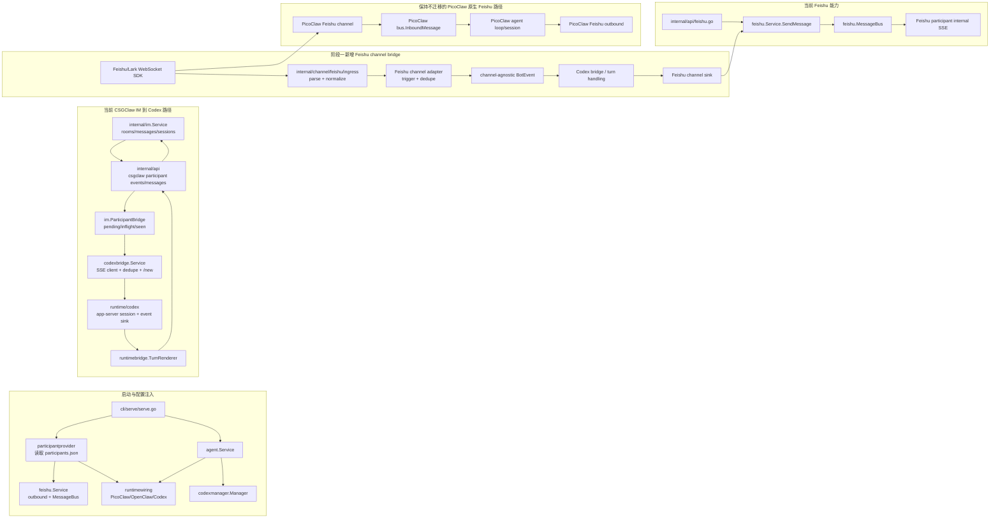

# Feishu 与本地 Coding Agent Runtime 通用桥接架构方案

本文档用于约束下一阶段开发：在不破坏当前 PicoClaw 运行时直连 Feishu 能力的前提下，把 CSGClaw 内已有的 participant、IM、Feishu Service、Codex Runtime 和 Codex Bridge 收敛成一条可扩展的本地 Coding Agent runtime 桥接路径。

结论先行：

- 可以进入下一阶段开发，但下一阶段不应先做“通用 local CLI 进程托管”。
- 为了控制改动面，阶段一也不应先铺完整 BridgeCore、通用 RuntimeProcessor、ChannelOutbound、BridgePolicy、持久化 store 和 IM mirror。
- 阶段一应先实现通用的 Feishu channel bridge：Feishu WebSocket 入站、消息 normalize、触发策略、Feishu outbound，并优先接入 Codex 跑通 `Feishu -> Codex -> Feishu` 纵向链路。
- CSGClaw channel 现有 `participant SSE -> codexbridge -> participant message API` 路径先保持不变，后续再逐步抽取成同一套通用 channel adapter。
- Feishu 入站边界必须区分两类路径：
  - PicoClaw runtime 自身已经能通过 Feishu/Lark WebSocket SDK 直连 Feishu，这是 PicoClaw runtime 的权威入站路径。
  - Codex 以及未来不具备 Feishu 通道能力的 runtime，才需要 CSGClaw 托管 Feishu 入站，并转交给 runtime bridge。
- CSGClaw 当前的 Feishu participant SSE 是 CSGClaw 到 runtime/channel adapter 的内部事件流，不是 Feishu 官方入站回调。
- Bridge 层应复用 participant 和 agent binding，避免再引入一套重复的 BridgeBinding 作为新的事实源。

## 1. 当前代码依据

### 1.1 CSGClaw 侧

| 能力 | 当前代码 |
| --- | --- |
| Codex runtime 注册 | `cli/serve/serve.go` 中 `runtimewiring.WithCodexRuntime()` |
| Codex app-server 启动参数 | `internal/codexcli/locator.go` 使用 `codex app-server --listen stdio://` |
| Codex runtime 会话管理 | `internal/runtime/codex/runtime.go`、`internal/runtime/codex/appserver_manager.go` |
| Codex bridge 事件处理 | `internal/channelbridge/codexbridge/bridge.go` |
| participant API 路由 | `internal/api/router.go`、`internal/api/participant.go` |
| participant message 当前限制 | `internal/api/participant.go` 只接受 `channel == csgclaw` |
| Feishu outbound service | `internal/channel/feishu/service.go` |
| Feishu participant SSE | `internal/api/feishu.go` 中 `/api/v1/channels/feishu/participants/{id}/events` |
| Feishu participant app credential | `internal/channel/feishu/participantprovider/provider.go`、`internal/participant/service.go` |
| PicoClaw sandbox runtime | `internal/runtime/picoclawsandbox/` |

### 1.2 PicoClaw 侧

PicoClaw 已经实现了完整 Feishu channel，并且它现在是 CSGClaw 的一种 runtime。因此 CSGClaw 不能把所有 Feishu 入站统一拦到自身 BridgeCore，否则会和 PicoClaw runtime 的原生入站重复。

关键路径如下：

| 能力 | PicoClaw 当前代码 |
| --- | --- |
| Feishu channel 注册 | `/home/jhw/opcsg/picoclaw/pkg/channels/feishu/init.go` |
| Feishu WebSocket/SDK 启动 | `/home/jhw/opcsg/picoclaw/pkg/channels/feishu/feishu_64.go` |
| Feishu message event 处理 | `handleMessageReceive` |
| allowlist、群聊触发、mention 处理 | `BaseChannel.ShouldRespondInGroup`、`BaseChannel.IsAllowedSender` |
| 统一入站消息 | `/home/jhw/opcsg/picoclaw/pkg/bus/types.go` 的 `InboundMessage` |
| 入站发布到 agent loop | `BaseChannel.HandleMessage` 调用 `bus.PublishInbound` |
| agent loop 消费入站 | `/home/jhw/opcsg/picoclaw/pkg/agent/loop.go` |
| 会话持久化 | `/home/jhw/opcsg/picoclaw/pkg/session/` |
| CSGClaw SSE 适配 | `runCSGClawSSELoop`、`openCSGClawSSEStream` |

PicoClaw 的 Feishu 入站实现重点：

1. 使用 Feishu/Lark SDK WebSocket client，不依赖共享 HTTP webhook server。
2. 订阅 `OnP2MessageReceiveV1`。
3. 从事件中解析 `chat_id`、`message_id`、`message_type`、`chat_type`、`tenant_key`、sender open_id、content 和 mentions。
4. 先做 allowlist，再做群聊 mention / prefix / permissive 策略。
5. 文本、post、interactive external URL、图片、文件、音频、媒体等被归一到 content/media refs。
6. 通过 `BaseChannel.HandleMessage` 产出 `bus.InboundMessage`，再由 agent loop 处理和持久化。

这应作为 CSGClaw-hosted Feishu ingress 的主要实现参考。

## 2. 目标与非目标

### 2.1 目标

1. 保护 PicoClaw runtime 原生 Feishu 入站路径。
2. 为 Codex runtime 提供 CSGClaw-hosted Feishu channel bridge，先跑通 Feishu 收消息、normalize、调用 Codex、发回 Feishu。
3. 用很薄的 channel-agnostic bot event / bot message 模型解耦 channel 收发和 Codex runtime turn handling。
4. 复用 participant、agent binding、channel app credential 和现有 redaction 机制。
5. 保持 Codex bridge 现有能力：线程上下文、`/new`、去重、hidden context、renderer。
6. 让下一阶段先交付一个可验证的最小纵向切片，而不是先做大规模框架化；BridgeCore、store、policy、IM mirror 后移。

### 2.2 非目标

1. 不在阶段一重写 PicoClaw 的 Feishu channel。
2. 不把 PicoClaw Feishu 入站强行迁移到 CSGClaw BridgeCore。
3. 不新增一套通用 local CLI 进程托管来替代已有 runtime/codex。
4. 不把 `POST /api/v1/channels/{channel}/participants/{id}/messages` 立即泛化到 Feishu；当前该 API 只支持 `csgclaw` 的事实必须保留在设计里。
5. 不把真实 app secret、access token、raw event 原文写入日志或可见 API。
6. 不在阶段一实现完整 BridgeCore、BridgeRun/store、BridgePolicy、通用 ChannelOutbound 或 IM mirror。
7. 不在阶段一改造 CSGClaw channel 现有路径；只保留它作为后续 adapter 化的参考实现。

## 3. 总体架构

整体应拆成三条清晰路径。

```text
路径 A: PicoClaw runtime 原生 Feishu 入站

Feishu WebSocket/SDK
  -> PicoClaw Feishu channel
  -> PicoClaw bus.InboundMessage
  -> PicoClaw agent loop / sessions
  -> PicoClaw Feishu outbound

CSGClaw 在该路径中只负责 runtime 生命周期、participant/app config 下发、
本地 IM/participant 管理，以及必要时通过 CSGClaw channel/SSE 与 runtime 互通。
```

```text
路径 B: 阶段一 CSGClaw-hosted Feishu channel bridge，优先服务 Codex

Feishu WebSocket/SDK
  -> internal/channel/feishu/ingress
  -> Feishu channel adapter normalize / trigger / dedupe
  -> codexbridge-compatible BotEvent
  -> Codex bridge / Codex turn handling
  -> Feishu channel adapter send
  -> Feishu message
```

```text
路径 C: CSGClaw IM / participant bridge

CSGClaw IM message
  -> participant bridge
  -> runtime adapter
  -> runtime response
  -> CSGClaw IM / optional channel outbound
```

阶段一优先完成路径 B 的 Codex 最小纵向切片，同时保证路径 A 和路径 C 的现有行为不被破坏。路径 C 里的 CSGClaw channel 后续再抽成同一套 channel adapter，不作为阶段一前置工作。

后续稳定后再收敛为更完整的通用 bridge 架构：

```text
Channel adapter(CSGClaw / Feishu / future)
  -> BridgeCore route / persistent dedupe / room mirror / run state
  -> RuntimeProcessor(Codex / future local CLI runtime)
  -> ChannelOutbound + optional IM mirror
```

## 4. 模块边界

本章按当前代码边界来约束下一阶段实现。重点是把已有的 CSGClaw participant bridge、Feishu outbound、Codex bridge、runtime wiring 和未来的 BridgeCore 区分开。

### 4.1 数据流与模块交互图



图中要点：

- 当前 CSGClaw 已有一条 `IM -> participant SSE -> codexbridge -> runtime/codex -> IM` 路径，它服务 `csgclaw` channel。
- 当前 Feishu 代码主要是 outbound、room/user/message API、MessageBus 和 internal SSE，不是 Feishu 官方入站。
- 阶段一新增 CSGClaw-hosted Feishu ingress 只接入 Codex，目标是跑通 Feishu channel bridge 的纵向链路。
- PicoClaw runtime 的 Feishu WebSocket 入站保持在 PicoClaw 内部，不进入 CSGClaw-hosted Feishu bridge。
- CSGClaw channel 现有路径先不抽取，后续再和 Feishu channel 一起收敛到通用 adapter / BridgeCore 形态。

### 4.2 启动与依赖注入边界

当前代码入口在 `cli/serve/serve.go`。

现状：

- `buildFeishuComponents()` 使用 `participantprovider.New(participantsPath)` 构造 participant-backed Feishu provider，再用 `NewFeishuService(provider)` 构造 `feishu.Service`。
- `newAgentService()` 注册 `runtimewiring.WithPicoClawSandboxRuntime(feishuProvider)`、`runtimewiring.WithOpenClawSandboxRuntime(feishuProvider)` 和 `runtimewiring.WithCodexRuntime()`。
- `configureFeishuService()` 把 `feishu.Service.ConfigProvider()` 注入 PicoClaw/OpenClaw runtime provider。
- `newCodexBridgeManager()` 从 `agent.Service` 里取出 `runtime/codex.Runtime`，再创建 `codexbridge.Service`，并在 `OnReady` 后 `Start()`。

方案落点：

- 阶段一只在 `serve` 启动组合处初始化 Feishu hosted ingress、Feishu channel adapter、轻量 Codex bridge source/sink 或 Codex turn handling 适配。
- BridgeCore、通用 RuntimeProcessor、通用 ChannelOutbound 后移，不作为阶段一启动依赖。
- 不能把启动逻辑写进 `internal/channel/feishu` 或 `internal/runtime/codex`。
- Feishu hosted ingress 应只对明确启用 CSGClaw-hosted bridge 的 Feishu participant 启动；阶段一可以先用 participant metadata/config 或显式配置控制，不引入完整 BridgePolicy store。
- PicoClaw/OpenClaw 的 provider 注入继续沿用 `runtimewiring.UpdatePicoClawFeishuProvider()` 和 `runtimewiring.UpdateOpenClawFeishuProvider()` 这类边界。

### 4.3 当前 CSGClaw participant bridge 边界

当前 CSGClaw channel 的 runtime 消息路径由 `internal/api/participant_bridge.go` 和 `internal/im/participant_bridge.go` 实现。

现状：

- `PublishParticipantEvent()` 监听 IM message created event，把房间消息转换成 participant event。
- `im.ParticipantBridge` 维护 `pending`、`inflight`、`seen` 三组内存状态，用于 SSE 投递、ack、requeue 和短期去重。
- `GET /api/v1/channels/csgclaw/participants/{id}/events` 由 `handleParticipantEventsStream()` 提供 SSE。
- `POST /api/v1/channels/csgclaw/participants/{id}/messages` 由 `handleParticipantSendMessage()` 写回 IM，底层调用 `im.Service.DeliverMessage()`。
- `replayRecentParticipantMessages()` 会从 IM 里回放近 30 分钟消息，但这不是跨重启持久化 idempotency store。

方案落点：

- BridgeCore 不能直接复用 `im.ParticipantBridge` 作为持久化编排层，因为它是当前 CSGClaw channel 的内存投递队列。
- 可以复用 `im.ParticipantEvent`、`ParticipantSendMessageRequest` 的部分字段语义作为 runtime 入站/出站适配参考。
- 阶段一 Feishu -> Codex 可先做最小 message id 去重；跨重启持久化去重、room mapping、run state 后移到 BridgeCore/store。
- 当前 CSGClaw participant SSE 路径必须保持不变，避免破坏 Codex bridge 现有运行方式。
- CSGClaw channel adapter 化不是阶段一前置条件；只需要在抽象 source/sink 时不把新接口设计死在 Feishu 上。

### 4.4 当前 Feishu channel adapter 边界

当前 Feishu 代码主要在 `internal/channel/feishu` 和 `internal/api/feishu.go`。

现状：

- `feishu.Service` 持有 users、rooms、apps、configProvider、messageBus，以及 create chat、list messages、send message 等 Feishu SDK 调用函数。
- `SendMessage()` 根据 sender participant 取 app config，按 mention participant 取 open_id 或 app config，然后调用 Feishu `Message.Create`。
- 发送成功后，只有带 mention 的消息会发布 `feishu.MessageEvent` 到 `MessageBus`。
- `/api/v1/channels/feishu/messages` 是 Feishu outbound API，调用 `feishu.Service.SendMessage()`。
- `/api/v1/channels/feishu/participants/{id}/events` 是 internal SSE，订阅 `feishu.MessageBus()` 并按 mention target 过滤。
- `feishu.MessageEvent` 当前字段是 `RoomID`、`SenderBotID`、`MentionBotID`、`Message`，它不是 Feishu 官方 WebSocket event 的完整模型。

方案落点：

- 新增 `internal/channel/feishu/ingress` 负责 Feishu/Lark WebSocket SDK、事件解析、allowlist、群聊触发、text/post/mention normalize。
- `ingress` 输出 channel-agnostic `BotEvent`，不直接调用 Codex runtime，也不写 IM。
- `feishu.Service.SendMessage()` 继续作为 outbound 的底层实现。
- `feishu.MessageBus` 和 Feishu participant internal SSE 保持当前内部事件流语义，不升级为官方 inbound callback。

### 4.5 participant 与 Feishu credential 边界

当前 participant 模型在 `internal/apitypes/participant.go` 和 `internal/participant/model.go`。

现状：

- `apitypes.Participant` 已有 `ID`、`Channel`、`Type`、`ChannelUserRef`、`ChannelUserKind`、`ChannelAppConfig`、`AgentID`、`Mentionable`、`Metadata`。
- `participantprovider.ParticipantConfigProvider` 从 `participants.json` 读取 Feishu participant。
- Feishu agent participant 要求 `channel == feishu`、`type == agent`、`channel_user_kind == app_id`，并从 `channel_app_config.app_id` / `channel_app_config.app_secret` 取 credential。
- `BotConfigForAgent(agentID)` 会按 Feishu participant 的 `agent_id` 查找 app config，并优先选择 `agent.ParticipantIDForAgent("", agentID)` 推导出的 canonical participant ID。
- API 展示 participant 时通过 `participant.RedactChannelAppConfig()` 脱敏 `channel_app_config`。

方案落点：

- participant 继续是 channel identity、agent binding、Feishu app credential 的事实源。
- 阶段一 route 时应先用 Feishu inbound event 的 app id / participant 配置定位 Feishu participant，再从 `Participant.AgentID` 找 agent。
- agent 的 `RuntimeID`、`RuntimeKind` 从 `agent.Service` 查询，不写入 Feishu ingress。
- 不新增保存 app secret、agent id、runtime id 的完整 BridgeBinding 表。
- 阶段一若需要启停、mention policy 等 bridge 级配置，可先放在 participant metadata/config 或显式 serve 配置中；完整 `BridgePolicy` 后移，并以 `channel + participant_id` 引用 participant。

### 4.6 阶段一轻量 bridge 与后续 BridgeCore 边界

阶段一不新增完整 BridgeCore。为了控制改动面，先在 Feishu channel bridge 和 `codexbridge` 抽象层之间定义很薄的 source/sink 模型：

```go
type ChannelEventSource interface {
    Events(ctx context.Context, participantID string) (<-chan BotEvent, <-chan error)
}

type ChannelMessageSink interface {
    Send(ctx context.Context, participantID string, req BotMessage) (BotMessageResult, error)
}
```

阶段一职责：

- Feishu source 从 Feishu/Lark WebSocket SDK 产出 normalized `BotEvent`。
- Feishu sink 复用 `feishu.Service.SendMessage()` 或其底层发送能力写回 Feishu。
- CSGClaw source/sink 继续由现有 `codexbridge.HTTPClient`、participant SSE 和 participant message API 承担，不强行迁移。
- Codex bridge / turn handling 消费 normalized event，调用 `runtime/codex`，再通过当前 channel sink 写回。
- 只做最小 message id 去重；跨重启去重、run state 和 room mirror 后移。

后续 BridgeCore 稳定落点建议为 `internal/bridgecore`，对应最终架构里的 `route + persistent dedupe + room mirror + run state`。

后续 BridgeCore 职责：

- 接收 `BridgeInboundEvent`。
- 用 participant / agent resolver 找到 `AgentID`、`RuntimeID`、`RuntimeKind`。
- 用 `channel + participant_id + external_event_id` 做持久化去重。
- 建立或查找 Feishu chat/thread 到 CSGClaw IM room/thread 的 mirror。
- 生成 `RuntimeInboundRequest`。
- 调用 RuntimeProcessor。
- 消费 `RuntimeOutput`，再分别写 IM mirror 和 ChannelOutbound。
- 记录 bridge run 状态，便于恢复和排查。

不做：

- 不解析 Feishu SDK raw event。
- 不持有 app secret。
- 不直接依赖 Codex app-server 协议。
- 不替代 `im.ParticipantBridge` 的 CSGClaw channel SSE。

### 4.7 Codex bridge source/sink 抽取边界

当前 Codex 能力分布在 `internal/runtime/codex`、`internal/channelbridge/codexbridge` 和 `internal/channelbridge/runtimebridge`。

现状：

- `runtimewiring.WithCodexRuntime()` 注册 `runtime/codex.Runtime`，它负责 Codex binary、app-server session、event sink、permission broker。
- `codexbridge.Service` 当前自己通过 `HTTPClient.StreamEvents()` 订阅 `/api/v1/channels/csgclaw/participants/{id}/events`。
- `codexbridge.worker` 已经实现事件去重、conversation key、hidden thread context、`/new` reset、prompt 调用、runtime event 消费和通过同一个 `BotClient` 写回 CSGClaw participant message。
- `runtimebridge.TurnRenderer` 负责把 runtime event 渲染成最终文本或 activity JSON。
- 这说明当前 `codexbridge` 同时包含三类职责：CSGClaw channel ingress、Codex runtime turn processing、CSGClaw channel outbound。它不是一个已经成型的调用型 RuntimeProcessor。

方案落点：

- 第一阶段不要把 Feishu 直接接进当前 `codexbridge.worker`，也不要把 `codexbridge.worker` 原样包装成 RuntimeProcessor。
- 阶段一应先把 `codexbridge` 的 channel source/sink 从固定 HTTP client 中抽出来，让它能消费不同 channel 的 normalized `BotEvent`，并通过对应 channel sink 写回。
- `codexbridge` 的 turn processing 语义仍由它负责：conversation key、hidden thread context、`/new` reset、prompt 调用、runtime event 消费和 renderer flush。
- CSGClaw participant SSE / message API 现有路径保持不变，继续作为默认 CSGClaw source/sink 实现，不在阶段一迁移到 BridgeCore。
- Feishu hosted ingress 作为新的 Feishu source，从 Feishu WebSocket 产出同一类 normalized event；Feishu outbound 作为新的 sink，写回 Feishu。
- Codex conversation key 应保持与当前 `codexbridge.conversationKey(room_id + thread_root_id)` 等价的稳定性；后续抽 BridgeCore 时再上移为通用规则。
- Feishu 协议字段只放在 `BotEvent.Source` 或 Codex hidden context，不能进入 `runtime/codex` 核心模型。
- 未来所有本机 coding agent CLI 都应作为新的 runtime kind 接入通用 RuntimeProcessor；这个抽象后移，不放在 `internal/channel/feishu`，也不复用 CSGClaw SSE 作为唯一入口。

### 4.8 阶段一 BotMessage sink 与 API 边界

当前 API 路由在 `internal/api/router.go`。

现状：

- 路由层存在 `/{channel}/participants/{id}/messages`，但 `handleParticipantMessage()` 当前显式拒绝非 `csgclaw` channel。
- Feishu 主动发送走 `/api/v1/channels/feishu/messages`，底层是 `feishu.Service.SendMessage()`。
- CSGClaw IM 写回走 `handleParticipantSendMessage()`，底层是 `im.Service.DeliverMessage()`。

阶段一方案落点：

- 不新增通用 `ChannelOutbound`。
- Feishu sink 复用 `feishu.Service.SendMessage()` 或其底层发送函数。
- CSGClaw sink 继续使用现有 participant message API。
- 阶段一不把 `POST /api/v1/channels/{channel}/participants/{id}/messages` 泛化到 Feishu。
- 如果后续要让 Feishu participant 成为 IM 里的直接发送目标，应作为独立 API/CLI/Web UI 行为设计，并补一致性测试。

## 5. 数据模型

本章把新增模型与当前已有模型对齐。阶段一只新增足够 Feishu channel adapter 和 Codex bridge 交互的薄模型；完整 BridgeCore 状态模型后移。

### 5.1 当前已有模型与可复用字段

| 当前模型 | 位置 | 当前用途 | 对 bridge 的意义 |
| --- | --- | --- | --- |
| `apitypes.Participant` | `internal/apitypes/participant.go` | channel 身份、agent binding、channel app config | Feishu participant 和 agent 绑定事实源 |
| `im.ParticipantEvent` | `internal/im/participant_bridge.go` | CSGClaw participant SSE 事件 | 可参考 message、room、thread、sender、mention、context 字段 |
| `im.ParticipantSendMessageRequest` | `internal/im/participant_bridge.go` | runtime 写回 CSGClaw IM | 可参考 room/chat/thread/text 解析逻辑 |
| `channelbridge.BotEvent` | `internal/channelbridge/types.go` | Codex bridge 当前消费的 bot event | 已抽为 channel-agnostic bot event，供 CSGClaw/Feishu source 共用 |
| `feishu.MessageEvent` | `internal/channel/feishu/bus.go` | Feishu outbound 后的内部 mention event | 只能作为 internal SSE 事件，不适合作为官方 Feishu inbound 模型 |
| `runtimecodex.PromptRequest` | `internal/runtime/codex` | Codex session prompt 输入 | Codex bridge / turn handling 最终会转成 prompt request |

### 5.2 阶段一 BotEvent

阶段一建议先扩展或抽出 `codexbridge.BotEvent` 的 channel-agnostic 版本，而不是直接新增 `BridgeInboundEvent`。它是 channel source 到 Codex bridge 的唯一入站模型。

```go
type BotEvent struct {
    Channel       string
    ParticipantID string
    AgentID       string
    RuntimeID     string

    MessageID    string
    ChatID       string
    ChatType     string
    ThreadRootID string
    MessageType  string
    Text         string

    Sender      BotSender
    Mentions    []BotMention
    Attachments []BotAttachment
    Source      BotSource
    ReceivedAt time.Time
}
```

字段来源：

| 字段 | Feishu hosted ingress 来源 | 当前代码对照 |
| --- | --- | --- |
| `Channel` | 固定 `feishu` | 对应 `participant.ChannelFeishu` |
| `ParticipantID` | 由 app id / participant 配置解析出的 CSGClaw Feishu participant ID | 对应 `apitypes.Participant.ID` |
| `AgentID` | Feishu participant 的 `agent_id` | 用于定位 Codex agent |
| `RuntimeID` | 从 `agent.Service` 查询 agent 后获取 | Codex prompt 使用的 runtime handle |
| `MessageID` | Feishu `message_id`，没有时才使用 event id | 当前 `codexbridge` 以 message id 做主要去重键 |
| `ChatID` | Feishu chat id | 对应当前 `feishu.Service.SendMessage()` 的 `RoomID/ChatID` |
| `ChatType` | Feishu chat type | 对应 `codexbridge.BotEvent.ChatType` |
| `ThreadRootID` | Feishu thread/topic/root message 映射值 | 对应当前 Codex conversation key 的 thread 部分 |
| `MessageType` | text、post、image 等 | 当前阶段只要求 text/post/mention 进入文本链路 |
| `Sender` | sender open_id / union_id / user_id | 不保存 credential |
| `Text` | normalize 后文本 | 对应 `codexbridge.BotEvent.Text` |
| `Mentions` | mentions 中的 open_id / name / tenant 信息 | 对应 `im.Message.Mentions`、`codexbridge.BotEvent.Mentions` |
| `Attachments` | image/file/audio/media descriptor | 阶段一只保留 descriptor |
| `Source` | 脱敏后的 tenant、chat、raw id 摘要 | 可参考 `im.ParticipantMessageContext`，但不保存 raw secret |

要求：

- `ParticipantID` 必须可追溯到 `participants.json` 中的 Feishu participant。
- `Source.ChannelAppID` 只能保存 app id，不保存 app secret。
- `Source` 只保存必要、脱敏、可排查字段。
- 不保存 app secret、access token、Authorization header、完整 raw event。

### 5.3 BotSender、BotMention、BotAttachment、BotSource

建议补充小模型，避免把 Feishu SDK 类型泄漏到 Codex bridge。

```go
type BotSender struct {
    OpenID  string
    UnionID string
    UserID  string
    Name    string
}

type BotMention struct {
    ID          string
    OpenID      string
    UserID      string
    Name        string
    Participant string
}

type BotAttachment struct {
    ID          string
    Type        string
    Name        string
    Size        int64
    ContentType string
    Source      map[string]string
}

type BotSource struct {
    Channel       string
    ParticipantID string
    ChannelAppID  string
    ChatID        string
    ChatType      string
    MessageID     string
    SenderID      string
    TenantKey     string
}
```

阶段一只要求 attachment descriptor 进入模型，不要求下载到 runtime workspace。`Source` 只能保存非敏感定位信息，例如 message id、file key、image key，不能保存 token。

### 5.4 BotMessage

阶段一 Codex bridge 输出先用很薄的 channel outbound 模型，不引入完整 `ChannelOutbound`。

```go
type BotMessage struct {
    Channel       string
    ParticipantID string
    ChatID        string
    ThreadRootID  string
    Text          string
}

type BotMessageResult struct {
    MessageID string
}
```

Codex bridge 使用规则：

- 不应把 Feishu 输出再绕回当前 `codexbridge.HTTPClient` / CSGClaw participant message API。
- CSGClaw sink 继续使用现有 participant message API。
- Feishu sink 使用 `feishu.Service.SendMessage()` 或其底层发送函数。
- `ConversationID` 要保持与当前 `conversationKey(roomID, threadRootID)` 等价的稳定性。
- 阶段一 outbound 只支持 create/reply，不支持按 `message_id` 更新同一条已发送消息；该能力后续作为独立任务评估。
- `/new` 或 reset 仍应调用当前 Codex reset 语义，而不是新增一套 runtime-local 清理规则。

### 5.5 后续 BridgeCore 持久化模型

当前 `im.ParticipantBridge` 的 `pending/inflight/seen` 是内存状态，不能满足 Feishu 重放、CSGClaw 重启、Codex 重连后的稳定性。阶段一只做最小 message id 去重；后续 BridgeCore 再新增持久化 store。

建议最小模型：

```go
type BridgeIdempotencyRecord struct {
    Key           string
    Channel       string
    ParticipantID string
    ExternalID    string
    Status        string
    FirstSeenAt   time.Time
    UpdatedAt     time.Time
}

type BridgeRoomMapping struct {
    Channel       string
    ParticipantID string
    ChatID        string
    ThreadRootID  string
    RoomID        string
    CreatedAt     time.Time
    UpdatedAt     time.Time
}

type BridgeRun struct {
    ID            string
    IdempotencyKey string
    AgentID       string
    RuntimeID     string
    RuntimeKind   string
    RoomID        string
    Status        string
    Error         string
    StartedAt     time.Time
    FinishedAt    *time.Time
}

type BridgeOutboundRecord struct {
    RunID             string
    Channel           string
    RoomID            string
    IMMessageID       string
    ExternalMessageID string
    CreatedAt         time.Time
}
```

存储要求：

- idempotency key 至少为 `channel + participant_id + external_event_id`。
- room mapping key 至少为 `channel + participant_id + chat_id + thread_root_id`。
- run status 用于排查 pending、processing、completed、failed。
- outbound record 用于关联 CSGClaw IM message 和 Feishu message id。
- 不把真实 credential 或完整 raw event 写入 store。

## 6. API 与事件边界

### 6.1 保留当前 participant API 语义

当前：

- `GET /api/v1/channels/feishu/participants/{participant_id}/events` 是内部 SSE。
- `POST /api/v1/channels/{channel}/participants/{participant_id}/messages` 当前只支持 `channel == csgclaw`。

文档和实现都不能暗示 Feishu participant 已经能通过该 POST API 直接向 runtime 投递消息。

### 6.2 CSGClaw-hosted Feishu ingress 不优先做官方 HTTP webhook

由于 PicoClaw 当前可用实现是 Feishu/Lark WebSocket SDK，CSGClaw-hosted ingress 也应优先采用相同边界：

```text
Feishu/Lark WebSocket SDK -> internal/channel/feishu/ingress -> Feishu channel adapter -> Codex bridge
```

如需开发测试入口，可增加内部 normalized event endpoint，但要明确：

- 只用于测试、本地调试或受控内部转发。
- 不是 Feishu 官方 callback API。
- 默认关闭或要求 server token。
- request body 使用 normalized schema，不保存 raw secret。

## 7. 核心流程

### 7.1 PicoClaw runtime 直连 Feishu

```text
1. CSGClaw 创建/更新 PicoClaw runtime，并下发 Feishu app config。
2. PicoClaw runtime 启动 Feishu WebSocket client。
3. Feishu message event 到达 PicoClaw `handleMessageReceive`。
4. PicoClaw 做 allowlist、mention、content/media normalize。
5. PicoClaw `BaseChannel.HandleMessage` 发布 `bus.InboundMessage`。
6. PicoClaw agent loop 处理消息、保存 session、发布 outbound。
7. PicoClaw Feishu channel 发送回复。
```

CSGClaw 在该流程中不应插入第二套 Feishu 入站消费。

### 7.2 Feishu 到 Codex

```text
1. CSGClaw Feishu ingress 使用 WebSocket SDK 收到 Feishu event。
2. ingress 解析 message id、chat id、sender、message type、mention、text。
3. Feishu channel adapter 根据 app id / participant / agent binding 找到 Codex agent。
4. Feishu channel adapter 生成 normalized `BotEvent`，并做最小 message id 去重。
5. Codex bridge 消费 `BotEvent`，保持现有 conversation key、hidden context、`/new` reset、renderer 和 runtime event 消费语义。
6. Codex bridge 调用 `runtime/codex`。
7. Codex bridge 生成 `BotMessage`。
8. Feishu sink 将最终响应写回 Feishu。
```

### 7.3 CSGClaw IM 到 runtime

当前代码中 participant message API 只支持 `csgclaw`。因此阶段一更稳妥的做法是：

- runtime 投递仍走已有 CSGClaw participant / codexbridge 能力；
- CSGClaw participant / codexbridge 能力阶段一保持不变，不能作为 Feishu 路径的内部跳板；
- Feishu participant 负责外部 Feishu 身份和 outbound credential；
- Feishu chat/thread 到 Codex conversation 的关系先由 Codex bridge conversation key 派生；
- 如果要让 Feishu participant 也成为 IM 里的直接发送目标，必须作为后续独立改造。

## 8. 下一阶段开发计划

### 阶段 0：文档与边界冻结

输出：

- 本文档更新完成。
- 明确 PicoClaw Feishu 原生入站不迁移。
- 明确阶段一 CSGClaw-hosted Feishu ingress 只服务 Codex；未来 runtime 后续再接入。

验收：

- 现有 PicoClaw sandbox runtime 行为不变。
- 现有 Codex bridge 行为不变。

### 阶段 1：Codex bridge 轻量 source/sink 抽象

输出：

- `BotEvent` / `BotMessage` 薄模型。
- `ChannelEventSource` / `ChannelMessageSink` 内部接口或等价抽象。
- 现有 CSGClaw participant SSE source 和 participant message sink 适配，行为不变。
- `codexbridge` 从固定 `HTTPClient` 解耦到 source/sink，但保留现有 conversation key、hidden context、`/new` reset、renderer 和 runtime event 消费语义。

验收：

- 现有 CSGClaw channel -> Codex 行为不变。
- 单测覆盖 CSGClaw source/sink、conversation key、reset dispatch 和 send path。
- 不改变现有 `/api/v1/channels/csgclaw/participants/{id}/events` 和 `/messages` 行为。

### 阶段 2：Feishu channel adapter + Codex 纵向切片

输出：

- `internal/channel/feishu/ingress`。
- WebSocket/SDK client。
- event normalize 逻辑，参考 PicoClaw `handleMessageReceive`。
- allowlist 和 group trigger。
- text/post/mention 支持。
- attachment descriptor 支持。
- Feishu source 输出 `BotEvent`。
- Feishu sink 复用 `feishu.Service.SendMessage()` 或其底层发送能力。
- Feishu event -> Codex -> Feishu outbound。

验收：

- Feishu text、post、mention 单测。
- 群聊 mention-only / prefix / permissive 单测。
- 私聊触发 Codex 回复。
- 群聊 mention 触发 Codex 回复。
- 重复 message id 在进程内不重复执行。
- 日志和 API 不泄漏 secret/raw token。

### 阶段 3：持久化去重、IM mirror 与 BridgeCore 评估

输出：

- 评估是否引入 `internal/bridgecore`。
- 持久化 idempotency store。
- Feishu chat/thread 到 CSGClaw IM room/thread 的 mirror。
- bridge run 状态。
- outbound message id 与 IM message id 映射。

验收：

- 重启后重复 Feishu message id 不重复执行。
- CSGClaw IM 中能看到 mirror 消息和最终回复。
- BridgeCore 引入后不改变阶段二 Feishu -> Codex -> Feishu 行为。

### 阶段 4：CSGClaw channel adapter 化和 participant API 整理

输出：

- 将 CSGClaw participant SSE / message API 路径逐步收敛为与 Feishu 相同的 channel adapter 形态。
- 明确 Feishu participant 是否可以作为 IM 直接目标。
- 如需要，扩展 participant message API，但必须补测试。

验收：

- 不破坏当前 `csgclaw` participant message API。
- Feishu participant 的行为在 API、CLI、Web UI 中一致。

### 阶段 5：媒体与高级消息

输出：

- 参考 PicoClaw media download/materialize。
- 图片、文件、音频、视频进入 runtime attachment。
- Feishu card 渲染策略。

验收：

- 媒体下载失败不会中断文本消息。
- 大文件、超时、权限错误有清晰用户可见提示。

## 9. 风险与调整项

### 9.1 最大风险：重复消费 Feishu 入站

如果 CSGClaw 和 PicoClaw runtime 同时用同一个 Feishu app 消费同一批事件，会出现重复回复、重复 session、去重边界混乱。

调整：

- PicoClaw runtime 的 Feishu app 默认由 PicoClaw runtime 消费。
- CSGClaw-hosted ingress 只绑定明确声明由 CSGClaw 托管的 participant/app。
- 同一个 Feishu app 不应同时启用 PicoClaw 原生入站和 CSGClaw-hosted ingress，除非后续实现明确的分片策略。

### 9.2 CSGClaw Feishu SSE 命名容易误解

`/api/v1/channels/feishu/participants/{id}/events` 容易被误解成 Feishu 官方事件入口。

调整：

- 文档中固定称为“Feishu participant internal SSE”。
- 代码注释和 API 文档应说明它是 CSGClaw -> adapter/runtime 的内部事件流。

### 9.3 BridgeBinding 重复事实源

如果新增完整 BridgeBinding，并保存 participant 已有的 app config、agent binding，后续会出现更新不一致。

调整：

- 阶段一不新增完整 BridgeBinding 或 BridgePolicy store。
- 如需开关，先放 participant metadata/config 或显式 serve 配置。
- 后续若新增 BridgePolicy，只保存策略和开关。
- credential、agent binding、channel identity 从 participant 推导。

### 9.4 Codex bridge 抽取要先拆耦合点

当前 Codex bridge 已经承担 CSGClaw SSE 输入、线程上下文、renderer、reset、去重、Codex prompt 和 CSGClaw participant message 写回等用户可见行为。直接把整个 worker 包装成 RuntimeProcessor 会把 Feishu 输出误绑定到 CSGClaw channel；但反过来，阶段一就抽完整 BridgeCore / RuntimeProcessor 也会放大改动面。

调整：

- 阶段一只抽 channel-agnostic 的 source/sink 和 bot event/message 模型。
- Codex turn handling 仍留在 `codexbridge`，继续复用现有 conversation key、reset、renderer 和 runtime event 消费。
- 当前 CSGClaw participant SSE / message API 保持原路径不变。
- Feishu hosted ingress 接入新的 Feishu source/sink，不调用当前固定 `csgclaw` API 的 `codexbridge.HTTPClient`。
- 待 Feishu -> Codex 纵向切片稳定后，再评估 BridgeCore、通用 RuntimeProcessor 和 CSGClaw channel adapter 化。

### 9.5 媒体支持不要阻塞第一切片

PicoClaw 已有比较完整的 media 处理，但 Codex 第一切片通常可以先跑通文本和 mention。

调整：

- normalized event 中先保留 attachment descriptor。
- 文本链路可用后，再迁移 media materialize。

## 10. 按当前方案需要修改与新增的模块

### 10.1 需要修改的现有模块

#### `cli/serve/` 与 runtime wiring

需要在服务启动时注册 Feishu hosted ingress、Feishu source/sink 和 Codex bridge source/sink 组合。现有 `cli/serve/serve.go` 已经负责 runtime wiring，因此这里应作为组合入口，而不是把启动逻辑散落到 channel 或 runtime 包里。

修改重点：

- 继续保留 `runtimewiring.WithCodexRuntime()`。
- 增加 Feishu channel bridge 相关依赖初始化。
- 仅对明确启用 CSGClaw-hosted bridge 的 Feishu participant 启动 ingress。
- 不改变 PicoClaw sandbox runtime 的 Feishu 配置下发和生命周期行为。

#### `internal/api/`

阶段一原则上不需要新增公开 API；如补充调试或内部测试入口，不能改变现有 participant message API 的语义。

修改重点：

- 保留 `POST /api/v1/channels/{channel}/participants/{id}/messages` 只支持 `channel == csgclaw` 的当前事实。
- 保留 `/api/v1/channels/feishu/participants/{id}/events` 作为 Feishu participant internal SSE。
- 如新增 normalized event 测试入口，应放在受控内部 API 下，默认关闭或要求 server token。
- API 输出继续复用现有 secret redaction 机制。

#### `internal/participant/`

participant 仍是 channel identity、agent binding、channel app config 的事实源。Feishu bridge 需要从 participant 推导 agent、runtime、credential，不应新增一套重复事实源。

修改重点：

- 增加或暴露 Feishu participant -> agent binding resolver 所需查询能力。
- 保持 `channel_app_config` 中 Feishu app credential 的存储与脱敏规则。
- 阶段一如需要开关，优先使用 participant metadata/config 或显式 serve 配置；不复制 app secret、agent id、runtime id 等可推导字段。

#### `internal/channel/feishu/`

现有 Feishu service 负责 outbound、message bus、participant SSE 和 credential provider。当前方案需要在这里增加 hosted ingress，但仍保持 Feishu 协议边界清晰。

修改重点：

- 复用 `service.go` 的 outbound 发送能力。
- 复用 `participantprovider` 的 participant-backed credential 解析。
- 增加 Feishu source：WebSocket/SDK client、message receive event 订阅、event normalize。
- 增加 Feishu sink：把 `BotMessage` 转成 Feishu outbound 请求。
- 不在 Feishu adapter 中直接启动 Codex、不管理 runtime session、不写 agent memory。

#### `internal/channelbridge/codexbridge/`

Codex bridge 已经包含用户可见的会话、renderer、hidden context、`/new` 和去重语义，但它当前也和 CSGClaw participant SSE、CSGClaw participant message API 耦合。阶段一不抽完整 RuntimeProcessor，只把 source/sink 从固定 HTTP client 中解耦出来。

修改重点：

- 抽出 `ChannelEventSource` / `ChannelMessageSink` 或等价内部接口。
- 将现有 CSGClaw participant SSE 拉取和 CSGClaw participant message 写回保留为默认 source/sink，行为不变。
- 复用现有 conversation key、renderer、hidden context 和 reset 语义。
- 避免把 Feishu 协议字段直接泄漏进 Codex bridge turn handling。
- 避免 Feishu 路径调用当前 `codexbridge.HTTPClient`，因为它固定读写 `csgclaw` participant API。

#### `internal/runtime/codex/`

阶段一继续作为 Codex bridge 的底层 runtime 能力来源。

修改重点：

- 复用现有 app-server manager 和 session 管理。
- 如 source/sink 抽象需要，暴露窄接口给 `codexbridge` 复用。
- 不新增一套 local CLI 进程托管替代当前 Codex runtime。

#### `internal/im/`

阶段一不改 `internal/im/`，除非测试或最小调试入口确实需要。Feishu chat/thread 与 CSGClaw room 的 mirror 后移到 BridgeCore / IM mirror 阶段。

修改重点：

- 阶段一避免新增 IM 写入路径。
- 后续 IM mirror 阶段再复用现有 IM service 写入 room message，并增加 room mirror 所需的调用入口或辅助方法。
- 避免把 Feishu raw event 持久化为 IM 消息内容。

#### `internal/runtime/picoclawsandbox/`

这个模块原则上只做回归保护，不作为阶段一主要改造对象。

修改重点：

- 保持 PicoClaw runtime 原生 Feishu 入站不迁移。
- 保持 Feishu app config 下发行为不变。
- 保持 PicoClaw 通过 CSGClaw channel / participant SSE 互通的既有路径不变。

### 10.2 阶段一需要新增的模块

#### `internal/channel/feishu/ingress/`

新增 CSGClaw-hosted Feishu ingress，只服务阶段一 Codex 纵向切片。

建议包含：

- Feishu/Lark WebSocket SDK client。
- message receive event 订阅。
- text、post、mention、interactive URL normalize。
- image/file/audio/media attachment descriptor。
- allowlist。
- 群聊 mention / prefix / permissive 触发策略。
- app id / participant / tenant / chat / message 的脱敏上下文提取。
- 不输出 raw event，不保存 credential。

#### `internal/channel/feishu/ingress/testdata/` 或对应测试包

新增 Feishu event normalize 和群聊触发策略测试样例。

建议覆盖：

- text。
- post。
- mention。
- interactive external URL。
- mention-only / prefix / permissive。
- allowlist。
- attachment descriptor。
- secret/raw token 不进入日志和可见输出。

### 10.3 后续再新增的模块

#### `internal/bridgecore/`

后续新增 BridgeCore 作为通道入站与 runtime processor 之间的编排层。

建议包含：

- `BridgeInboundEvent`、`RuntimeInboundRequest`、`RuntimeOutput` 等内部模型。
- participant/agent binding resolver。
- route、dedupe、room mapping、run state 编排。
- runtime output 到 IM mirror 和 channel outbound 的分发。
- 不包含 Feishu SDK 细节，不直接依赖 Codex app-server 协议。

#### `internal/bridgecore/store/`

新增 bridge 持久化存储，避免重启后去重、room mirror 和运行状态丢失。

至少保存：

- inbound event idempotency record。
- channel chat/thread 到 CSGClaw room 的映射。
- bridge run 状态。
- outbound message id 与 IM message id 映射。

#### `internal/bridgecore/policy/`

如需要 bridge 级别开关或策略，应新增轻量 policy 模块，而不是新增完整 BridgeBinding 事实源。

建议保存：

- channel + participant_id 级别 enabled 开关。
- mention policy。
- room mapping mode。
- sync policy。
- 非敏感 metadata。

不应保存：

- app secret。
- access token。
- agent id、runtime id、runtime kind 等可从 participant/agent 推导的字段。

#### `internal/channel/outbound/`

新增内部 outbound 抽象，隔离 BridgeCore 和具体 channel service。

建议接口：

```go
type ChannelOutbound interface {
    Send(ctx context.Context, req ChannelOutboundRequest) (*ChannelOutboundResult, error)
}
```

Feishu 实现复用 `internal/channel/feishu/service.go`，CSGClaw IM 实现复用 `internal/im/`。

#### `internal/runtime/bridgeprocessor/`

新增 runtime processor 抽象层，用于把 BridgeCore 和不同 runtime 解耦。

建议包含：

- `RuntimeProcessor` 接口。
- Codex RuntimeProcessor 实现，复用 `runtime/codex` 的 session manager、event sink、permission broker 和 `channelbridge/runtimebridge.TurnRenderer`。
- reset conversation 适配。
- conversation key / room id / source metadata 的转换。
- channel-agnostic turn processing contract，供 CSGClaw channel、Feishu channel 和未来 local CLI runtime 共同复用。

未来 local CLI agent 应作为新的 runtime kind 接入这里，而不是直接挂到 Feishu channel adapter。
