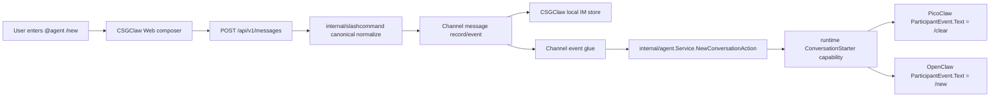
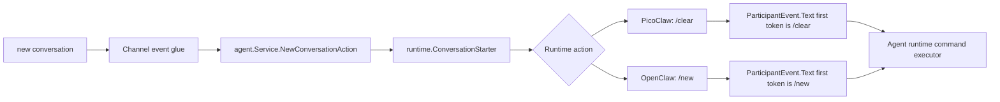
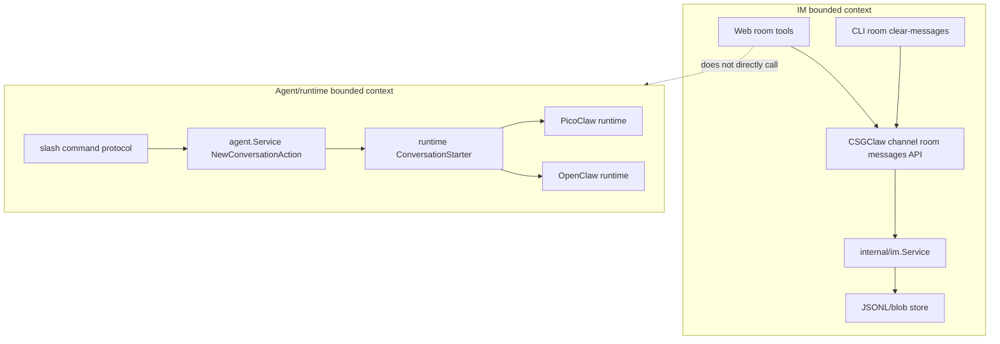

# CSGClaw IM Agent History Cleanup Plan

## Chapter 2: Slash Cleanup Design for the CSGClaw Local Channel, and PicoClaw/OpenClaw Integration

### 2.1 Slash Cleanup Boundary

An Agent's context history is private runtime/agent state. It is not part of the message persistence owned by `internal/im`. The current code already has several layers of state:

- IM room messages: managed by `internal/im.Service` and stored under `~/.csgclaw/im/sessions`.
- PicoClaw/OpenClaw sandbox: CSGClaw starts an external runtime through the sandbox gateway and injects CSGClaw channel environment variables. Runtime history is owned by that runtime.
- Codex is a built-in runtime in the CSGClaw local channel. Users trigger it only by sending `/new` through the CSGClaw channel. This document does not design an independent external Codex channel integration.
- Runtime-direct external channels such as Feishu are not `/new` protocol entry points in this document. When users send messages directly to a runtime external channel, behavior follows that runtime's native command capabilities.

Slash cleanup must satisfy:

- The command enters the target Agent through an IM message, preserving auditable user intent.
- The cleanup scope is determined by the current room and target Agent, not by thread.
- CSGClaw does not delete internal sandbox files across module boundaries.
- `new` only resets the Agent conversation context (runtime session). It does not clear IM room messages.

### 2.2 Unified Slash Command Protocol

Add a built-in slash command whose user-facing meaning is "reset the current conversation context":

```text
/new
/new conversation
```

This is the unified command exposed by the CSGClaw local channel. Internally, CSGClaw keeps a canonical form:

```xml
<slash-command name="new" arg="conversation"></slash-command>
```

With an optional note:

```xml
<slash-command name="new" arg="conversation"></slash-command> reset before rebuild
```

Command fields:

| Field | Meaning |
|---|---|
| `name` | Fixed to `new` |
| `arg` | Cleanup scope. The current implementation supports `conversation` |
| `body` | Optional reason or note. It is not used for permission checks |

Notes:

- `/new` resets Agent conversation context. It does not mean "delete IM history".
- In the CSGClaw local channel, the only externally exposed reset command is `/new`.
- `/new` maps to runtime-native reset commands inside CSGClaw runtime adapters. PicoClaw uses `/clear`, and OpenClaw uses `/new`. This mapping is not duplicated in the Feishu channel.

The current implementation supports only `conversation`, and it no longer distinguishes between root messages and threads. In other words, the scope is the whole current room:

- In the current room: clear the mentioned Agent's full conversation history in that room, including root-room messages and all threads under that room.
- In a group chat, when an Agent is hit by `@mention`: only that mentioned Agent is affected. If no Agent is mentioned, the cleanup action is not broadcast to multiple Agents.

Currently unsupported:

- `agent`: clear one Agent's history across multiple rooms.
- `all`: clear all Agent histories.

These scopes are more dangerous and should be designed later with permissions and confirmation.

Runtime adaptation:

| Runtime | CSGClaw canonical command | Runtime-native command/handling |
|---|---|---|
| PicoClaw sandbox | `new conversation` | Map to PicoClaw native command `/clear` (clears context for current `opts.SessionKey`) |
| OpenClaw sandbox | `new conversation` | Map to OpenClaw native command `/new` (resets current `session`) |

The CSGClaw local channel does not expose runtime-native commands such as PicoClaw `/clear` as the unified user protocol. Native commands are used only inside CSGClaw runtime adapters. Users only see `/new`. Codex only responds to `/new` through the CSGClaw local channel and is not expanded as a separate integration plan in this document.

Command basis:

- PicoClaw already implements `/clear`, which resets the conversation context and summary for the current `opts.SessionKey`. It does not touch IM platform chat records.
- OpenClaw official slash command docs define `/new` for in-place session reset. The current implementation uses `/new`. Reference: https://docs.openclaw.ai/tools/slash-commands

### 2.3 Frontend Slash Normalization Design

Current state:

- `internal/slashcommand` can parse `<slash-command ...>`.
- The Web composer currently normalizes `/xxx` shorthand into `use-skill`.
- `MessageContent` mainly renders `use-skill` as a slash command card/text.

Add a built-in command registry on the frontend:

```ts
type SlashCommandDefinition = {
  name: string;
  defaultArg?: string;
};

const builtinSlashCommands = [
  { name: "new", defaultArg: "conversation" },
];
```

Normalization rules:

1. User enters `/new`:
   - Output `<slash-command name="new" arg="conversation"></slash-command>`.
2. User enters `/skill-name ...`:
   - Continue outputting `<slash-command name="use-skill" arg="skill-name"></slash-command> ...`.
3. Invalid slash commands remain normal text or use the existing malformed-slash error path. Do not introduce new ambiguous behavior.

UI hints:

- The slash picker should distinguish built-in commands from skill candidates.
- `new` does not depend on the Agent workspace skill list. It can be shown even before skills are loaded.

### 2.4 Backend Slash Parser Design

Add constants in `internal/slashcommand/command.go`:

```go
const (
    UseSkillCommandName        = "use-skill"
    NewConversationCommandName = "new"
)
```

Add helpers:

```go
func IsNewConversationCommand(cmd Command) bool {
    return strings.EqualFold(strings.TrimSpace(cmd.Name), NewConversationCommandName)
}

func NormalizeNewConversationArg(arg string) (string, error) {
    switch strings.ToLower(strings.TrimSpace(arg)) {
    case "", "conversation":
        return "conversation", nil
    default:
        return "", fmt.Errorf("unsupported new scope %q", arg)
    }
}
```

`validate(cmd)` already permits different command names. `new` does not need to masquerade as `use-skill`.

### 2.5 Module Flow from the CSGClaw Local Channel to Runtimes



CSGClaw local channel responsibilities:

- Preserve the original slash command intent.
- Pass the canonical slash command as user intent to the Agent dispatcher. CSGClaw local channel audit/history is stored in `internal/im`.
- Do not treat `new` as a normal skill in the IM layer.
- The CSGClaw channel normalizes user input into canonical slash form and sends messages through the existing channel/event flow.
- Channel event glue recognizes canonical `/new` and calls `internal/agent.Service.NewConversationAction` to get the target runtime action.
- For PicoClaw/OpenClaw, output a ParticipantEvent invocation and deliver it through the existing ParticipantEvent protocol.
- Codex only responds to `/new` through the CSGClaw local channel. This document does not design an external channel or external Codex CLI integration.

Add the Agent service use-case data structures:

```go
type NewConversationRequest struct {
    Channel      string
    BotID        string
    RoomID       string
    ThreadRootID string
    Reason       string
}

type NewConversationAction struct {
    Mode         NewConversationActionMode
    BotEventText string
    AckText      string
}

type NewConversationActionMode string

const (
    NewConversationActionBotEvent NewConversationActionMode = "bot_event"
    NewConversationActionInternal NewConversationActionMode = "internal"
)
```

Add a use-case method to `internal/agent.Service`:

```go
func (s *Service) NewConversationAction(ctx context.Context, req NewConversationRequest) (NewConversationAction, error)
```

This method is responsible for:

- Looking up the Agent snapshot by `BotID`.
- Resolving the runtime implementation from the Agent's `RuntimeKind` through the existing `runtimeRegistry`.
- Building `agentruntime.Handle{RuntimeID, HandleID}`.
- Calling the runtime `ConversationStarter` capability.
- Returning an explicit unsupported error if the target runtime does not implement the capability.

To keep API/channel glue from branching on `RuntimeKind`, add an optional capability interface to `internal/runtime`:

```go
type ConversationStartRequest struct {
    Channel      string
    BotID        string
    RoomID       string
    ThreadRootID string
    Reason       string
}

type ConversationStartAction struct {
    Mode         ConversationStartActionMode
    BotEventText string
    AckText      string
}

type ConversationStartActionMode string

const (
    ConversationStartActionBotEvent ConversationStartActionMode = "bot_event"
    ConversationStartActionInternal ConversationStartActionMode = "internal"
)

type ConversationStarter interface {
    NewConversation(ctx context.Context, h Handle, req ConversationStartRequest) (ConversationStartAction, error)
}
```

Implementation contract:

- PicoClaw sandbox runtime implements `ConversationStarter` and returns `Mode=bot_event`, `BotEventText="/clear"`.
- OpenClaw sandbox runtime implements `ConversationStarter` and returns `Mode=bot_event`, `BotEventText="/new"`.
- `Mode=internal` is only for built-in runtime cleanup through the CSGClaw local channel. It is not a separate external integration plan.
- `internal/agent.Service.NewConversationAction` only depends on the `runtime.ConversationStarter` capability. It does not maintain a `RuntimeKind -> command` branch table. If the target runtime does not support this capability, it returns a clear unsupported error.

Module boundaries:

- `internal/slashcommand`: parse, normalize, and validate CSGClaw canonical slash commands only.
- `internal/channel/csgclaw`: channel ingress/egress adaptation, mention/room parsing, and no runtime command mapping.
- `internal/channel/feishu`: Feishu configuration, platform message send/query, fallback rendering, and internal MessageBus/SSE bridge only. It does not parse or normalize user-side slash input, does not recognize Agent `/new` reset, and does not maintain runtime-native command mappings.
- `internal/im`: store CSGClaw local-channel messages, rooms, and threads only. It does not know runtime-native commands.
- `internal/agent.Service`: find agent/runtime/handle by participant or bridge target ID and call the runtime `ConversationStarter` capability.
- `internal/api` channel event glue: before delivering through the CSGClaw participant event bridge, recognize canonical `/new` and write the Agent service action back into the existing event path.
- PicoClaw/OpenClaw runtime: execute only their own native command or internal cleanup interface.

CSGClaw invokes Agent slash commands through the existing participant event bridge, not through a new RPC:



To make runtime-native commands recognizable, the delivered `ParticipantEvent.Text` must start with the native slash command as the first token. Do not put `<at ...>` before the command, and do not send canonical XML directly to PicoClaw/OpenClaw expecting them to recognize it.

#### 2.5.1 CSGClaw Local Channel Entry Point

Current CSGClaw local channel message flow:

```text
internal/api.handleCreateMessage
-> internal/channel/csgclaw.Service.SendMessage
-> internal/im.Service.CreateMessage
-> internal/api.Handler.PublishParticipantEvent
-> internal/im.ParticipantBridge.PublishMessageEvent
-> /api/v1/channels/csgclaw/participants/{participantID}/events
```

For `/new`:

1. `internal/channel/csgclaw.Service.SendMessage` continues to only canonical-normalize and write to `internal/im`.
2. `internal/im.ParticipantBridge` continues to only queue events and deliver SSE. It does not query runtimes or maintain runtime-native command mappings.
3. Near `internal/api.Handler.PublishParticipantEvent`, detect whether `evt.Message.Content` is canonical `new conversation`.
4. If matched, call `agent.Service.NewConversationAction` for each target Agent that should actually be notified.
5. For PicoClaw/OpenClaw, replace `im.ParticipantEvent.Text` with the runtime-native command `/clear` or `/new`. Keep the other room/thread/context fields produced by ParticipantBridge.
6. For Codex, only use `/new` through the CSGClaw local channel. Do not integrate through an external channel or external CLI here.

Note: `ParticipantBridge` currently notifies by room membership, and `shouldNotifyParticipant` does not require mention. The `/new` implementation must tighten routing semantics: in a direct room with an Agent, mention is not required; in a group chat, `@agent` is required. If no Agent is mentioned, no cleanup is executed, and cleanup is not broadcast to all room Agents. API glue should filter participant bridge targets using message mentions.

Feishu notes:

- CSGClaw's `/api/v1/channels/feishu/participants/{participantID}/events` is an internal SSE bridge, not a Feishu Open Platform inbound webhook.
- Real Feishu inbound messages are currently handled by the runtime's own Feishu/Lark channel. CSGClaw server does not translate `/new` to `/clear` on that path.
- If users talk directly to PicoClaw's Feishu channel, history cleanup should use PicoClaw's native `/clear` command, or PicoClaw itself should decide whether to support an additional alias.

### 2.6 PicoClaw Integration Plan

Key environment variables injected by CSGClaw into PicoClaw sandbox include:

```text
CSGCLAW_BASE_URL
CSGCLAW_ACCESS_TOKEN
PICOCLAW_CHANNELS_CSGCLAW_BASE_URL
PICOCLAW_CHANNELS_CSGCLAW_ACCESS_TOKEN
PICOCLAW_CHANNELS_CSGCLAW_BOT_ID
```

PicoClaw already has an internal cleanup command:

- Command name: `/clear`
- Code location: PicoClaw `pkg/commands/cmd_clear.go`
- Execution flow: `commands.Executor` handles commands before entering the LLM.
- Cleanup action: resets the conversation state on `opts.SessionKey`, eventually calling `agent.Sessions.SetHistory(opts.SessionKey, [])` and `agent.Sessions.SetSummary(opts.SessionKey, "")`.
- Scope: current `opts.SessionKey`, which corresponds to the current room session. Cleanup is not split by thread.

PicoClaw integration through the CSGClaw local channel:

1. CSGClaw Web/API normalizes `/new` into canonical slash.
2. The CSGClaw runtime slash adapter recognizes that the target Agent uses PicoClaw sandbox.
3. The adapter maps the canonical command to the PicoClaw native command:

```text
/clear
```

4. `internal/im.ParticipantBridge` or a dedicated Agent slash dispatcher delivers a ParticipantEvent to the target PicoClaw participant bridge.
5. PicoClaw subscribes through the CSGClaw participant bridge protocol and receives the message event.
6. PicoClaw command executor recognizes `/clear` before entering the LLM.
7. PicoClaw computes its own session key from event context:
   - `roomID`
8. PicoClaw clears this Agent's internal conversation history for the current conversation.
9. PicoClaw replies through the CSGClaw participant bridge protocol.

CSGClaw and PicoClaw communicate through HTTP/SSE:

```http
GET /api/v1/channels/csgclaw/participants/{participantID}/events
```

- PicoClaw connects to CSGClaw using `CSGCLAW_BASE_URL` or `PICOCLAW_CHANNELS_CSGCLAW_BASE_URL`.
- Requests include `Authorization: Bearer <token>`.
- CSGClaw returns `text/event-stream`; event name is `message`.
- Event data is `im.ParticipantEvent`, containing `channel=csgclaw`, `room_id`, `chat_id`, `thread_root_id`, `text`, `context`, and `thread_context`. Thread fields are pass-through context and do not affect cleanup scope.

PicoClaw replies through:

```http
POST /api/v1/channels/csgclaw/participants/{participantID}/messages
```

Request body:

```json
{
  "room_id": "room-123",
  "text": "Cleared my internal history for this conversation. The IM room messages were not cleared.",
  "thread_root_id": "msg-root"
}
```

Important ParticipantEvent fields delivered by CSGClaw to PicoClaw:

```text
text = "/clear"
channel = "csgclaw"
room_id = current room
chat_id = current room
thread_root_id = current thread root, optional pass-through and not part of cleanup scope
context.channel = "csgclaw"
context.account = participant_id
context.chat_id = current room
context.topic_id = current thread root, optional pass-through and not part of cleanup scope
```

Therefore PicoClaw does not need a new standalone cleanup command for the current CSGClaw local channel capability. CSGClaw maps local-channel user-facing `/new` to PicoClaw native `/clear` and keeps ParticipantEvent context pointing at the current room. This mapping does not cover PicoClaw's direct Feishu/Lark channel.

### 2.7 OpenClaw Integration Plan

Key environment variables injected into OpenClaw sandbox include:

```text
CSGCLAW_BASE_URL
CSGCLAW_ACCESS_TOKEN
CSGCLAW_BOT_ID
```

OpenClaw integration:

1. CSGClaw parses the user-facing canonical slash command.
2. The runtime slash adapter recognizes that the target Agent uses OpenClaw sandbox.
3. The adapter maps the canonical command to the OpenClaw native command:

```text
/new
```

4. `internal/im.ParticipantBridge` or a dedicated Agent slash dispatcher delivers a ParticipantEvent to the target OpenClaw participant bridge.
5. OpenClaw receives the message event through the CSGClaw participant bridge HTTP/SSE protocol.
6. The OpenClaw gateway/channel adapter forwards the event to the OpenClaw runtime.
7. The OpenClaw command executor recognizes `/new` before entering the model and resets the current session in place.
8. OpenClaw replies through `POST /api/v1/channels/csgclaw/participants/{participantID}/messages`.

Important ParticipantEvent fields delivered by CSGClaw to OpenClaw:

```text
text = "/new"
channel = "csgclaw"
room_id = current room
chat_id = current room
thread_root_id = current thread root, optional pass-through and not part of cleanup scope
context.channel = "csgclaw"
context.account = participant_id
context.chat_id = current room
context.topic_id = current thread root, optional pass-through and not part of cleanup scope
```

OpenClaw official docs require slash commands to be standalone messages that start with `/`. When CSGClaw delivers a runtime-native command, it delivers only the command itself. It does not append explanatory text and does not place a mention before the command. The IM record keeps the user's original `/new` message and OpenClaw's confirmation reply. OpenClaw owns its internal session reset.

Cleanup is not implemented by prompting the model to "understand and clear history", and CSGClaw does not delete OpenClaw internal history files.

### 2.8 Permissions and Mistake Prevention

Current trigger-scope constraints:

- Cleanup runs through existing IM distribution and message routing.
- The cleanup command only affects Agents that receive that command. It does not affect other Agents in the same room.

Audit strategy:

- IM keeps the user's slash cleanup command and the Agent confirmation message.
- Cleared internal history content is not saved.
- Logs should record only participant or agent id, room id, scope, and result. They must not record message content or history content.

### 2.9 End-to-End Scenarios

UI clears IM:

```text
User clicks room tools -> clear chat history -> room messages/threads are cleared -> Agent internal history stays unchanged
```

Agent slash cleanup:

```text
User sends @dev /new in the CSGClaw channel -> dev agent clears its own current conversation -> IM message remains visible
```

Combined use:

```text
1. User sends @dev /new
2. dev replies cleanup succeeded
3. User clears room chat history through UI
4. IM room becomes empty, and dev internal context has also been cleared
```

### 2.10 Current Implementation and Additions

- Add CSGClaw channel-scoped room messages cleanup API.
- Add "clear chat history" to Web room tools.
- Web frontend calls `/api/v1/channels/csgclaw/rooms/{id}/messages`, not the non-channel URL.
- Add CLI: `csgclaw-cli room clear-messages <room-id> --channel csgclaw`.
- Add `room.messages_cleared` SSE to synchronize multi-window state.
- Add canonical `new` slash support.
- Add optional `ConversationStarter` capability in `internal/runtime`.
- Add `NewConversationAction` use-case method in `internal/agent.Service`, centralizing participant/bridge target -> agent/runtime/handle lookup and capability invocation.
- CSGClaw local channel recognizes canonical `/new` in the existing event glue and calls the Agent service use case. Do not add an `internal/channel/agentslash` package.
- Feishu channel does not participate in Agent `/new` reset. `handleFeishuEvents` only filters MessageBus events by Feishu mention and forwards them as-is.
- Codex is only used through `/new` in the CSGClaw local channel and is not listed as an independent integration item.
- Runtime slash adapter supports PicoClaw: `new conversation` maps to PicoClaw native `/clear`.
- Runtime slash adapter supports OpenClaw: `new conversation` maps to OpenClaw native `/new`.
- Larger scopes and failure policies can be added later. The current scope remains `conversation` only.

## Architecture Boundary Summary



Final principles:

- IM cleanup is a room-domain capability and belongs to `internal/im`.
- Agent history cleanup is a runtime-domain capability and belongs to each runtime.
- Slash command is the user-intent protocol between the two domains.
- UI does not delete runtime state across layers, and runtime does not modify IM room messages in reverse.
