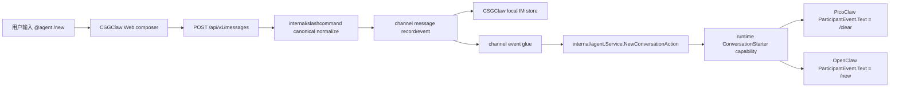
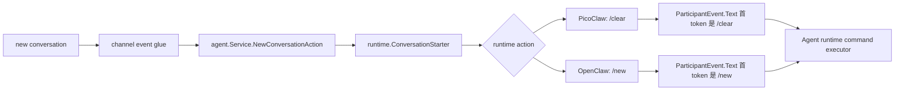
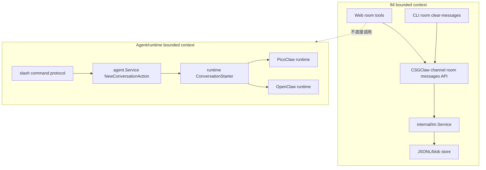

# CSGClaw IM Agent 历史清理方案

## 第二章节：CSGClaw 本地 channel 的 slash 清理设计，以及 PicoClaw、OpenClaw 对接方案

### 2.1 Slash 清理的边界

Agent 的上下文历史是 runtime/agent 的私有状态，不属于 `internal/im` 的消息持久化。当前代码已经能看到多层状态：

- IM room 消息：`internal/im.Service` 管理，存放在 `~/.csgclaw/im/sessions`。
- PicoClaw/OpenClaw sandbox：CSGClaw 通过 sandbox gateway 启动外部 runtime，并注入 CSGClaw channel 环境变量，runtime 内部历史由其自身维护。
- Codex 是 CSGClaw 本地 channel 中的内置 runtime，用户只通过 CSGClaw channel 发送 `/new` 触发，不设计独立的外部 channel 对接方案。
- Feishu 等 runtime 直连外部 channel 不属于本文的 `/new` 协议入口；直接对 runtime 外部 channel 发送消息时，按该 runtime 的原生命令能力处理。

slash 清理满足：

- 命令通过 IM 消息进入目标 Agent，保留可审计的用户意图。
- 清理范围由当前 room 和目标 Agent 决定，不按 thread 拆分。
- CSGClaw 不跨模块删除 sandbox 内部文件。
- `new` 只会重置 Agent 会话上下文（runtime session），不会清理 IM room 消息。

### 2.2 统一 slash 命令协议

新增内置 slash 命令（用户语义为“当前会话上下文重置”）：

```text
/new
/new conversation
```

这是 CSGClaw 本地 channel 对用户暴露的统一命令。CSGClaw 内部保留 canonical form：

```xml
<slash-command name="new" arg="conversation"></slash-command>
```

带说明文本时：

```xml
<slash-command name="new" arg="conversation"></slash-command> reset before rebuild
```

命令字段：

| 字段 | 含义 |
|---|---|
| `name` | 固定为 `new` |
| `arg` | 清理范围，当前实现支持 `conversation` |
| `body` | 可选原因或备注，不参与权限判断 |

注意：

- `/new` 的目标是重置 Agent 会话上下文，并不对应“删除 IM 历史消息”。
- 在 CSGClaw 本地 channel 中，对外统一仅支持 `/new`。
- `/new` 与 runtime 内部重置命令（PicoClaw 为 `/clear`，OpenClaw 为 `/new`）是 CSGClaw runtime adapter 的映射关系，不在 Feishu channel 中重复实现。

当前实现统一支持 `conversation`，并且不再区分主线/线程（即“当前 room 全量”）：

- 在当前 room 中：清理被提及 Agent 在该 room 的全部会话历史（包含 room 根消息和该 room 下所有 thread）。
- 在群聊里通过 @mention 命中某 Agent 时：只对该被提及 Agent 生效；未命中时不在多个 Agent 之间广播清理动作。

当前不支持：

- `agent`：清理某 Agent 在多个 room 的全部历史。
- `all`：清理所有 Agent 历史。

这些范围更危险，后续配合权限和确认机制单独设计。

runtime 适配关系：

| runtime | CSGClaw canonical command | runtime 原生命令/处理方式 |
|---|---|---|
| PicoClaw sandbox | `new conversation` | 映射为 PicoClaw 原生命令 `/clear`（清空当前 `opts.SessionKey` 的 context） |
| OpenClaw sandbox | `new conversation` | 映射为 OpenClaw 原生命令 `/new`（重置当前 `session`） |

CSGClaw 本地 channel 不把 PicoClaw 的 `/clear` 这类 runtime 原生命令作为用户侧统一协议。各 runtime 的原生命令只在 CSGClaw runtime adapter 内部使用，用户侧统一只看到 `/new`。Codex 只在 CSGClaw 本地 channel 路径中响应 `/new`，不在本文展开独立对接方案。

命令依据：

- PicoClaw 本地代码已经实现 `/clear`，会重置当前 `opts.SessionKey` 的会话上下文和摘要（不涉及 IM 平台聊天记录）。
- OpenClaw 官方 slash command 文档定义 `/new`，用于原地 reset 当前 session；当前实现使用 `/new`。参考：https://docs.openclaw.ai/tools/slash-commands

### 2.3 前端 slash 归一化设计

现状：

- `internal/slashcommand` 支持解析 `<slash-command ...>`。
- Web composer 当前把 `/xxx` 简写归一化成 `use-skill`。
- MessageContent 当前主要把 `use-skill` 渲染成 slash command card。

前端增加内置命令 registry：

```ts
type SlashCommandDefinition = {
  name: string;
  defaultArg?: string;
};

const builtinSlashCommands = [
  { name: "new", defaultArg: "conversation" },
];
```

归一化规则：

1. 用户输入 `/new`：
   - 输出 `<slash-command name="new" arg="conversation"></slash-command>`。
2. 用户输入 `/skill-name ...`：
   - 继续输出 `<slash-command name="use-skill" arg="skill-name"></slash-command> ...`。
3. 非法 slash 保持普通文本或报现有 malformed slash 错误，不新增模糊行为。

UI 提示：

- slash picker 中区分展示 built-in commands 和 skill candidates。
- `new` 不依赖 agent workspace skills 列表，即使 skills 还没加载也可提示。

### 2.4 后端 slash parser 设计

`internal/slashcommand/command.go` 新增常量：

```go
const (
    UseSkillCommandName     = "use-skill"
    NewConversationCommandName = "new"
)
```

新增 helper：

```go
func IsNewConversationCommand(cmd Command) bool {
    return strings.EqualFold(strings.TrimSpace(cmd.Name), NewConversationCommandName)
}

func NormalizeNewConversationArg(arg string) (string, error) {
    switch strings.ToLower(strings.TrimSpace(arg)) {
    case "", "conversation":
        return "conversation", nil
    default:
        return "", fmt.Errorf("unsupported new scope %q", arg)
    }
}
```

`validate(cmd)` 已经允许不同 command name，不需要让 `new` 伪装成 `use-skill`。

### 2.5 CSGClaw 本地 channel 到各 runtime 的模块链路



CSGClaw 本地 channel 责任：

- 保留 slash command 原始语义。
- 把 canonical slash 作为用户意图传递给 agent dispatcher；CSGClaw 本地 channel 的审计/历史落在 `internal/im`。
- 不在 IM 层把 `new` 当作普通 skill。
- CSGClaw channel 负责把用户输入归一化为 canonical slash，并把消息送入现有 channel/event 链路。
- 在 channel event glue 中识别 canonical `/new`，调用 `internal/agent.Service.NewConversationAction` 获取目标 runtime action。
- 对 PicoClaw/OpenClaw runtime 输出 ParticipantEvent invocation，再走现有 ParticipantEvent 协议投递。
- Codex 仅在 CSGClaw 本地 channel 中响应 `/new`；不在本文设计外部 channel 或外部 Codex CLI 对接。

新增 agent service use-case 数据结构：

```go
type NewConversationRequest struct {
    Channel     string
    BotID       string
    RoomID      string
    ThreadRootID string
    Reason      string
}

type NewConversationAction struct {
    Mode         NewConversationActionMode
    BotEventText string
    AckText      string
}

type NewConversationActionMode string

const (
    NewConversationActionBotEvent NewConversationActionMode = "bot_event"
    NewConversationActionInternal NewConversationActionMode = "internal"
)
```

`internal/agent.Service` 增加 use-case 方法：

```go
func (s *Service) NewConversationAction(ctx context.Context, req NewConversationRequest) (NewConversationAction, error)
```

该方法负责：

- 根据 `BotID` 查 agent snapshot。
- 根据 agent 的 `RuntimeKind` 从现有 `runtimeRegistry` 找 runtime 实现。
- 组装 `agentruntime.Handle{RuntimeID, HandleID}`。
- 调用 runtime 的 `ConversationStarter` capability。
- 若目标 runtime 未实现该 capability，返回明确 unsupported error。

为避免 API/channel glue 显式判断 `RuntimeKind`，在 `internal/runtime` 增加可选能力接口：

```go
type ConversationStartRequest struct {
    Channel      string
    BotID        string
    RoomID       string
    ThreadRootID string
    Reason       string
}

type ConversationStartAction struct {
    Mode         ConversationStartActionMode
    BotEventText string
    AckText      string
}

type ConversationStartActionMode string

const (
    ConversationStartActionBotEvent ConversationStartActionMode = "bot_event"
    ConversationStartActionInternal ConversationStartActionMode = "internal"
)

type ConversationStarter interface {
    NewConversation(ctx context.Context, h Handle, req ConversationStartRequest) (ConversationStartAction, error)
}
```

实现约定：

- PicoClaw sandbox runtime 实现 `ConversationStarter`，返回 `Mode=bot_event`、`BotEventText="/clear"`。
- OpenClaw sandbox runtime 实现 `ConversationStarter`，返回 `Mode=bot_event`、`BotEventText="/new"`。
- `Mode=internal` 仅用于 CSGClaw 本地 channel 的内置 runtime 清理，不作为独立外部对接方案。
- `internal/agent.Service.NewConversationAction` 只面向 `runtime.ConversationStarter` 能力，不维护 `RuntimeKind -> 命令` 分支表。若目标 runtime 未实现该能力，则返回明确的 unsupported error。

模块边界：

- `internal/slashcommand`：只负责 CSGClaw canonical slash 的 parse/normalize/validate。
- `internal/channel/csgclaw`：只负责 channel 入站/出站适配、mention/room 解析，不维护 runtime 命令映射。
- `internal/channel/feishu`：只负责 Feishu 配置、平台消息发送/查询、fallback 展示和内部 MessageBus/SSE bridge；不解析或归一化用户侧 slash 输入，不识别 agent `/new` reset，不维护 runtime 原生命令映射。
- `internal/im`：只保存 CSGClaw 本地 channel 的消息、room、thread，不感知 runtime 原生命令。
- `internal/agent.Service`：负责根据 participant 或 bridge target ID 找 agent/runtime/handle，并调用 runtime `ConversationStarter` capability。
- `internal/api` 的 channel event glue：在 CSGClaw participant event bridge 投递前识别 canonical `/new`，并把 agent service 返回的 action 写回现有事件路径。
- PicoClaw/OpenClaw runtime：只执行自己的原生命令或内部清理接口。

CSGClaw 调用 Agent slash 的方式不是新增 RPC，而是复用现有 participant event bridge：



为了让原生命令被 runtime 识别，投递给 Agent 的 `ParticipantEvent.Text` 必须以原生 slash 命令作为第一个 token。不能把 `<at ...>` mention 放在命令前面，也不能把 canonical XML 直接投给 PicoClaw/OpenClaw 期待它识别原生命令。

#### 2.5.1 CSGClaw 本地 channel 落点

当前 CSGClaw 本地 channel 的消息链路是：

```text
internal/api.handleCreateMessage
-> internal/channel/csgclaw.Service.SendMessage
-> internal/im.Service.CreateMessage
-> internal/api.Handler.PublishParticipantEvent
-> internal/im.ParticipantBridge.PublishMessageEvent
-> /api/v1/channels/csgclaw/participants/{participantID}/events
```

实现 `/new` 时：

1. `internal/channel/csgclaw.Service.SendMessage` 继续只做 canonical normalize 与 `internal/im` 写入。
2. `internal/im.ParticipantBridge` 继续只负责事件排队与 SSE 投递，不查询 runtime，也不维护 runtime 原生命令映射。
3. 在 `internal/api.Handler.PublishParticipantEvent` 附近识别 `evt.Message.Content` 是否为 canonical `new conversation`。
4. 命中后，对每个实际要通知的目标 Agent 调用 `agent.Service.NewConversationAction`。
5. 对 PicoClaw/OpenClaw，把投递给目标 bridge 的 `im.ParticipantEvent.Text` 替换成 runtime 原生命令 `/clear` 或 `/new`，其余 room/thread/context 字段仍复用 `ParticipantBridge` 构造逻辑。
6. 对 Codex，仅在 CSGClaw 本地 channel 使用 `/new`，不通过外部 channel 或外部 CLI 对接。

注意：`ParticipantBridge` 当前按 room member 通知目标 bridge，且 `shouldNotifyParticipant` 不要求 mention。`/new` 的实现必须收紧路由语义：在直接对某个 agent 的 room 中可以不带 mention 生效；在群聊中必须 `@agent`，未 mention 不执行清理，且只对被 mention 的目标 agent 生效。API glue 层需要用 message mentions 过滤 participant bridge target，避免广播给所有 room member。

Feishu 说明：

- CSGClaw 的 `/api/v1/channels/feishu/participants/{participantID}/events` 是内部 SSE bridge，不是飞书开放平台入站 webhook。
- 当前 Feishu 真实入站由 runtime 自己的 Feishu/Lark channel 处理，CSGClaw server 不在该路径中把 `/new` 翻译成 `/clear`。
- 如果用户直接在 PicoClaw 的 Feishu channel 对话，清理历史应使用 PicoClaw 原生命令 `/clear`，或者由 PicoClaw 自身决定是否支持额外别名。

### 2.6 PicoClaw 对接方案

当前 CSGClaw 对 PicoClaw sandbox 注入的关键环境变量包括：

```text
CSGCLAW_BASE_URL
CSGCLAW_ACCESS_TOKEN
PICOCLAW_CHANNELS_CSGCLAW_BASE_URL
PICOCLAW_CHANNELS_CSGCLAW_ACCESS_TOKEN
PICOCLAW_CHANNELS_CSGCLAW_BOT_ID
```

PicoClaw 已有内部清理命令：

- 命令名：`/clear`
- 代码位置：PicoClaw `pkg/commands/cmd_clear.go`
- 执行链路：`commands.Executor` 在进入 LLM 前处理命令。
- 清理动作：重置 runtime 上 `opts.SessionKey` 的会话状态，最终执行 `agent.Sessions.SetHistory(opts.SessionKey, [])` 和 `agent.Sessions.SetSummary(opts.SessionKey, "")`。
- 作用范围：当前 `opts.SessionKey`，也就是当前 room 对应会话；清理时不按 thread 细分。

PicoClaw 通过 CSGClaw 本地 channel 的对接方式：

1. CSGClaw Web/API 将 `/new` 归一化成 canonical slash。
2. CSGClaw runtime slash adapter 识别目标 Agent 使用 PicoClaw sandbox。
3. adapter 将 canonical command 映射成 PicoClaw 原生命令：

```text
/clear
```

4. `internal/im.ParticipantBridge` 或专门的 agent slash dispatcher 向目标 PicoClaw participant bridge 投递 ParticipantEvent。
5. PicoClaw 通过 CSGClaw participant bridge 协议订阅并收到 message event。
6. PicoClaw command executor 在进入 LLM 前识别 `/clear`。
7. PicoClaw 根据 event context 计算自身 session key：
   - `roomID`
8. PicoClaw 清理该 Agent 当前 conversation 的内部历史。
9. PicoClaw 通过 CSGClaw participant bridge 协议回一条确认消息。

CSGClaw 和 PicoClaw 的协议是 HTTP/SSE：

```http
GET /api/v1/channels/csgclaw/participants/{participantID}/events
```

- PicoClaw 使用 `CSGCLAW_BASE_URL` 或 `PICOCLAW_CHANNELS_CSGCLAW_BASE_URL` 连接 CSGClaw。
- 请求带 `Authorization: Bearer <token>`。
- CSGClaw 返回 `text/event-stream`，事件名是 `message`。
- 事件 data 是 `im.ParticipantEvent`，包含 `channel=csgclaw`、`room_id`、`chat_id`、`thread_root_id`、`text`、`context`、`thread_context`，其中线程相关字段仅用于透传，不参与清理范围判断。

PicoClaw 回消息使用：

```http
POST /api/v1/channels/csgclaw/participants/{participantID}/messages
```

请求体：

```json
{
  "room_id": "room-123",
  "text": "已清理我在当前会话中的内部历史。IM 房间聊天记录未被清空。",
  "thread_root_id": "msg-root"
}
```

CSGClaw 投递给 PicoClaw 的 ParticipantEvent 关键字段：

```text
text = "/clear"
channel = "csgclaw"
room_id = 当前 room
chat_id = 当前 room
thread_root_id = 当前 thread root，可为空（保留透传，不影响清理范围）
context.channel = "csgclaw"
context.account = participant_id
context.chat_id = 当前 room
context.topic_id = 当前 thread root，可为空（保留透传，不影响清理范围）
```

因此 PicoClaw 不需要新增独立清理命令才能完成 CSGClaw 本地 channel 的当前能力。CSGClaw 要做的是把本地 channel 用户侧 `/new` 映射为 PicoClaw 原生 `/clear`，并确保 ParticipantEvent 的上下文仍指向当前 room。这个映射不覆盖 PicoClaw 直连 Feishu/Lark channel。

### 2.7 OpenClaw 对接方案

OpenClaw sandbox 注入的关键环境变量包括：

```text
CSGCLAW_BASE_URL
CSGCLAW_ACCESS_TOKEN
CSGCLAW_BOT_ID
```

OpenClaw 对接方式：

1. CSGClaw 解析用户侧 canonical slash。
2. runtime slash adapter 识别目标 Agent 使用 OpenClaw sandbox。
3. adapter 将 canonical command 映射成 OpenClaw 原生命令：

```text
/new
```

4. `internal/im.ParticipantBridge` 或专门的 agent slash dispatcher 向目标 OpenClaw participant bridge 投递 ParticipantEvent。
5. OpenClaw 通过 CSGClaw participant bridge HTTP/SSE 协议接收 message event。
6. OpenClaw gateway/channel adapter 将 event 交给 OpenClaw runtime。
7. OpenClaw command executor 在进入模型前识别 `/new`，原地 reset 当前 session。
8. OpenClaw 通过 `POST /api/v1/channels/csgclaw/participants/{participantID}/messages` 回确认。

CSGClaw 投递给 OpenClaw 的 ParticipantEvent 关键字段：

```text
text = "/new"
channel = "csgclaw"
room_id = 当前 room
chat_id = 当前 room
thread_root_id = 当前 thread root，可为空（保留透传，不影响清理范围）
context.channel = "csgclaw"
context.account = participant_id
context.chat_id = 当前 room
context.topic_id = 当前 thread root，可为空（保留透传，不影响清理范围）
```

OpenClaw 官方文档要求 slash command 是以 `/` 开头的 standalone message。CSGClaw 投递原生命令时只投递命令本身，不附加解释文本，不把 mention 放在命令前。IM 中保留用户原始的 `/new` 消息和 OpenClaw 回的确认消息，OpenClaw 内部 session 由 OpenClaw 自己 reset。

清理逻辑不通过 prompt 让模型“理解并手动清理”，也不由 CSGClaw 删除 OpenClaw 内部历史文件。

### 2.8 权限与防误清

当前触发范围约束：

- 基于现有 IM 分发链路和消息路由执行清理。
- 清理命令只影响收到该命令的 Agent，不影响同房间其他 Agent。

审计策略：

- IM 中保留用户发出的 slash 清理命令和 Agent 的确认消息。
- 不保存被清理的内部历史内容。
- 日志只记录 participant 或 agent id、room id、scope、结果，不记录消息正文或历史内容。

### 2.9 端到端场景

UI 清空 IM：

```text
用户点击房间工具 -> 清空聊天记录 -> room messages/threads 清空 -> Agent 内部历史不变
```

Agent slash 清理：

```text
用户在 CSGClaw channel 发送 @dev /new -> dev agent 清理自己的当前 conversation -> IM 消息仍可见
```

组合使用：

```text
1. 用户先发送 @dev /new
2. dev 回复清理成功
3. 用户再用 UI 清空房间聊天记录
4. IM 只剩空 room，dev 内部上下文也已清理
```

### 2.10 当前实现与补充

- 新增 CSGClaw channel-scoped room messages 清空 API。
- Web room tools 增加“清空聊天记录”。
- Web 前端调用 `/api/v1/channels/csgclaw/rooms/{id}/messages`，不调用无 channel URL。
- 增加 CLI：`csgclaw-cli room clear-messages <room-id> --channel csgclaw`。
- 新增 `room.messages_cleared` SSE，同步多窗口状态。
- 新增 `new` canonical slash 支持。
- 在 `internal/runtime` 增加 `ConversationStarter` optional capability。
- 在 `internal/agent.Service` 增加 `NewConversationAction` use-case 方法，集中完成 participant/bridge target -> agent/runtime/handle 查找与 capability 调用。
- CSGClaw 本地 channel 在现有 event glue 中识别 canonical `/new`，再调用 agent service use-case；不新增 `internal/channel/agentslash` 包。
- Feishu channel 不参与 agent `/new` reset；`handleFeishuEvents` 只按 Feishu mention 过滤 MessageBus 事件并原样转发。
- Codex 仅通过 CSGClaw 本地 channel 的 `/new` 使用，不列为独立对接项。
- runtime slash adapter 支持 PicoClaw：`new conversation` 映射为 PicoClaw 原生 `/clear`。
- runtime slash adapter 支持 OpenClaw：`new conversation` 映射为 OpenClaw 原生 `/new`。
- 后续可按需补充更大 scope 与失败策略，但当前范围仅保留 `conversation`。

## 架构边界总结



最终原则：

- IM 清理是 room 领域能力，归 `internal/im`。
- Agent 历史清理是 runtime 领域能力，归各 runtime。
- slash command 是两个领域之间的用户意图传递协议。
- UI 不跨层删除 runtime 状态，runtime 不反向修改 IM room 消息。
