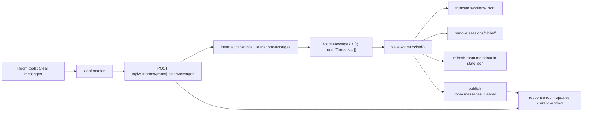

# CSGClaw IM Room Chat Cleanup Plan

## Background and Scope

Issue 2219 requires the CSGClaw IM room tools to support clearing chat history. Related Issue 2080 focuses on clearing the current Agent's internal chat history during Agent recreation so stale context does not affect model judgment.

This plan keeps the two requirements separate:

- The UI room tool only clears room messages, thread display state, and local persisted message files in CSGClaw IM.
- Each Agent's internal history is cleared through a slash command routed to the corresponding Agent/runtime, and the Agent/runtime clears its own session context.

Non-goals:

- UI chat cleanup does not delete the room, members, users, or bots.
- UI chat cleanup does not directly delete PicoClaw, OpenClaw, or Codex internal memory, sessions, workspace memory, or files.
- Agent slash cleanup does not clear IM room messages in reverse, unless a combined operation is designed separately later.

## Chapter 1: Current IM Message Storage, Write Timing, and UI Room Chat Cleanup

### 1.1 Current IM State and Message Storage

The default IM state path is generated by `config.DefaultIMStatePath()`:

```text
~/.csgclaw/im/state.json
```

The actual directory comes from `config.DefaultDir()` and `config.DefaultIMDir()`. By default it is `.csgclaw/im` under the user's home directory.

Current persistence layout:

```text
~/.csgclaw/im/
  state.json
  sessions/
    <roomID>.jsonl
    blobs/
      <roomID>/
        <messageID>.json
```

Responsibilities:

- `state.json`: maintained by `internal/im.Service`; stores current user, users, rooms, room members, room metadata, thread state, and each room's relative messages path.
- `sessions/<roomID>.jsonl`: message log for each room. Each line is a `sessionMessageLine`.
- `sessions/blobs/<roomID>/<messageID>.json`: when a single message is too large, content, event, and thread summary are moved out of the JSONL line into a blob file, while the JSONL line keeps only `blob_ref`.

Key code locations:

- `internal/config/config.go`: `DefaultIMStatePath()` and `DefaultIMDir()`.
- `cli/serve/serve.go`: service startup loads the default IM state through `newIMService()`.
- `internal/im/service.go`: `persistedBootstrap`, `persistedRoom`, and room/message/thread domain logic.
- `internal/im/session_store.go`: JSONL and blob read, write, migration, and cleanup.

### 1.2 Current IM Message Write Timing

`internal/im.Service` manages rooms with an in-memory map. All mutations first update memory and then call `saveLocked()` to persist.

Main write scenarios:

| Scenario | Current Behavior |
|---|---|
| `CreateRoom` | Creates a room and appends a `room_created` event message |
| `AddRoomMembers` | Updates members and appends a `room_members_added` event message |
| `CreateMessage` | Appends a user or frontend message to `room.Messages` |
| `DeliverMessage` | Appends or overwrites a bot/runtime message idempotently by message ID |
| `StartThread` | Creates `ThreadState` for the root message and saves the thread context snapshot |
| `DeleteRoom` | Saves state after deleting the room, and `cleanupSessionFiles` removes JSONL and blob files that are no longer referenced |

Therefore, "clear room chat history" should be provided as a new semantic operation by `internal/im.Service`, which centralizes messages, threads, JSONL, blob cleanup, and event notification.

### 1.3 UI Room Chat Cleanup Design

Add a room tools menu item:

```text
Room tools
  Show/hide tool calls
  Clear messages
  Delete room
```

Interaction rules:

- "Clear messages" is placed above "Delete room", uses destructive styling, and has copy and confirmation text that are distinct from room deletion.
- The confirmation copy must explain that only the current room's IM messages are cleared, and Agent internal history is not cleared.
- After cleanup succeeds, the room still exists, members remain unchanged, and the input box can still send messages.
- If the thread panel is open and the thread belongs to the cleared room, close the thread panel.
- After cleanup, the message list shows the `noMessages` empty state.

Frontend flow:

1. The user clicks room tools in `ConversationPane`.
2. The user clicks "Clear messages".
3. A confirmation dialog opens and shows the room title and cleanup scope.
4. The user confirms, and the frontend calls `clearRoomMessagesRequest(roomID)`.
5. After the request succeeds:
   - Upsert the cleared room returned by the HTTP response into the bootstrap cache.
   - Clear thread drafts for that room.
   - If the active thread belongs to that room, close the thread panel.
   - Close the tools menu and confirmation dialog.
6. If the request fails, show a localized error and leave frontend state unchanged.

### 1.4 New API

Add only an IM-native room custom method. The Web UI uses this route:

```http
POST /api/v1/rooms/{room}:clearMessages
```

Do not add these routes:

```http
DELETE /api/v1/channels/{channel}/rooms/{room}/messages
POST /api/v1/channels/{channel}/rooms/{room}/messages/clear
POST /api/v1/channels/{channel}/rooms/{room}:clearMessages
```

Rationale:

- "Clear chat history" is not room deletion or single-message deletion. It is a side-effecting action on a room, so it should use `POST` and `:clearMessages` in the Google AIP custom method style.
- `DELETE /rooms/{room}/messages` can be misunderstood as deleting a messages collection or bulk deleting message resources, instead of a clear action at room level.
- Cleanup only mutates local IM room state, session JSONL, and blobs. It is not a generic room capability for external channels such as Feishu.
- Putting it under `/api/v1/rooms/...` keeps API ownership aligned with state ownership, and lets the HTTP handler call `internal/im.Service.ClearRoomMessages(roomID)` directly.
- Do not add a channel-scoped entry point for now, to avoid solidifying an IM-native operation as a cross-channel capability.

Response:

```json
{
  "id": "room-123",
  "title": "general",
  "members": ["u-admin", "u-manager"],
  "messages": [],
  "threads": []
}
```

Error codes:

| Condition | Status |
|---|---:|
| room is empty or malformed | 400 |
| room does not exist | 404 |
| IM service is not configured | 503 |
| save fails | 500 |
| other business validation fails | 400 |

### 1.5 New Go Data Structures and Interfaces

No dedicated response DTO is added. The HTTP response directly returns the cleared `apitypes.Room`, staying consistent with room update APIs such as `CreateRoom` and `AddRoomMembers`.

Layering:

- The HTTP layer parses `roomID` from the URL and directly calls local `internal/im.Service.ClearRoomMessages(roomID)`.
- `internal/channel/csgclaw.Service` remains responsible for CSGClaw channel adaptation, such as bot ID/user ID conversion, slash content normalization, and future permission checks, but it does not own the ability to clear IM room messages.
- `internal/im.Service` handles local IM room/message data and owns the full "clear, persist, publish domain event" operation boundary.

The current message sending path uses channel adaptation:

```text
POST /api/v1/channels/csgclaw/messages
  -> API handler selects the csgclaw channel
  -> internal/channel/csgclaw.Service.SendMessage
  -> internal/im.Service.CreateMessage
```

The chat cleanup path is IM-native:

```text
POST /api/v1/rooms/{room}:clearMessages
  -> API handler parses roomID
  -> internal/im.Service.ClearRoomMessages(roomID)
```

`internal/im.Service.ClearRoomMessages` has no channel parameter because the capability belongs to the local IM room surface, not the cross-channel room surface.

`internal/im/service.go`:

```go
func (s *Service) ClearRoomMessages(roomID string) (Room, error)
```

`internal/apiclient/client.go`:

```go
func (c *Client) ClearRoomMessages(ctx context.Context, roomID string) (apitypes.Room, error)
```

`apiclient` must require a non-empty `roomID` and generate `POST /api/v1/rooms/{room}:clearMessages` through `roomClearMessagesPath(roomID)`. It does not expose a channel parameter and does not fall back to a channel-scoped route.

### 1.6 Backend Cleanup Flow

Thread messages are normalized into the room:

- The thread root message exists in `room.Messages`.
- Thread replies also exist in the same `room.Messages`, linked to the root through `relates_to.rel_type = "m.thread"` and `relates_to.event_id = rootMessageID`.
- `room.Threads` stores thread state, context snapshots, and summary indexes. It is not a second independent message table.
- Default room message display filters out thread replies. When `include_thread_replies=true` is set, or when the thread panel is opened, replies are fetched through the relation.

Therefore, IM room chat cleanup clears the entire room message collection in one operation:

```go
room.Messages = []RoomMessage{}
room.Threads = []RoomThread{}
```

This clears mainline messages, thread roots, thread replies, thread state summaries, and thread context snapshots. Persistence truncates `sessions/<roomID>.jsonl` and removes `sessions/blobs/<roomID>/`; no second cleanup flow is needed for threads.

Cleanup semantics are bounded by the room messages that have been persisted at call time. Messages delivered after cleanup may appear. For example, if a bot/runtime reply was already triggered before cleanup but only arrives through `DeliverMessage` after cleanup finishes, it can continue to appear as a new room message. This API does not attempt to cancel or filter such in-flight replies.



`ClearRoomMessages` steps:

1. Trim and validate `roomID`.
2. Acquire the write lock.
3. Find the room. If it does not exist, return `room not found`.
4. Set `room.Messages = []` and `room.Threads = []`.
5. Call room-scoped `saveRoomLocked()`, which saves only the current room's session JSONL/blob and refreshes room metadata in `state.json`.
6. Publish `room.messages_cleared` after persistence succeeds.
7. Return `presentRoomLocked(*room)`.

`ClearRoomMessages()` does not use the full `saveLocked() -> SaveBootstrap()` path. That avoids rewriting every room's session JSONL and scanning the whole `sessions` directory for a single-room cleanup operation. It reuses the existing JSONL/blob encoding and cleanup helpers, and updates only:

- `sessions/<roomID>.jsonl`
- `sessions/blobs/<roomID>/`
- this room's metadata in `state.json`, especially `Threads`

When the target room has no messages, `saveMessagesJSONL()` creates or truncates `sessions/<roomID>.jsonl` and removes that room's blob directory. To avoid keeping an empty blob directory for empty messages, add a cleanup branch in `saveMessagesJSONL()`:

```go
if len(messages) == 0 {
    truncateSessionJSONL(path)
    return removeRoomSessionBlobs(sessionsRoot, roomID)
}
```

This makes cleanup semantics direct and avoids creating a blob directory only to clean it up immediately.

### 1.7 Frontend State Updates

After `internal/im.Service.ClearRoomMessages()` persists successfully, it publishes the `room.messages_cleared` SSE event. The event payload includes the cleared `room`. The frontend `applyIMEvent(room.messages_cleared)` writes that room back as the authoritative room state in bootstrap data, so other windows or tabs can synchronize through SSE.

After the user confirms, the frontend calls `clearRoomMessagesRequest(roomID)`. When the request succeeds, the current window immediately upserts the cleared room from the HTTP response. If `room.messages_cleared` later arrives through SSE, the frontend converges through the same room-level authoritative update path.

The success callback in `useConversationController` also:

- Calls `closeThread()` if the cleared `roomID` is the currently open room.
- Clears thread drafts for the current room.
- Does not clear the normal composer draft, because the user may already be typing the next message.

### 1.8 IM Domain Event Boundary Design

After introducing `room.messages_cleared`, IM state mutation and event publication boundaries should stay clear. The long-term direction is: every IM domain state change is handled by `internal/im.Service`, which performs validation, mutates in-memory state, persists, and publishes the domain event. HTTP/API/CLI/channel layers should only parse requests, adapt channels, call services, and return responses.

Current event publication is mixed:

- `internal/im.Service` mutates and saves IM in-memory state.
- `internal/api.Handler` publishes `message.created`, `room.created`, `room.members_added`, `thread.created`, and `thread.updated` after some requests succeed.
- `internal/im.Provisioner` publishes user, room, and message events during initialization.
- `ClearRoomMessages()` has already started publishing `room.messages_cleared` from `internal/im.Service`.

The risk is that state mutation and event publication do not share the same domain operation boundary. Under concurrent requests, event order can differ from the actual state write order. Example:

```text
A: ClearRoomMessages saves successfully
A: releases im.Service lock
B: CreateMessage saves successfully
B: API layer publishes message.created
A: publishes room.messages_cleared
```

If the frontend receives `message.created` first and then the delayed `room.messages_cleared`, the empty room state can overwrite the newly appended message until the next refresh or bootstrap reload.

Target layering:

```text
api.Handler
  - parse request
  - auth/channel dispatch where applicable
  - call im.Service or channel service
  - write response

internal/channel/csgclaw.Service
  - channel adapter for channel-owned operations
  - bot/user id normalization if needed
  - delegate to im.Service

internal/im.Service
  - validate domain input
  - mutate room/user/thread/message state
  - persist state
  - publish IM domain events
```

Domain event ownership:

- `CreateRoom` -> `room.created`
- `AddRoomMembers` -> `room.members_added`
- `CreateMessage` -> `message.created`
- `DeliverMessage` -> `message.created`, and `thread.updated` when needed
- `StartThread` -> `thread.created`
- `ClearRoomMessages` -> `room.messages_cleared`
- `DeleteUser` -> `user.deleted`

Simple implementation approach:

1. Publish all IM domain events from `internal/im.Service`.
2. Each write operation validates input, mutates state, and persists under `s.mu`.
3. Publish the corresponding event after persistence succeeds and before releasing the lock.
4. `Bus.Publish()` is currently non-blocking and drops events when the channel is full, so publishing under the lock does not introduce long blocking.
5. Remove domain-event backfill logic such as `publishMessageCreated()`, `publishRoomEvent()`, and `publishThreadEvent()` from the API layer. Keep only HTTP responses and non-IM-domain side effects there.

A more complete evolution is to add a monotonic `seq` or `version` to `im.Event`:

1. Every IM write operation allocates an event sequence in the service.
2. Events may be published after releasing the lock, but still carry domain state order.
3. The frontend applies events by sequence and ignores stale events.
4. This reduces concerns around publishing under the lock, but requires more protocol and frontend state-management changes.

For this phase, prefer the simple approach: let `im.Service` serialize state writes and event publication so event order matches persistence order. If IM event volume grows or cross-process synchronization becomes necessary, introduce sequence/version later.

### 1.9 CLI Room Chat Cleanup Deferred

Do not add a `room clear-messages` CLI subcommand in this phase.

The reason is that chat cleanup is now explicitly an IM-native API, not a cross-channel room capability. The `room` CLI currently covers both CSGClaw and Feishu channel room operations. Adding `room clear-messages --channel csgclaw` now would solidify this capability as a generic room/channel command. If CLI support is needed later, design a command entry that aligns with `/api/v1/rooms/{room}:clearMessages` and does not imply Feishu/channel-wide support.

### 1.10 Test Coverage

Backend:

- `internal/im/service_test.go`
  - `ClearRoomMessages` preserves room and members.
  - Clears messages and threads.
  - Messages and threads remain empty after reloading state.
  - Only rewrites the target room session and does not rewrite other room sessions.
  - Publishes `room.messages_cleared` after persistence succeeds.
- `internal/im/session_store_test.go`
  - After cleanup, `sessions/<roomID>.jsonl` is empty or missing but loads as empty.
  - After cleanup, `sessions/blobs/<roomID>/` is removed.
- `internal/api/handler_test.go`
  - `POST /api/v1/rooms/{room}:clearMessages` returns the cleared room.
  - A missing room returns 404.
  - `room.messages_cleared` SSE is published through the IM service.
- `internal/apiclient/client_test.go`
  - `ClearRoomMessages(ctx, roomID)` builds `/api/v1/rooms/{roomID}:clearMessages`.
  - Empty roomID returns an argument error.

Frontend:

- `web/app/tests/models/conversations.test.ts`
  - `applyIMEvent(room.messages_cleared)` clears target room messages/threads and does not affect other rooms.
- `web/app/tests/hooks/useConversationController.test.ts`
  - After local cleanup, the room remains selected and the thread panel closes.
- `web/app/tests/components/ConversationPane.test.tsx`
  - Room tools show "Clear messages".
  - Clicking it requires confirmation and does not directly delete the room.
  - Confirmation calls `/api/v1/rooms/{roomID}:clearMessages`, not `/api/v1/rooms/{roomID}/messages`.
