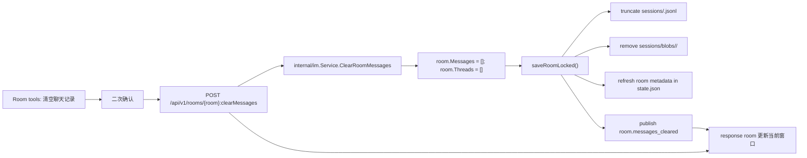

# CSGClaw IM 房间聊天记录清空方案

## 背景与范围

Issue 2219 要求在 CSGClaw IM 的房间工具中支持清空聊天记录。关联 Issue 2080 关注的是“Agent 在重建过程中清空当前 Agent 历史聊天记录，避免影响大模型判断”。

本方案将两个需求边界拆开：

- UI 房间工具只清理 CSGClaw IM 中的 room 消息、thread 展示状态和本地消息落盘文件。
- 各 Agent 内部历史记录通过 slash 命令进入对应 Agent/runtime，由 Agent/runtime 自己清理其会话上下文。

非目标：

- UI 清空聊天记录不删除 room，不删除 members，不删除 users，不删除 participants 或 agents。
- UI 清空聊天记录不直接删除 PicoClaw、OpenClaw、Codex 的内部记忆、会话、workspace memory 或文件。
- Agent slash 清理不反向清空 IM 房间消息，除非后续单独设计组合操作。

## 第一章节：当前 IM 消息记录存放位置和时机，以及 UI 工具清理房间聊天记录

### 1.1 当前 IM 状态与消息存放位置

默认 IM state 路径由 `config.DefaultIMStatePath()` 生成：

```text
~/.csgclaw/im/state.json
```

实际目录来自 `config.DefaultDir()` 和 `config.DefaultIMDir()`，默认是用户 home 下的 `.csgclaw/im`。

当前持久化结构：

```text
~/.csgclaw/im/
  state.json
  sessions/
    <roomID>.jsonl
    blobs/
      <roomID>/
        <messageID>.json
```

职责划分：

- `state.json`：由 `internal/im.Service` 维护，存放 current user、users、rooms、room members、room metadata、thread state，以及每个 room 的 messages 相对路径。
- `sessions/<roomID>.jsonl`：每个 room 的消息记录。每行是一个 `sessionMessageLine`。
- `sessions/blobs/<roomID>/<messageID>.json`：当单条消息过大时，正文、event、thread summary 会从 JSONL 行中挪到 blob 文件，JSONL 行只保留 `blob_ref`。

关键代码位置：

- `internal/config/config.go`：`DefaultIMStatePath()`、`DefaultIMDir()`。
- `cli/serve/serve.go`：服务启动时通过 `newIMService()` 加载默认 IM state。
- `internal/im/service.go`：`persistedBootstrap`、`persistedRoom`、room/message/thread 领域逻辑。
- `internal/im/session_store.go`：JSONL 与 blob 的读写、迁移和清理。

### 1.2 当前 IM 消息写入时机

`internal/im.Service` 以内存 map 管理 room，所有修改都先改内存，再调用 `saveLocked()` 落盘。

主要写入场景：

| 场景 | 当前行为 |
|---|---|
| `CreateRoom` | 创建 room，并追加 `room_created` event message |
| `AddRoomMembers` | 修改 members，并追加 `room_members_added` event message |
| `CreateMessage` | 用户或前端发送消息，追加到 `room.Messages` |
| `DeliverMessage` | Agent/runtime 回写消息，按 message id 幂等追加或覆盖 |
| `StartThread` | 给 root message 创建 `ThreadState`，并保存 thread context snapshot |
| `DeleteRoom` | 删除 room 后保存 state，`cleanupSessionFiles` 清理不再被引用的 JSONL 和 blob |

因此，“清空房间聊天记录”由 `internal/im.Service` 提供新的语义操作，集中处理 messages、threads、JSONL、blob 和事件通知。

### 1.3 UI 清理房间聊天记录的设计

新增 room 工具菜单项：

```text
房间工具
  显示/隐藏工具调用
  清空聊天记录
  删除房间
```

交互规则：

- “清空聊天记录”放在“删除房间”上方，使用危险样式，但文案和二次确认要与删除房间区分。
- 二次确认文案必须说明：只清空当前房间 IM 消息，不清空各 Agent 内部历史。
- 清理成功后，当前 room 仍然存在，成员不变，输入框可继续发送消息。
- 如果当前打开 thread panel，且 thread 属于该 room，则关闭 thread panel。
- 清理后消息列表显示 `noMessages` 空状态。

前端详细流程：

1. 用户点击 `ConversationPane` 的 room tools。
2. 用户点击“清空聊天记录”。
3. 弹出确认 Dialog，展示 room title 和清理范围。
4. 用户确认后调用 `clearRoomMessagesRequest(roomID)`。
5. 请求成功后：
   - 将 HTTP response 中返回的 cleared room upsert 到 bootstrap cache。
   - 清理该 room 下的 thread drafts。
   - 如果当前 active thread 属于该 room，关闭 thread panel。
   - 关闭工具菜单和确认弹窗。
6. 请求失败后显示本地化错误，不改变前端状态。

### 1.4 新增接口 API

只新增 IM-native room custom method，Web UI 走这条路径：

```http
POST /api/v1/rooms/{room}:clearMessages
```

不新增下面这些接口：

```http
DELETE /api/v1/channels/{channel}/rooms/{room}/messages
POST /api/v1/channels/{channel}/rooms/{room}/messages/clear
POST /api/v1/channels/{channel}/rooms/{room}:clearMessages
```

原因：

- “清空聊天记录”不是删除 room，也不是删除单条 message，而是对 room 执行一个有副作用的清空动作；按 Google AIP custom method 风格，应使用 `POST` 和 `:clearMessages`。
- `DELETE /rooms/{room}/messages` 容易被误解为删除 messages 集合资源或批量删除 message 资源，而不是明确的 room-level clear action。
- 清空聊天记录只操作本地 IM room 状态、session JSONL 和 blob，不是 Feishu 等外部 channel 的通用 room 能力。
- 放在 `/api/v1/rooms/...` 下可以让 API ownership 与状态归属一致，HTTP handler 直接调用 `internal/im.Service.ClearRoomMessages(roomID)`。
- 暂不新增 channel-scoped 入口，避免把 IM-native 操作固化为跨 channel 能力。

响应：

```json
{
  "id": "room-123",
  "title": "general",
  "members": ["admin", "manager"],
  "messages": [],
  "threads": []
}
```

错误码：

| 条件 | 状态码 |
|---|---:|
| room 为空 / 格式非法 | 400 |
| room 不存在 | 404 |
| IM service 未配置 | 503 |
| 保存失败 | 500 |
| 其他业务校验失败 | 400 |

### 1.5 新增 Go 数据结构与接口

不新增专门的 response DTO。HTTP response 直接返回清空后的 `apitypes.Room`，与 `CreateRoom`、`AddRoomMembers` 这类 room 更新接口保持一致。

接口分层如下：

- HTTP 层从 URL 解析出 `roomID`，直接调用本地 `internal/im.Service.ClearRoomMessages(roomID)`。
- `internal/channel/csgclaw.Service` 继续负责 CSGClaw channel 适配，例如 participant/user ID 转换、slash 内容归一化、后续权限校验，但不承载清空 IM room 消息的能力。
- `internal/im.Service` 处理本地 IM room/message 数据，负责“清空、落盘、发布领域事件”的完整操作边界。

当前消息发送链路也是这个模式：

```text
POST /api/v1/channels/csgclaw/messages
  -> api handler 选择 csgclaw channel
  -> internal/channel/csgclaw.Service.SendMessage
  -> internal/im.Service.CreateMessage
```

清理聊天记录沿用同样的链路：

```text
POST /api/v1/rooms/{room}:clearMessages
  -> api handler 解析 roomID
  -> internal/im.Service.ClearRoomMessages(roomID)
```

所以 `internal/im.Service.ClearRoomMessages` 没有 channel 参数，是因为该能力归属于本地 IM room，而不是跨 channel room surface。

`internal/im/service.go`：

```go
func (s *Service) ClearRoomMessages(roomID string) (Room, error)
```

`internal/apiclient/client.go`：

```go
func (c *Client) ClearRoomMessages(ctx context.Context, roomID string) (apitypes.Room, error)
```

`apiclient` 必须要求 `roomID` 非空，并通过 `roomClearMessagesPath(roomID)` 生成 `POST /api/v1/rooms/{room}:clearMessages`。不提供 channel 参数，也不回退到 channel-scoped route。

### 1.6 后端清理流程

Thread 消息按 room 归一化存储：

- thread root message 存在 `room.Messages`。
- thread reply 也存在同一个 `room.Messages`，通过 `relates_to.rel_type = "m.thread"` 和 `relates_to.event_id = rootMessageID` 关联 root。
- `room.Threads` 存的是 thread 状态、上下文快照和摘要索引，不是另一份独立消息表。
- 默认展示 room messages 时会过滤 thread reply；带 `include_thread_replies=true` 或打开 thread panel 时再按 relation 取出 thread reply。

因此 IM 清理房间聊天记录时一次性清理整个 room 的消息集合：

```go
room.Messages = []RoomMessage{}
room.Threads = []RoomThread{}
```

这会同时清理主线消息、thread root、thread reply、thread 状态摘要和 thread context snapshot。落盘时统一截断 `sessions/<roomID>.jsonl`，删除 `sessions/blobs/<roomID>/`，不再为 thread 单独设计第二套清理流程。

清空语义以调用时刻已经落盘的 room 消息为边界：清空只删除调用时刻之前已落盘消息，之后到达的消息允许出现。例如清空前已经触发但尚未回写的 agent/runtime reply，如果在清空完成后才通过 `DeliverMessage` 到达，可以作为新的 room 消息继续出现；本接口不尝试取消或过滤这类 in-flight 回复。



`ClearRoomMessages` 内部步骤：

1. trim 并校验 `roomID`。
2. 加写锁。
3. 查找 room，不存在返回 `room not found`。
4. 设置 `room.Messages = []`，`room.Threads = []`。
5. 调用 room-scoped `saveRoomLocked()`，只保存当前 room 的 session JSONL/blob，并刷新 `state.json` 中的 room metadata。
6. 持久化成功后发布 `room.messages_cleared` 事件。
7. 返回清空后的 `presentRoomLocked(*room)`。

`ClearRoomMessages()` 不走全量 `saveLocked() -> SaveBootstrap()`，避免为单个 room 的清空操作重写所有 room 的 session JSONL，并避免扫描清理整个 `sessions` 目录。它复用现有 JSONL/blob 编码和 cleanup helper，只更新：

- `sessions/<roomID>.jsonl`
- `sessions/blobs/<roomID>/`
- `state.json` 中该 room 的 metadata，尤其是 `Threads`

当目标 room 的 messages 为空时，`saveMessagesJSONL()` 会创建或截断 `sessions/<roomID>.jsonl`，并删除该 room 的 blob 目录。为了避免空消息也保留空 blob 目录，在 `saveMessagesJSONL()` 中增加清空分支：

```go
if len(messages) == 0 {
    truncateSessionJSONL(path)
    return removeRoomSessionBlobs(sessionsRoot, roomID)
}
```

这样清空语义更直接，也避免先创建 blob dir 再清理。

### 1.7 前端状态更新

`internal/im.Service.ClearRoomMessages()` 持久化成功后发布 `room.messages_cleared` SSE，event payload 带清空后的 `room`。前端 `applyIMEvent(room.messages_cleared)` 将该 room 作为权威状态写回 bootstrap data，因此其他窗口或标签页可以通过 SSE 同步清空结果。

前端点击确认后调用 `clearRoomMessagesRequest(roomID)`，请求成功后当前窗口立即 upsert HTTP response 中的 cleared room；随后如果收到 `room.messages_cleared` SSE，会再按同一 room-level authoritative update path 收敛。

`useConversationController` 的请求成功回调中额外处理：

- 如果清空的 `roomID` 是当前打开 room，调用 `closeThread()`。
- 清理当前 room 的 thread drafts。
- 不清理普通 composer draft，用户可能正在输入下一条消息。

### 1.8 IM domain event 收口设计

`room.messages_cleared` 事件引入后，IM 状态变化和事件发布的边界需要保持清晰。长期方向是：所有 IM 领域状态变化都由 `internal/im.Service` 负责完成“校验、修改内存状态、落盘、发布领域事件”，HTTP/API/CLI/channel 层只负责解析请求、做 channel 适配、调用 service 和返回响应。

当前代码中事件发布存在混合来源：

- `internal/im.Service` 负责修改 IM 内存状态和保存。
- `internal/api.Handler` 在部分请求成功后发布 `message.created`、`room.created`、`room.members_added`、`thread.created`、`thread.updated`。
- `internal/im.Provisioner` 会发布初始化相关的 user、room、message event。
- `ClearRoomMessages()` 已经开始在 `internal/im.Service` 内发布 `room.messages_cleared`。

这种混合模式的风险是：状态变化和事件发布不在同一个领域操作边界里。并发请求下，事件顺序可能和真实状态写入顺序不一致。例如：

```text
A: ClearRoomMessages 保存成功
A: 释放 im.Service 锁
B: CreateMessage 保存成功
B: API 层发布 message.created
A: 发布 room.messages_cleared
```

如果前端先收到 `message.created`，再收到迟到的 `room.messages_cleared`，就可能用空 room 状态覆盖刚追加的新消息，直到下一次刷新或 bootstrap reload 才恢复。

目标分层如下：

```text
api.Handler
  - parse request
  - auth/channel dispatch where applicable
  - call im.Service or channel service
  - write response

internal/channel/csgclaw.Service
  - channel adapter for channel-owned operations
  - participant/user ID normalization if needed
  - delegate to im.Service

internal/im.Service
  - validate domain input
  - mutate room/user/thread/message state
  - persist state
  - publish IM domain events
```

对应的领域事件归属：

- `CreateRoom` -> `room.created`
- `AddRoomMembers` -> `room.members_added`
- `CreateMessage` -> `message.created`
- `DeliverMessage` -> `message.created`，必要时触发 `thread.updated`
- `StartThread` -> `thread.created`
- `ClearRoomMessages` -> `room.messages_cleared`
- `DeleteUser` -> `user.deleted`

简单稳妥的实现方式：

1. 所有 IM domain event 都从 `internal/im.Service` 发布。
2. 每个写操作在 `s.mu` 保护下完成校验、状态修改和持久化。
3. 持久化成功后、释放锁前发布对应事件。
4. `Bus.Publish()` 当前是非阻塞发送，channel 满时会 drop，因此在锁内发布不会引入长时间阻塞。
5. API 层删除 `publishMessageCreated()`、`publishRoomEvent()`、`publishThreadEvent()` 这类 domain event 补发逻辑，只保留 HTTP 响应和非 IM 领域副作用。

更完整的演进方式是给 `im.Event` 增加单调递增的 `seq` 或 `version`：

1. 每个 IM 写操作在 service 内分配 event sequence。
2. 事件可以在释放锁后发布，但仍携带领域状态顺序。
3. 前端按 sequence 应用事件，忽略过期事件。
4. 这种方式可以减少持锁发布的顾虑，但需要更多协议和前端状态管理改造。

本阶段优先使用简单稳妥版：让 `im.Service` 串行化状态写入和事件发布，保证事件顺序与持久化顺序一致。后续如果 IM event 量增大或需要跨进程同步，再引入 sequence/version 机制。

### 1.9 CLI 清理房间聊天记录暂缓

本阶段不新增 `room clear-messages` CLI 子命令。

原因是清空聊天记录已经明确归属于 IM-native API，而不是跨 channel room 能力。`room` CLI 当前同时承载 CSGClaw 和 Feishu channel room 操作，如果现在加入 `room clear-messages --channel csgclaw`，会把该能力固化为 generic room/channel 命令。等后续确认需要 CLI 操作时，再设计一个与 `/api/v1/rooms/{room}:clearMessages` 一致、不会误导为 Feishu/channel 通用能力的命令入口。

### 1.10 测试覆盖

后端：

- `internal/im/service_test.go`
  - `ClearRoomMessages` 保留 room 和 members。
  - 清空 messages 和 threads。
  - 重新加载 state 后 messages/threads 仍为空。
  - 只重写目标 room 的 session，不重写其他 room session。
  - 持久化成功后发布 `room.messages_cleared` 事件。
- `internal/im/session_store_test.go`
  - 清空后 `sessions/<roomID>.jsonl` 为空或不存在但可加载为空。
  - 清空后 `sessions/blobs/<roomID>/` 被删除。
- `internal/api/handler_test.go`
  - `POST /api/v1/rooms/{room}:clearMessages` 返回清空后的 room。
  - 不存在 room 返回 404。
  - 通过 IM service 发布 `room.messages_cleared` SSE。
- `internal/apiclient/client_test.go`
  - `ClearRoomMessages(ctx, roomID)` path 拼接为 `/api/v1/rooms/{roomID}:clearMessages`。
  - 空 roomID 返回参数错误。

前端：

- `web/app/tests/models/conversations.test.ts`
  - `applyIMEvent(room.messages_cleared)` 清空目标 room messages/threads，不影响其他 room。
- `web/app/tests/hooks/useConversationController.test.ts`
  - 本地调用清空后 room 仍选中，thread panel 关闭。
- `web/app/tests/components/ConversationPane.test.tsx`
  - room tools 显示“清空聊天记录”。
  - 点击后需要确认，不直接调用删除。
  - 确认后调用 `/api/v1/rooms/{roomID}:clearMessages`，不调用 `/api/v1/rooms/{roomID}/messages`。
