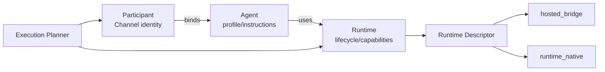
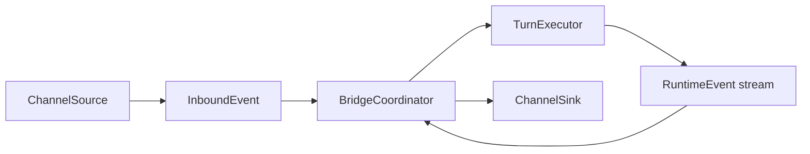
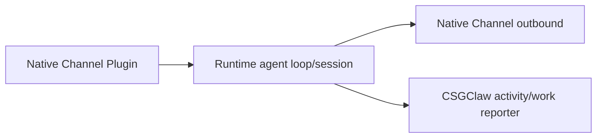

# Agent / Channel / Runtime 架构改造方案

## 1. 背景与结论

本文用于梳理 CSGClaw 中 Agent、Channel、Runtime，尤其是 Codex 与 OpenClaw
两类 Runtime 的职责边界、接口设计和后续改造顺序。

结论先行：

- 统一 Agent、Participant、Channel、Runtime 的控制面契约。
- 数据面保留“CSGClaw 宿主桥接”和“Runtime 原生通道”两种执行模式。
- 不强制 Codex 和 OpenClaw 使用完全相同的物理调用链。
- Participant 继续作为 Channel 身份和 Agent Binding 的唯一事实源。
- Runtime 生命周期接口保持轻量，通过窄能力接口补充 Turn 执行、Binding
  刷新等能力。
- 第一阶段只抽取契约、消除具体类型依赖，不改变现有用户行为和公开 API。

目标不是再增加一条 `Channel × Runtime` 专用桥接，而是让新增 Channel 或
Runtime 时只实现各自一侧的 Adapter，避免形成 N×M 组合。

## 2. 当前架构

### 2.1 已有领域关系

当前总体领域关系保持为：

```text
Channel -> Room -> Participant -> Agent -> Runtime -> Sandbox
```

各对象职责如下：

| 对象 | 当前及目标职责 |
| --- | --- |
| Channel | 外部或内建的消息交互面，如 CSGClaw IM、Feishu |
| Room | Channel 内的会话与协作容器 |
| Participant | Channel 内稳定身份，可绑定 Human、Agent 或 Notification |
| Agent | 执行身份，保存 Profile、Instructions、Runtime 选择等信息 |
| Runtime | Agent 的执行环境与生命周期实现，如 Codex、OpenClaw、PicoClaw |
| Sandbox | Runtime 可选的隔离后端，如 BoxLite |

必须保持以下身份边界：

- Channel API 边界使用 `participant_id`。
- Runtime 执行边界使用 `agent_id` 和 `runtime_id`。
- `channel_user_ref` 只表达 Channel 内的真实用户或应用身份。
- 不再把 `bot_id` 同时用作 Participant、Agent 和 Runtime 标识。

### 2.2 已经完成的基础改造

Runtime 生命周期抽象已经具备正确的基本形态：

- `internal/runtime.Runtime` 负责 `New`、`Start`、`Stop`、`Delete`、`State`
  和 `Info`。
- `internal/runtime.Provisioner` 负责 Workspace、配置文件和 Runtime 环境准备。
- Codex、OpenClaw Sandbox 已经注册到 Runtime Registry。
- `Feishu -> Codex -> Feishu` 已有可运行的纵向链路：
  `channelbridge.FeishuClient` 消费 Feishu WebSocket 事件，再交给 Codex bridge。

因此本次不需要重做 Runtime 生命周期抽象，也不需要重新实现
Feishu-to-Codex 链路。

### 2.3 当前主要问题

#### Codex bridge 依赖具体 Runtime 类型

`internal/channelbridge/codexmanager` 从 Runtime Registry 取出 Codex Runtime
后，仍断言为 `*runtimecodex.Runtime`，并直接访问 SessionManager、EventSink、
PermissionBroker 和 UserInputBroker。

这说明当前 Runtime 生命周期接口之外，缺少稳定的 Turn 执行能力契约。

#### Channel 入站与出站职责未拆分

当前 `channelbridge.BotClient` 同时提供：

- `StreamEvents`：Channel 入站；
- `SendMessage`：Channel 出站。

同时接口仍使用 Bot 命名，难以表达 Participant、Channel Binding、消息更新、
Reaction 和能力差异。

#### Binding 刷新存在 Runtime 硬编码

Agent 外部 Binding 更新时：

- Codex 通过 host-side bridge 热刷新；
- 其他 Runtime 默认 Recreate。

该判断目前位于 Agent Service 中。目标应改为 Runtime 自己声明 Binding
是否支持热刷新、配置重载或必须重启。

#### OpenClaw extension 职责过重

`openclaw-csgclaw-extension/src/monitor.ts` 同时承担：

- CSGClaw SSE 消费与重连；
- Feishu internal SSE 消费；
- OpenClaw route/session 解析；
- Turn 调度与取消；
- Work Lease 上报；
- Tool、Thinking、Final 等活动转换；
- 回复和失败消息投递。

这些职责应拆成 Transport、OpenClaw Runtime Connector、Delivery、Work Reporter
几个窄模块。

#### OpenClaw Feishu 存在两条路径

OpenClaw Sandbox 配置已经启用 OpenClaw 官方 Feishu Plugin；与此同时，
CSGClaw extension 仍监听 Feishu participant internal SSE。

两条路径语义不同，容易造成以下问题：

- Feishu 入站权威来源不清晰；
- 同一 Feishu App 被重复消费；
- Conversation、去重和回复路径不一致；
- internal SSE 被误认为 Feishu 官方入站回调。

目标状态下，OpenClaw 的真实 Feishu 入站应优先由官方 Feishu Plugin 负责。
删除 extension 的 Feishu internal SSE 路径前，需要先确认是否仍有本地跨 Agent
消息场景依赖该路径。

## 3. 改造目标与非目标

### 3.1 目标

1. 明确 Agent、Participant、Channel、Runtime 的单一职责。
2. 通过 Runtime Capability 选择宿主桥接或 Runtime 原生通道。
3. 让 Codex bridge 依赖通用 Turn 接口，不依赖具体 Codex Runtime 类型。
4. 拆分 Channel Source 与 Channel Sink。
5. 统一 Conversation、Runtime Event、Work Lease、Stop、Reset 等核心语义。
6. 让 Participant Binding 变更通过能力接口进行 Reconcile。
7. 为后续新增 Channel 和 Runtime 提供可测试、可版本化的协议。

### 3.2 非目标

- 不在第一阶段重写 Codex app-server Runtime。
- 不把 OpenClaw 原生 Channel 全部迁移到 CSGClaw 进程。
- 不让 CSGClaw 和 OpenClaw 同时消费同一个 Feishu App 的真实入站事件。
- 不新增包含 Agent、Runtime、Credential 副本的持久化 `BridgeBinding`。
- 不在第一阶段引入新的 RPC 框架或消息中间件。
- 不删除现有 participant SSE、message、work lease API。
- 不在第一阶段处理完整媒体下载、卡片渲染和跨重启消息镜像。

## 4. 目标架构

### 4.1 控制面



控制面职责：

- Participant Service 保存 Channel Identity、Credential、Agent Binding。
- Agent Service 保存 Agent Metadata、Profile、Instructions 和 Runtime 引用。
- Runtime Registry 保存 Runtime 实现及其 Descriptor/Capabilities。
- Execution Planner 根据 Channel、Runtime Capability 和 Binding 状态选择数据面模式。
- 不持久化可从 Participant、Agent、Runtime 推导出的重复 Bridge Binding。

### 4.2 数据面模式 A：宿主桥接

适用于 Codex 以及未来不具备原生 Channel 能力的 Runtime。



`BridgeCoordinator` 负责：

- Participant -> Agent -> Runtime 解析；
- 消息准入、队列和进程内去重；
- Conversation Key 与 Thread 映射；
- Work Lease 和 Turn 状态；
- Reset、Stop、Permission、User Input 编排；
- Runtime Event 到 Channel Outbound 的转换。

Channel Adapter 不直接调用具体 Codex 类型，Codex Runtime Adapter 也不依赖
CSGClaw 或 Feishu SDK。

### 4.3 数据面模式 B：Runtime 原生通道

适用于 OpenClaw、PicoClaw 这类已有完整 Channel/Agent Loop 的 Runtime。



该模式下：

- Runtime 自己拥有 Channel 入站、会话和回复循环。
- CSGClaw 负责 Agent 生命周期、Participant Binding、配置下发和状态观测。
- Runtime Connector 使用版本化协议向 CSGClaw 上报 Work、Activity、Stop Result。
- CSGClaw 不再启动第二套相同 Channel 的入站消费者。

### 4.4 Channel / Runtime 执行矩阵

| Channel | Codex | OpenClaw |
| --- | --- | --- |
| CSGClaw IM | CSGClaw hosted bridge | CSGClaw OpenClaw extension |
| Feishu | CSGClaw hosted Feishu bridge | OpenClaw 官方 Feishu Plugin |
| 未来 Channel | Channel Adapter + Codex TurnExecutor | 优先使用 OpenClaw 原生 Plugin |

如果一个 Runtime 同时声明 `HostTurnExecution=true` 和某个 Native Channel，
Execution Planner 默认优先 Native Channel；只有显式策略允许时才使用宿主桥接。

## 5. 核心接口草案

以下接口为架构草案，具体命名可在实现阶段调整。

### 5.1 Runtime Descriptor

```go
type ReloadMode string

const (
    ReloadUnsupported ReloadMode = "unsupported"
    ReloadInPlace     ReloadMode = "in_place"
    ReloadRestart     ReloadMode = "restart"
)

type RuntimeDescriptor struct {
    Kind              string
    HostTurnExecution bool
    NativeChannels    []string
    BindingReload     ReloadMode
}
```

Descriptor 只保存稳定能力，不保存运行中的 Session、Participant 或 Credential。

### 5.2 Channel Source 与 Sink

```go
type ChannelSource interface {
    Channel() string
    Subscribe(
        ctx context.Context,
        binding ParticipantBinding,
    ) (EventStream, error)
}

type ChannelSink interface {
    Channel() string
    Send(
        ctx context.Context,
        message OutboundMessage,
    ) (MessageResult, error)
}
```

可选能力使用独立接口表达：

```go
type MessageUpdater interface {
    Update(context.Context, UpdateMessage) (MessageResult, error)
}

type MessageReactor interface {
    AddReaction(context.Context, ReactionRequest) (ReactionResult, error)
    DeleteReaction(context.Context, DeleteReactionRequest) error
}
```

不要把所有 Channel 能力塞进一个大接口。

### 5.3 Turn Executor

```go
type TurnExecutor interface {
    StartTurn(
        ctx context.Context,
        handle Handle,
        req TurnRequest,
    ) (TurnHandle, error)

    ResetConversation(
        ctx context.Context,
        handle Handle,
        conversation ConversationRef,
    ) error

    StopTurn(
        ctx context.Context,
        ref TurnRef,
    ) error
}
```

`TurnHandle` 至少提供：

- Runtime ID、Session ID、Turn ID；
- Runtime Event Stream；
- Wait/Result；
- Cancel/Stop 所需的稳定引用。

Codex Runtime 实现该能力。OpenClaw 第一阶段不必实现，因为 OpenClaw 使用
Runtime Native Channel 模式。

### 5.4 Binding Reconciler

```go
type BindingReconciler interface {
    ReconcileBindings(
        ctx context.Context,
        handle Handle,
        bindings []ParticipantBinding,
    ) error
}
```

建议行为：

- Codex：通知 host-side bridge manager，进程内刷新 Binding。
- OpenClaw：重写 canonical config；支持热加载时原地刷新，否则返回 restart required。
- PicoClaw：根据其配置能力声明原地刷新或 restart。

Agent Service 只负责调用能力接口，不再按 Runtime Kind 写分支。

## 6. 通用数据模型

### 6.1 Participant Binding

```go
type ParticipantBinding struct {
    ParticipantID string
    Channel       string
    AgentID       string
    ChannelUser   ChannelUserRef
    Metadata      map[string]string
}
```

Credential 不进入通用 Binding 模型，由 Channel Adapter 通过 Participant Provider
按需解析。

### 6.2 Inbound Event

```go
type InboundEvent struct {
    ID            string
    Channel       string
    ParticipantID string
    Conversation  ConversationRef
    Sender        SenderRef
    Message       InboundMessage
    OccurredAt    time.Time
}
```

### 6.3 Turn Request

```go
type TurnRequest struct {
    RequestID     string
    AgentID       string
    RuntimeID     string
    ParticipantID string
    Conversation  ConversationRef
    Input         []InputBlock
    Metadata      map[string]string
}
```

### 6.4 Outbound Message

```go
type OutboundMessage struct {
    Channel       string
    ParticipantID string
    Conversation  ConversationRef
    Text          string
    Metadata      map[string]any
}
```

Runtime 原始事件统一使用 `internal/activity.RuntimeEvent` 的语义。不同 Runtime
Adapter 负责把自身事件转换为该模型，不把 Codex app-server 或 OpenClaw Plugin SDK
类型泄漏到 BridgeCoordinator。

## 7. 内部 Bridge 协议

### 7.1 第一阶段保留现有传输

第一阶段继续使用现有 SSE + REST：

```text
GET    /api/v1/channels/{channel}/participants/{id}/events
POST   /api/v1/channels/{channel}/participants/{id}/messages

PUT    /api/v1/channels/csgclaw/participants/{id}/work-leases/{turn_id}
PATCH  /api/v1/channels/csgclaw/participants/{id}/work-leases/{turn_id}
DELETE /api/v1/channels/csgclaw/participants/{id}/work-leases/{turn_id}
```

不因为内部重构修改现有 URL、鉴权方式和请求语义。

### 7.2 版本化事件 Envelope

```json
{
  "version": 1,
  "event_id": "evt-01",
  "type": "message.created",
  "occurred_at": "2026-08-03T10:00:00Z",
  "participant_id": "pt-worker",
  "agent_id": "agent-worker",
  "channel": "csgclaw",
  "conversation": {
    "room_id": "room-1",
    "thread_root_id": "msg-root"
  },
  "message": {
    "id": "msg-1",
    "sender_id": "user-admin",
    "text": "hello",
    "mentions": [],
    "attachments": []
  }
}
```

要求：

- `event_id` 在一个 Channel/Participant 范围内稳定。
- `version` 为显式协议版本，不依赖 Runtime 版本猜测。
- Envelope 不包含 app secret、access token、Authorization header 或完整 raw event。
- Map、Mention、Attachment 顺序在生成协议载荷前保持确定性。
- 单个事件和上下文字段必须有明确大小上限。

### 7.3 后续增量能力

后续可按兼容方式新增：

```text
GET  /api/v1/channels/{channel}/participants/{id}/bridge/capabilities
POST /api/v1/channels/{channel}/participants/{id}/events/{event_id}:ack
```

Capabilities 可声明：

- Event Schema Version；
- Thinking Status；
- Work Stage；
- Turn Stop；
- Message Update；
- Reaction；
- Structured User Input；
- Attachment Materialization。

ACK 用于区分“已经写入 SSE”与“Runtime 已经接收处理”。在持久化去重实现前，
它不是第一阶段前置条件。

## 8. OpenClaw extension 改造边界

建议将 extension 拆分为：

```text
src/
  channel.ts                  OpenClaw ChannelPlugin 注册
  transport/
    csgclaw-events.ts         SSE 消费、重连、协议解析
    csgclaw-messages.ts       REST 消息投递
  runtime/
    inbound-context.ts        OpenClaw inbound context 映射
    reply-dispatch.ts         OpenClaw reply pipeline 调用
    activity-adapter.ts       OpenClaw event -> CSGClaw activity
  work/
    lease-reporter.ts         Work Lease 与 Stop
  config.ts
```

边界规则：

- Transport 不解析 OpenClaw Session。
- Runtime Connector 不拼接 CSGClaw URL。
- Work Reporter 不决定 Channel Route。
- Delivery 不管理 Runtime Turn。
- Feishu 官方入站留在 OpenClaw Feishu Plugin。
- extension 的 CSGClaw Plugin 只负责 CSGClaw Channel Transport。

对 `monitorCsgclawFeishuProvider` 的处理顺序：

1. 列出它当前实际承载的消息来源和用户场景。
2. 验证这些场景是否已由 CSGClaw Channel 或 OpenClaw Feishu Plugin 覆盖。
3. 增加防重复消费测试和运行时告警。
4. 确认无依赖后删除该内部 SSE 路径。

## 9. 分阶段实施计划

### 阶段 0：RFC 与契约冻结

输出：

- 本方案评审完成；
- 术语、责任边界和执行矩阵确认；
- Runtime Descriptor 与核心接口定稿；
- Event Envelope V1 定稿；
- 四条关键链路的时序和验收用例确认。

### 阶段 1：接口抽取，行为不变

内容：

- 将 `BotClient` 拆为 `ChannelSource`、`ChannelSink` 和可选能力。
- 新增 `RuntimeDescriptor`、`TurnExecutor`、`BindingReconciler`。
- Codex Runtime 实现 `TurnExecutor`。
- `codexmanager` 不再断言具体 `*runtimecodex.Runtime`。
- 现有 CSGClaw、Feishu Codex 链路使用 Adapter 兼容层，行为不变。

验收：

- CSGClaw -> Codex -> CSGClaw 回归通过。
- Feishu -> Codex -> Feishu 回归通过。
- Conversation、Thread、Reset、Stop、User Input 行为不变。

### 阶段 2：Codex BridgeCoordinator 收敛

内容：

- 抽出通用 `BridgeCoordinator`。
- 从 `codexbridge` 迁移队列、Conversation Key、Work Lease、Turn Stop 等通用逻辑。
- Codex Adapter 只保留 Runtime Session、Prompt 和 Runtime Event 转换。
- CSGClaw、Feishu 各自实现 Channel Source/Sink。

验收：

- 两个 Channel 使用同一套 hosted bridge orchestration。
- 新增 Channel 不需要修改 Codex Runtime Adapter。
- 重复 Message ID 在进程内不会重复执行。

### 阶段 3：OpenClaw Connector 整理

内容：

- 拆分 extension 的 Transport、Runtime Dispatch、Delivery、Work Reporter。
- extension 使用 Event Envelope V1 和 Capability 协议。
- 明确 OpenClaw Feishu 官方 Plugin 为真实 Feishu 入站权威路径。
- 完成 Feishu internal SSE 依赖审计与迁移。

验收：

- CSGClaw -> OpenClaw -> CSGClaw 行为不变。
- Feishu -> OpenClaw 只存在一个真实入站消费者。
- Work、Thinking、Tool、Final、Stop 状态仍可在 CSGClaw 中展示。

### 阶段 4：Binding 生命周期收敛

内容：

- Participant 创建、更新、删除后统一触发 Binding Reconcile。
- 删除 Agent Service 中按 Runtime Kind 判断刷新或重建的逻辑。
- Runtime 通过 Descriptor/Capability 声明原地刷新或 restart。

验收：

- Codex Binding 更新无需重启 Runtime。
- OpenClaw/PicoClaw 按声明的 Reload Mode 执行。
- Participant Store 仍是 Binding 唯一事实源。

### 阶段 5：持久化与高级能力

作为后续独立阶段。

可选内容：

- 跨重启 Idempotency Store；
- Bridge Run 状态；
- Channel Chat/Thread 到 CSGClaw Room/Thread 的映射；
- Outbound Message ID 映射；
- 媒体下载与 Workspace Materialization；
- 高级卡片和 Channel 特定渲染。

## 10. 测试与验收矩阵

### 10.1 核心链路

| 场景 | 必须验证 |
| --- | --- |
| CSGClaw -> Codex | DM、群聊 mention、thread、reset、stop、structured input |
| Feishu -> Codex | DM、群聊 mention、post、thread、重复消息 |
| CSGClaw -> OpenClaw | SSE 重连、reply、tool/activity、work lease、stop |
| Feishu -> OpenClaw | 官方 Feishu Plugin 单一消费、群聊 mention、回复 |

### 10.2 Contract Tests

- 同一语义的 CSGClaw/Feishu 入站事件生成一致的 `InboundEvent`。
- Runtime Adapter 生成一致的 `RuntimeEvent` 状态机。
- Channel Sink 对不支持的 Update、Reaction 返回明确 capability error。
- Participant ID、Agent ID、Runtime ID 不交叉替代。
- Credential 和 Raw Event 不进入日志、事件 Envelope 或 Activity Metadata。

### 10.3 兼容性

- 现有 participant SSE/REST URL 不变。
- 现有 Work Lease 请求和状态值不变。
- 现有 Agent/Participant 持久化结构不因第一阶段改造而变化。
- 现有 OpenClaw extension 配置在迁移期可继续加载。
- 新协议先增量发布，再迁移内部调用方，最后删除旧内部路径。

## 11. 主要风险

### 重复消费 Feishu 入站

同一个 Feishu App 不得同时由 CSGClaw hosted ingress 和 OpenClaw/PicoClaw
原生 Channel 消费。启动时应根据 Runtime Descriptor 和 Participant Binding 检查冲突，
并输出不含 Credential 的明确错误。

### 过早构建大型 BridgeCore

第一阶段只抽接口和 Adapter，不一次性迁移所有行为。先保证现有链路无行为变化，
再逐步移动队列、Work、Reset 等通用逻辑。

### 重复事实源

不要新增同时保存 `participant_id`、`agent_id`、`runtime_id`、app credential 的
Bridge Binding Store。需要策略时只保存 enabled、mention policy、mapping mode 等
不可推导信息。

### OpenClaw Plugin SDK 版本变化

OpenClaw extension 应只使用公开 `openclaw/plugin-sdk/*` 契约，并通过 extension
仓库的 peer/min host version 管理兼容性。协议变化采用 additive-first 策略。

### 用户可见行为漂移

以下行为在接口抽取阶段必须保持：

- Conversation Key；
- Thread Context；
- `/new` Reset；
- Tool/Thinking/Final 展示；
- Work Lease 与 Stop；
- Permission 和 Structured User Input；
- 回复失败时的可见错误。

## 12. 需要会议确认的决议

1. Participant 是否确认为 Channel Binding 唯一事实源。
   建议：确认。
2. OpenClaw Feishu 是否统一以官方 Feishu Plugin 为真实入站路径。
   建议：确认，并先完成 internal SSE 依赖审计。
3. 内部 Bridge 协议是否继续采用 SSE + REST。
   建议：继续，不在本期引入新 RPC 框架。
4. 第一阶段是否只抽取接口、不改变用户行为。
   建议：是。
5. Work Lease 是否作为所有 Runtime 的通用 Turn 状态协议。
   建议：是，保留现有名称和字段做兼容。
6. Runtime Native Channel 与 Host Turn Execution 同时可用时是否优先 Native。
   建议：默认优先 Native，显式策略才能覆盖。

## 13. 代码落点

### `csgclaw`

主要改造仓库。建议落点：

- `internal/runtime/`：Descriptor、TurnExecutor、BindingReconciler。
- `internal/channelbridge/`：通用数据模型、BridgeCoordinator、兼容 Adapter。
- `internal/channel/csgclaw/`：CSGClaw Channel Source/Sink。
- `internal/channel/feishu/`：Feishu Channel Source/Sink。
- `internal/app/channelwiring/`：Channel Registry 与组合。
- `internal/app/runtimewiring/`：Runtime Capability 注册。
- `internal/agent/`：移除 Runtime Kind 特判，调用 BindingReconciler。

### `openclaw-csgclaw-extension`

负责 OpenClaw Runtime Native Connector：

- 拆分 `monitor.ts`；
- 对齐 Event Envelope 和 Capability 协议；
- 保留 CSGClaw Channel Plugin；
- 审计并移除重复的 Feishu internal SSE 路径；
- 保持 Work、Activity、Stop 上报能力。

### `reference-projects/openclaw` 与 `reference-projects/codex`

默认只作为契约参考，不在本次改造中直接修改：

- OpenClaw：参考公开 Plugin SDK、Channel Runtime 和 Gateway 契约。
- Codex：参考 app-server Session、Turn、Event 和 Stop/Reset 契约。

## 14. 参考文件

- `docs/tech/architecture.md`
- `docs/tech/channel/feishu-local-cli-agent-bridge-design.zh.md`
- `docs/tech/channel/feishu-participant-runtime-design.zh.md`
- `internal/runtime/runtime.go`
- `internal/runtime/provision.go`
- `internal/agent/lifecycle.go`
- `internal/channelbridge/types.go`
- `internal/channelbridge/codexbridge/bridge.go`
- `internal/channelbridge/codexmanager/manager.go`
- `internal/channelbridge/feishu_client.go`
- `internal/runtime/openclawsandbox/config.go`
- `../openclaw-csgclaw-extension/src/channel.ts`
- `../openclaw-csgclaw-extension/src/monitor.ts`
- `../openclaw-csgclaw-extension/src/work-lease.ts`
