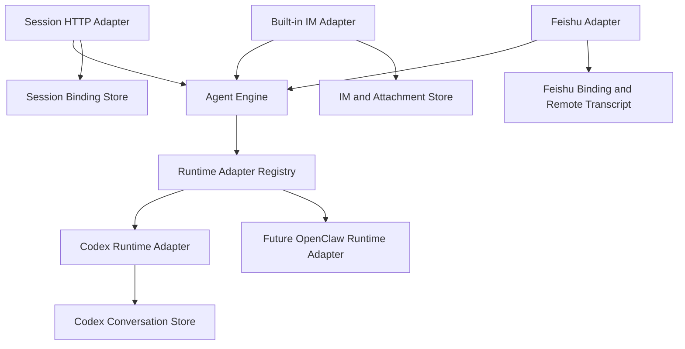
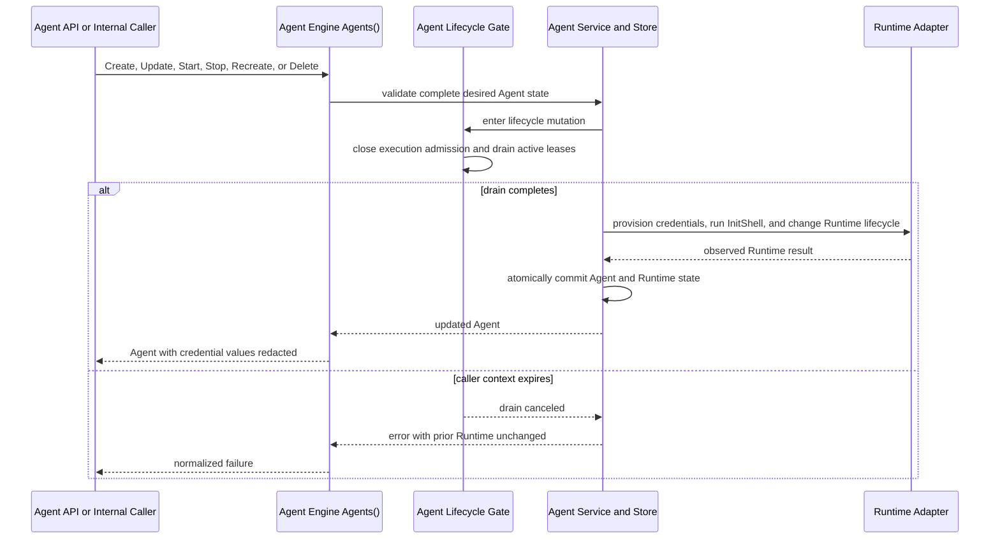
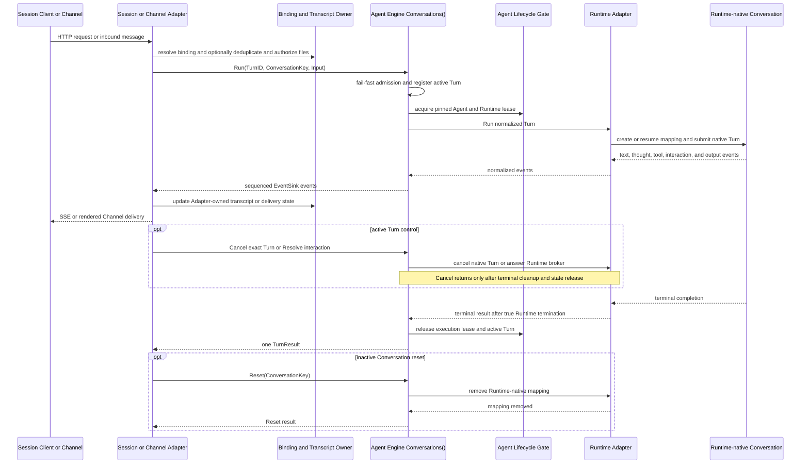

# Agent Engine Decoupling

Chinese version: [agent-engine-decoupling.zh.md](agent-engine-decoupling.zh.md)

## Status

Status: **Architecture proposal; Phase 2 Engine and Mock Client baseline complete; Phase 3 built-in IM Adapter integration in progress**.

The contract and Phase 1 in-process Conversation implementation are in [`internal/agentengine`](../../internal/agentengine).
Phase 1 connects the anonymous Session API to the existing Codex Runtime and removes anonymous Session dependence on IM entities.
Phase 2 completes the Engine, Memory Client, Session migration, Codex Runtime Adapter behavior, and a mock-backed Feishu Adapter proof.
It does not introduce or switch a production Channel Adapter.
Phase 3 integrates them with an atomic switch, and Phase 4 then refactors the internal Engine components.
That package is the source of truth for exact Go types and method signatures.
This document explains the intended ownership, behavior, and incremental implementation plan.

`internal/channel/csgclaw` now contains the runtime-neutral core for Phase 3,
including binding-scoped workers, conversation key/input conversion, the
attachment resolver boundary, and transcript rendering. These components are
not wired into the composition root yet; the production built-in IM path still
uses `internal/channelbridge/codexbridge`. The current implementation therefore
does not mean Phase 3 is complete and does not change existing channel behavior.

## 1. Scope

### 1.1 Goal

CSGClaw needs one runtime-neutral execution path for anonymous sessions, built-in IM, Feishu, and future direct Channels:

```text
Channel Adapter or Session API -> Agent Engine -> Runtime Adapter
```

The design has two public resource interfaces:

- `Agents()` manages persisted Agent resources and Runtime lifecycle.
- `Conversations(agentID)` executes conversations for one selected Agent.

The interface follows the Kubernetes client style by selecting a resource scope first and then exposing focused operations.
It does not introduce a Kubernetes controller, API server, object metadata model, or reconciliation framework.

The design must:

- Keep anonymous sessions independent from IM Rooms and Messages.
- Preserve built-in IM collaboration behavior.
- Keep Runtime-specific protocols behind `ConversationRuntime`.
- Let each Runtime Adapter materialize its credentials and initialize its execution environment.
- Support text, files, live progress, interactions, and CSGClaw Structured Output.
- Reuse current storage owners instead of creating an Engine database.
- Allow implementation in small, reviewable phases.

### 1.2 Non-goals

This proposal does not:

- Replace the existing Agent, IM, Participant, Team, Task, or Runtime stores.
- Turn `/api/v1/agents/{id}/llm` into an Agent execution API.
- Implement a remote Agent Engine or Engine HTTP protocol.
- Implement the complete OpenAI Responses API or a `previous_response_id` chain.
- Add a Files API or new Feishu file-download support.
- Make conversation execution own transcripts, attachments, Runtime credential files, or Runtime-native conversation mappings.
- Standardize credential file formats or paths across Runtime Adapters.
- Add compatibility, fallback, or dual execution paths.
- Claim direct OpenClaw support before OpenClaw exposes a suitable direct protocol.

## 2. Current Product Constraints

### 2.1 Existing State Owners

The architecture keeps these current ownership boundaries:

| State | Owner |
|---|---|
| Agent, Profile, Runtime record | `internal/agent` |
| Runtime-native conversation mapping | Concrete Runtime package, currently `internal/runtime/codex` for Codex |
| User, Room, Message, Thread, attachment | `internal/im` |
| Participant and Channel binding | `internal/participant` |
| Team, Task, Scheduled Task, Notification, Work | Their existing services |
| Model transport and proxy authentication | `internal/llm` and `internal/cliproxy` |

Agent Engine must not copy any of this durable state.
It may hold only process-local admission, active-turn, and pending-interaction state.

### 2.2 Existing Execution Paths

Before Phase 1, the anonymous Session API created an IM Room and Messages:

```text
POST /api/v1/agents/{agent}/sessions/{session_id}/responses
  -> resolve Participant and IM User
  -> EnsureAgentSessionRoom
  -> persist input Message
  -> execute through Codex Channel Bridge
  -> persist final Message
```

Phase 1 replaces that path with `Conversations(agentID).Run` while preserving the request, SSE, and error shapes.
It no longer creates anonymous Session IM entities.

Built-in IM and host-side Feishu Codex execution currently use `internal/channelbridge/codexbridge`.
That bridge already owns source subscription, deduplication, conversation-key construction, hidden Channel and Thread context, attachment manifests, activity rendering, interactions, Stop, and `/new`.
Those Channel behaviors remain in Channel Adapters when execution moves to Agent Engine.

Feishu currently accepts text, post, and some interactive content.
Image, file, audio, and media input remain unsupported.

Codex exposes direct Session, Prompt, Event, Permission, and User Input APIs.
OpenClaw currently executes through its Channel or sandbox gateway and has no repository-proven direct equivalent of `Run`, streaming events, Cancel, Reset, and Resolve.
The first Runtime Adapter is therefore Codex.

## 3. Target Architecture

### 3.1 Dependency Direction



Agent Engine does not import IM, Participant, Channel, Team, or concrete Runtime packages.
The composition root registers Runtime Adapters and connects the interfaces to their existing owners.
A missing Runtime Adapter returns `runtime_adapter_unavailable` before creating Engine execution state or a Session Binding.
It does not start a fallback execution path.

The overview above shows dependency direction and state ownership.
The following two views expand the same components into control-plane and data-plane interactions without introducing a second Engine execution path.

#### Control Plane

The control plane changes desired Agent state and coordinates Runtime lifecycle.
In Phase 2, the Engine Agent Facade delegates persistence and lifecycle work to the existing Agent Service, so the Engine does not create a duplicate Agent store.



All existing direct Agent Service lifecycle callers use the same Gate.
This prevents Session execution, future Channel execution, and current Agent APIs from replacing or deleting a Runtime while a Turn still holds a pinned execution lease.

#### Data Plane

The data plane executes one normalized Turn and returns ordered events and one terminal result.
Binding, transcript, attachment, and delivery state remain owned by the calling Adapter and its stores.



The Engine owns admission, cancellation, interaction routing, event ordering, and result normalization in this flow.
The Runtime Adapter owns only Runtime-specific mapping, protocol translation, credential materialization, `InitShell` execution, and Runtime-local file exposure.

### 3.2 Public Resource Interfaces

The exact declarations remain in `internal/agentengine`.
The review surface is:

| Resource | Operations | Purpose |
|---|---|---|
| `Agents()` | Create, Get, List, Update, Delete, Start, Stop, Recreate | Desired Agent configuration and Runtime lifecycle |
| `Conversations(agentID)` | Run, Cancel, Reset, Resolve | Conversation execution scoped to one Agent |
| `ConversationRuntime` | Run, Cancel, Reset, Resolve | Runtime-specific direct execution behind Engine |

`AgentInterface` is the collection-scoped API for Agent resources, and callers cannot depend on the current `internal/agent.Service`.
The Phase 2 Engine Facade may wrap the current Agent Service through a private backend so it can first reuse the already verified Agent persistence and Runtime lifecycle code.
That wrapper is only an internal Engine implementation; it does not enter the public contract or prevent Phase 4 from separating the broad Service into explicit storage, lifecycle, and Runtime components.
Conversation execution keeps no duplicate Agent records and coordinates active Turns with lifecycle changes.
The Phase 1 Conversation implementation may reach the current Agent Service only through the private Adapter wired by the composition root.
Phase 2 extends this boundary so the complete Engine implements `Agents()` and `Conversations()` through one private Facade instead of first rewriting the existing Agent components.
Phase 4 then replaces the transitional Facade and consolidates the internal owners of Agent state and Runtime lifecycle while preserving external behavior.
If the internal refactor genuinely requires a public interface change, the change remains subject to joint review and must update every implementation, the Mock Client, and the contract tests together.

`AgentSpec` contains the complete desired state: name, description, instructions, role, Runtime, model, Skills, and MCP servers.
`RuntimeSpec.Credentials` maps workspace-relative file paths to complete secret file contents.
`RuntimeSpec.InitShell` is an idempotent shell program executed with the Runtime workspace as its working directory.
Create and Update replace both fields as part of the complete desired Runtime state.
The Go names follow the Kubernetes Go API field convention; a serialized form uses `credentials` and `initShell`.
`Credentials` is write-only on Create and Update; every returned `Agent`, including Create, Update, Get, and List results, omits its values.

The Phase 2 Codex Runtime Adapter validates every relative path, atomically writes credential files with restrictive permissions, and removes files omitted by a complete Update.
It runs `InitShell` only after credential files are available; a file or shell failure fails the Agent operation and restores the previous managed credential files.
`InitShell` uses the selected workspace as `cwd` and receives the same `HOME`, per-Agent `CODEX_HOME`, model environment, and reserved-variable filtering as the Codex process; exported shell variables do not persist after the script exits.
Credential values must not enter logs, status messages, events, transcripts, shell arguments, or `InitShell` itself.
The Codex Adapter does not receive Feishu credentials when the host Feishu Adapter owns delivery; these fields do not change Channel ownership.

`AgentStatus` contains observed lifecycle state and the current Runtime ID.
Updating an Agent replaces its desired specification as one resource update.

`ConversationInterface` does not expose CRUD methods because Engine does not persist Conversation resources.
Phase 1 activates `Run` and uses `context.Context` for current request cancellation.
Phase 2 activates `Cancel`, `Reset`, `Resolve`, and their related request fields in the same contract so Engine and Adapter implementations can align independently through the Mock Client.

### 3.3 Conversation Semantics

This section describes the complete target contract.
Phase 1 uses only `TurnID`, `ConversationKey`, text `InputPart` values, text and tool events, and a terminal result.
Phase 2 completes continuation policy, fail-fast per-Conversation serialization, files, interactions, structured output, and explicit lifecycle methods together instead of splitting Engine capability by caller.

`ConversationKey` is an opaque caller-owned identity.
Engine validates only that it is non-empty and length-bounded.
It never parses Room, Thread, Channel, Binding, or Session fields from the key.

`TurnID` is an opaque caller-generated identity for one `Run` request.
The Channel Adapter generates it after ingress validation and keeps it stable for retries of the same source event, while the Session HTTP Adapter generates one response ID for its request.
Engine validates only that it is non-empty and length-bounded, and passes it unchanged to the Runtime Adapter.
It remains distinct from `ConversationKey`; a Channel Adapter may normalize a scoped source event ID into `TurnID` because that event identifies the same logical Turn across delivery retries.
Within one Engine process, `(agentID, ConversationKey, TurnID)` is the idempotency identity.
An in-flight retry joins the original Turn, and a completed dispatched retry replays the bounded process-local progress events and returns the cached result without submitting another Runtime Turn.
Reusing the same identity with different normalized input or policies returns `invalid_request`.

Each Adapter owns collision-free key construction:

| Caller | Key source |
|---|---|
| Built-in IM | Agent Participant, Room, and optional Thread root |
| Feishu | App Binding, Chat, and optional Thread root |
| Session API | Random internal key stored by the Session Binding Store |

Engine permits at most one Turn or atomic control operation for `(agentID, ConversationKey)` at a time.
Different Conversation keys may execute concurrently.
`AdmissionPolicy` selects `reject_if_busy`, `wait`, or `supersede` for a different overlapping Turn.
`reject_if_busy` fails immediately with `conversation_busy` and remains the default for the anonymous Session API.
`wait` waits for the current Turn or control operation before competing for admission.
`supersede` closes admission, cancels the current Turn, waits for true Runtime cleanup, and admits the replacement without an intervening Run.
Cancel therefore uses the Agent-scoped `ConversationKey` and `TurnID` to identify exactly one running Turn.
Resolve additionally carries `InteractionID` to identify one pending interaction.

`TurnID` is retained only in a bounded process-local idempotency window after the Turn lifecycle.
It is not a Conversation key, Runtime-native conversation mapping, transcript identity, or durable Engine resource, so a process restart still requires source-side deduplication.
`Reset` remains scoped to `ConversationKey`, and `Resolve` remains scoped to `ConversationKey` plus `InteractionID`.

`ContinuationPolicy` makes Runtime mapping behavior explicit:

- `create_or_resume` creates a missing native mapping or resumes it.
- `require_existing` returns `conversation_not_resumable` when the mapping is missing.

`InteractionPolicy` selects caller behavior for blocking Runtime interactions:

- `resolve` allows the caller to answer through `Resolve`.
- `reject` terminates the Turn with `interaction_unsupported`.
- `skip_user_input` submits the Runtime's empty-answer form and safely denies permissions.

Built-in IM uses `resolve`.
The anonymous Session API uses `reject`.
Feishu keeps its current `skip_user_input` behavior.

### 3.4 Input, Events, and Result

`TurnRequest.Input` is one ordered list of `InputPart` values.
A text part contains `Text`.
A file part contains one caller-authorized `InputFile`.
There is no parallel file list and no Engine file-preparation step.
Incremental implementation does not narrow this contract to a string.
The Phase 1 Session HTTP Adapter creates one text part, and the private Codex Runtime Adapter joins ordered text parts before calling the current Runtime API.
A file part retains its public type but returns `file_unavailable` before Runtime dispatch until a later phase implements file execution.

The Event Sink receives ordered progress for a logical Turn:

- Text delta.
- Thought delta.
- Activity update.
- Interaction request.
- Validated output item.

The sink is not an event bus, transcript store, or Channel renderer.
Every event carries `TurnID` and monotonic `Sequence`.
The tuple `(TurnID, Sequence)` lets an Adapter deduplicate replayed envelopes after a retry.

`Run` returns exactly one `TurnResult` and no second raw Runtime error.
`Dispatched=false` means the native Turn was not submitted.
This includes Engine admission rejection and failure to create, resolve, or persist a required Runtime-native conversation mapping.
`Dispatched=true` means the Continuation Policy succeeded, the required mapping was durably established or resolved, and the native Turn was submitted.
After submission, success, failure, cancellation, and timeout all retain `Dispatched=true`.

Stable failure categories include invalid request, unavailable Agent, unavailable Runtime Adapter, busy Conversation, missing Runtime mapping, unavailable file, unsupported interaction, cancellation, and Runtime failure.

## 4. Ownership

Each fact has one owner:

| Component | Owns | Does not own |
|---|---|---|
| Agent resource implementation | Agent persistence, desired configuration including Runtime credentials and `InitShell`, Runtime lifecycle, Workspace and Runtime provisioning | Turn input, transcript, Runtime-native conversation mapping, Channel Event Worker lifecycle |
| Agent Engine | Admission, per-Conversation serialization, dispatch, active Turn, pending interaction, event ordering, normalized result | Durable Agent or Conversation state, files, Channel behavior |
| Runtime Adapter | Runtime credential serialization, `InitShell` execution, native conversation mapping, direct Runtime protocol, Runtime event translation, file exposure to Runtime | Channel subscription, transcript, Agent persistence |
| Channel Adapter | Ingress, identity, binding and Channel Event Worker lifecycle, host-side Channel credentials, deduplication, hidden context, file authorization, transcript, rendering, acknowledgment | Runtime-native mapping, Engine admission |
| Session HTTP Adapter | HTTP validation, Session Binding, SSE and error mapping | IM Room, Message, Participant, transcript |

The minimal Phase 1 Session implementation has no lifecycle coordination.
The complete Phase 2 Engine makes the Agent resource implementation and Conversation execution share one Agent Lifecycle Gate so lifecycle changes cannot replace resources used by an active Turn.
The Gate remains an implementation detail and is not part of the public interfaces.

## 5. Primary Flows

### 5.1 Anonymous Session

The endpoint remains:

```http
POST /api/v1/agents/{agent}/sessions/{session_id}/responses
```

The target flow is:

```text
Session HTTP Adapter
  -> load or create Session Binding
  -> generate TurnID
  -> Conversations(agentID).Run
  -> Runtime Adapter
  -> map Engine events to existing SSE
```

The Phase 1 Session Binding Store is uniquely keyed by `(agentID, externalSessionID)` and contains only those IDs and one random opaque Conversation Key.
It stores no prompt, output, file, Runtime handle, interaction, or recovery state.
After a process restart, the binding reuses the same Conversation Key and the Codex Adapter calls the existing idempotent `EnsureSession` behavior.
The later strict-continuation design may add explicit mapping state when another caller requires it.

The route preserves current request input, `stream`, body limit, timeout, SSE, error envelope, `409 session_busy`, and empty `room_id` response metadata.
It creates no Room, User, Participant, IM Message, Participant Work, or hidden Channel context.

### 5.2 Built-in IM

```text
IM persists user Message
  -> Channel Adapter applies routing and deduplication
  -> build ConversationKey, generate TurnID, and order Input
  -> Conversations(agentID).Run
  -> Runtime Adapter
  -> Channel Adapter renders Activity and final Message
```

The Channel Adapter preserves mentions, Thread context, Skills, Participant Work, Stop, `/new`, superseding, replay, reactions, and transcript behavior.
It may merge the current hidden Channel or new-Thread context into normalized text input before calling Engine.
Engine does not model that context separately.

`/new` calls `Reset` with the same `ConversationKey`.
Engine closes admission in the same Conversation gate, cancels and drains any active Turn, calls the Runtime Adapter to remove its native mapping, and only then reopens admission.

### 5.3 Runtime Adapter

During Create, a Runtime-affecting Update, or Recreate, the Agent resource implementation selects the registered Adapter from `RuntimeSpec.Adapter`.
The Adapter materializes `Credentials`, runs `InitShell`, and starts the Runtime only after both steps succeed.
Credential layout and initialization mechanics remain private to that Adapter.

Engine selects the registered Adapter for the Agent's ready Runtime after admission.
The selected Adapter:

1. Resolves or creates and persists the native conversation mapping according to `ContinuationPolicy`.
2. Executes the ordered input.
3. Converts native progress into Engine events.
4. Decodes eligible CSGClaw Structured Output before public text is emitted.
5. Returns one terminal result.

The Codex Adapter reuses the existing `conversation_sessions` mapping and `EnsureSession` behavior.
Reset replaces that mapping for the same `ConversationKey`.

An OpenClaw Adapter is added only after OpenClaw provides stable direct submission, terminal state, event delivery, Cancel, Reset, and interaction behavior.
It must not fabricate direct execution through an IM or Feishu event.

## 6. Critical Boundaries

### 6.1 Persistence

Agent Engine has no durable Conversation store.
It retains only a bounded process-local cache of dispatched Turn progress events and results for retry idempotency.
The Agent resource implementation owns desired Runtime credentials, while each Runtime Adapter owns its materialized credential files.
Runtime Adapters own native conversation mappings.
Channel Adapters own transcripts and source delivery state.
The Session Binding Store owns only the association between an external Session ID and a Conversation Key.

An Engine process restart interrupts waiting and running Turns and clears the process-local idempotency cache.
It does not delete Runtime-native mappings.
The design does not promise cross-restart replay, exactly-once execution, or recovery of in-flight side effects.

### 6.2 Files

Built-in IM continues to own attachment metadata, blobs, download tokens, and garbage collection.
Before calling Engine, the trusted caller authorizes the file and resolves an `InputFile` containing ID, source path, name, media type, size, and hash.

Engine validates the Input shape but treats `SourcePath` as opaque.
It does not call IM APIs, read file bytes, write Workspace files, manage blobs, or mount sandboxes.
The Runtime Adapter decides how to mount, copy, or expose the file and preserves path, symlink, size, and hash checks.
The caller keeps the resolved source valid until `Run` returns.

Files are included only when newly uploaded or explicitly referenced.
Previous file bytes are not resent merely to continue a Runtime-native conversation.

### 6.3 Structured Output and Interactions

One shared decoder owns the `::csgclaw-output::` grammar.
It validates `resource_link` and detached `request_user_input` payloads before they cross the Engine boundary.
Raw control lines never reach public text or Channel renderers.

A blocking Runtime Permission or User Input keeps the same Turn open and uses `Resolve`.
A detached `request_user_input` completes the current Turn and creates a later Turn after the user answers.
Detached input does not call `Resolve`.
Engine atomically claims a pending interaction before calling the Runtime Adapter, so only the first duplicate action can enter Runtime resolution.
A failed Runtime resolution restores the claim to pending while the same Turn remains active; a successful resolution consumes it.
The Channel Adapter authorizes the acting user, while Engine treats `ResponderID` as opaque audit identity and never uses it for authorization.

Secret interaction answers must not enter logs or transcripts.
Detached secret answers also must not be inserted into model continuation.

### 6.4 Concurrency and Lifecycle

Engine applies the request's `AdmissionPolicy` before acquiring the Agent execution lease.
Waiting and superseding remain process-local, while Runtime-native conversation mappings remain keyed by Conversation identity.
Channel Adapters may retain source-ingress buffering for subscription, deduplication, and acknowledgment.

If a sink fails, Engine requests Runtime cancellation when possible and waits for a true Runtime terminal state before releasing admission.
If cancellation is unsupported, Engine continues supervising the Runtime until termination.

The Agent Lifecycle Gate is the process-local concurrency primitive for one Agent, not a service or public interface.
It records whether admission is open and which execution leases are active.
Phase 2 extends the existing `internal/agent.agentLifecycleGate` instead of introducing a second coordinator.
If its expanded responsibility later warrants a different internal name, it may be renamed without changing this public contract.

Run admission and lifecycle changes serialize through the same Gate.
Run may dispatch only after it atomically confirms that the Agent is ready and registers the active Turn with the selected internal Runtime handle.

Stop, Runtime-affecting Update, Recreate, and Delete first mark the Agent unavailable and close new admission.
New Runs return `TurnFailed` with `Dispatched=false` and `agent_unavailable`.
Running Turns are allowed to reach a terminal result before Runtime state changes.

A configured drain timeout bounds that wait.
If it expires, the lifecycle operation fails without replacing or deleting the current Runtime and reopens admission only when that Runtime remains ready.
Agent persistence and Runtime Adapter calls occur outside the Gate critical section while admission remains closed.
If a lifecycle call fails, admission reopens only after the previous Runtime is confirmed ready; otherwise the Agent remains unavailable with the observed failure in status.

Stop preserves the Runtime conversation store, and Start reopens admission only after the Runtime is ready.
Recreate and Delete remove Runtime-owned conversation mappings before a replacement Runtime becomes ready or deletion completes.
A strict caller receives `conversation_not_resumable` when its mapping is gone.

### 6.5 Channel Event Worker Lifecycle

The Channel layer is the sole owner of Channel Event Worker lifecycle.
The composition root starts each Channel Adapter once, and the Adapter reconciles enabled bindings by stable Binding identity.
Binding creation, update, and deletion start, reconfigure, and stop exactly one Worker through idempotent operations.
A Worker listens for incoming Channel events, targets an Agent ID, and calls `Conversations(agentID)`; it does not bind to a Runtime ID or native Session ID.

The Agent resource implementation, Agent Engine, and Runtime Adapters neither control Channel Event Workers nor access IM message persistence.
As each Channel migrates, the current `LifecycleObserver` and `BindingActivator -> codexBridgeMgr` control chain is removed from the Agent resource path.
Binding changes invoke the owning Channel layer directly.

Agent Stop, Runtime-affecting Update, Recreate, and Runtime restart leave bindings, Workers, and saved transcripts unchanged.
While an Agent is unavailable, its Worker continues normal ingress and acknowledgment and handles `agent_unavailable` according to Channel behavior.
Agent deletion is coordinated at the application and Binding boundary: referenced bindings are deleted or deactivated, the Channel Adapter stops their Workers, and saved transcripts remain owned by the Channel.
`AgentInterface.Delete` itself remains Channel-neutral.

## 7. Incremental Implementation

The phases describe delivery order without artificially splitting the Agent Engine contract or implementation capabilities.
Starting in Phase 2, the Agent Engine interface is the only boundary between Engine and Adapter development.

### Phase 1: Anonymous Session Path (Complete)

- Establish the standalone `internal/agentengine` contract and in-process Conversation implementation.
- Reuse Codex `EnsureSession`, `Prompt`, and scoped Runtime events through a private Adapter.
- Route streaming and non-streaming anonymous Session requests through `Conversations(agentID).Run`.
- Add the Agent-scoped Session Binding Store.
- Remove anonymous Session persistence dependencies on IM Rooms, Messages, and Participants while preserving the existing HTTP, SSE, timeout, and error shapes.
- Fail explicitly for unavailable Runtime Adapters without starting a fallback path.
- Preserve Agent CRUD, built-in IM, Feishu, Team, Task, Scheduled Task, Notification, and Work behavior.

### Phase 2: Agent Engine and Mock Baseline - Complete

- Implement the complete `agentengine.Interface` and provide the concurrency-safe, stateful `enginetest.MemoryClient` implementing the same contract.
- The interface is not an immutable protocol; when implementation exposes an omission or mistake, it may change through joint review, with the real Engine, Mock Client, contract tests, and affected Adapter call sites updated in the same change.
- Implement `Agents()`, `Run`, `Cancel`, atomic `Reset`, claimed `Resolve`, explicit admission policies, Turn retry idempotency, TurnID event envelopes, file input, interactions, Structured Output, `Dispatched`, and stable errors.
- Let the Agent Engine Facade first wrap the existing Agent Service, Codex Session, brokers, Structured Output, and Runtime provisioning code instead of making internal refactoring a prerequisite for a complete Engine.
- Coordinate Agent mutation, admission, active Turns, drain, and pinned Runtime handles through one shared Lifecycle Gate.
- Migrate the anonymous Session API to `agentengine.Interface` while preserving its HTTP contract and zero IM entity creation.
- Prove a test-only Feishu ingress harness through `MemoryClient`, with Feishu credentials remaining exclusively in the current Channel binding owner.
- Keep production Channel Adapter implementation, integration, and atomic switching in Phase 3.
- Materialize Codex `RuntimeSpec.Credentials` as workspace-relative files and run `RuntimeSpec.InitShell` after the files are available.

### Phase 3: Agent Engine and Adapter Integration

- Have the composition root inject the real Agent Engine into the Adapter already verified against the Mock Client.
- Run joint Engine and Adapter contract, concurrency, lifecycle, and end-to-end behavior verification.
- After verification, atomically switch the target Channel execution path to `Channel Adapter -> Agent Engine -> Runtime Adapter`.
- Preserve existing Room, Thread, mention, file, interaction, Work, Stop, `/new`, transcript, rendering, reaction, and acknowledgment behavior.
- At the switch, remove the corresponding old execution entry point, duplicate queue and cancellation state, and the Agent lifecycle control chain into `codexBridgeMgr`.
- Do not run dual execution, shadow prompts, or fallback; any missing required capability blocks the switch.

### Phase 4: Refactor Agent Engine Internals

- Refactor internal Engine components while preserving external behavior; keep the public interface stable by default, but allow it to evolve through joint review when necessary.
- Replace the Phase 2 Agent Service Facade with focused Agent resource backend, Conversation coordinator, Lifecycle Gate, Runtime Adapter registry, and Runtime Adapter components.
- Extract reusable storage, Runtime provisioning, credential, InitShell, file exposure, interaction, and Structured Output capabilities while removing duplicate state and reverse-control dependencies.
- Make `Agents()` the unified Engine entry point for Agent persistence and Runtime lifecycle, then incrementally migrate internal callers that still bypass it.
- Use the Phase 2 contract tests and Phase 3 end-to-end tests to prove the refactor preserves existing CSGClaw behavior; when a reviewed interface change is required, update the Adapter and Mock Client together.

Every merge must leave existing CSGClaw behavior operational.
The two Phase 2 sides can be developed and verified independently, Phase 3 owns only integration and atomic switching, and Phase 4 changes only Engine internals.

## 8. Acceptance Criteria

### 8.1 Phase 1 (Complete)

- Streaming and non-streaming Session requests use `Conversations(agentID).Run`.
- Anonymous Session execution creates no IM entities and preserves the existing HTTP, JSON, SSE, timeout, and error shapes.
- Session Bindings are uniquely keyed by `(agentID, externalSessionID)`, persist one opaque Conversation Key, and reuse it after restart.
- Same-Agent, same-Session overlap returns `409 session_busy`; different Sessions and the same external Session ID under different Agents can run concurrently.
- Codex text deltas and tool activities preserve the existing SSE shape and secret redaction.
- The Session Adapter sends one text `InputPart`, and the private Codex Runtime Adapter preserves ordered multi-part text input.
- Unsupported Runtime Adapters fail explicitly before binding creation, without fallback.
- Request cancellation reaches the Codex Runtime through `context.Context`.
- A request arriving after cancellation waits for Runtime cleanup before starting; active overlapping requests still fail fast with `409 session_busy`.
- Agent CRUD, built-in IM, Feishu, Team, Task, Scheduled Task, Notification, and Work behavior remains unchanged.

### 8.2 Target Architecture

- `internal/agentengine` imports no IM, Participant, Channel, Team, or concrete Runtime package.
- `Interface` exposes `Agents()` and Agent-scoped `Conversations(agentID)`.
- Conversation requests do not repeat Agent ID.
- Conversation keys remain opaque and caller-owned.
- Every Run carries a caller-generated opaque Turn ID, and Cancel targets one Turn with its Conversation Key and Turn ID.
- Engine persists no Agent, Conversation, transcript, file, or delivery state.
- Agent resource implementations, Agent Engine, and Runtime Adapters have no Channel Event Worker dependency and do not access IM message persistence.
- Channel Event Workers are keyed by stable Binding identity, not Runtime ID or native Session ID.
- Runtime-native conversation mapping has one owner.
- After Phase 2, external callers depend only on `AgentInterface`, and `Conversations()` accesses Agent availability and Runtime selection only through the internal Engine Facade.
- After Phase 4, the `AgentInterface` implementation is the only Agent persistence and Runtime lifecycle owner, and Engine internals no longer depend on the broad `internal/agent.Service`.
- Runtime credential file layouts and initialization remain owned by each Runtime Adapter.
- Missing Runtime Adapters fail explicitly with no fallback path.
- The Go contract and both language documents remain synchronized.

### 8.3 Target Behavior

- Anonymous Sessions create no IM entities and preserve their public API contract.
- Different Conversations can run concurrently while one Conversation remains serialized.
- Built-in IM preserves Room, Thread, Mention, file, Activity, Stop, Work, interaction, and `/new` behavior.
- Feishu preserves its currently supported text behavior without claiming file support.
- Binding creation, update, and deletion reconcile exactly one Channel Event Worker through idempotent operations.
- Agent Stop, Recreate, and Runtime restart neither restart Channel Event Workers nor delete bindings or transcripts.
- Agent API deletion removes or deactivates referenced bindings, stops their Event Workers, and preserves saved transcripts.
- Codex conversations continue after Stop followed by Start.
- Lifecycle changes close admission, drain running Turns, and never replace a Runtime still used by an active Turn.
- A lifecycle drain timeout leaves the current Runtime unchanged and returns a failed lifecycle operation.
- Session Bindings are unique by `(agentID, externalSessionID)`, remain `initializing` after mapping failure, and retry the same Conversation Key after process restart.
- Codex credential files are replaced atomically with restrictive permissions, and failed `InitShell` execution fails the Agent operation while restoring previous managed credentials.
- Create, Update, Get, and List results omit Runtime credential values.
- Recreate and Delete report missing strict-continuation mappings honestly.
- CSGClaw Structured Output never leaks raw control lines.
- Secret answers enter neither logs nor transcripts.

### 8.4 Target Verification

- Contract tests cover Run, Cancel, atomic Reset, claimed Resolve, event envelopes, terminal results, and stable errors.
- Tests cover Turn retry idempotency, different-Conversation concurrency, reject, wait, supersede, sink failure, and cancellation behavior.
- Tests cover no MCP, local MCP, remote MCP, text input, and file input.
- Anonymous tests verify that IM entity counts do not change and Session Binding scope is Agent-specific.
- Channel tests verify deduplication, replay, superseding, rendering, Binding-driven Event Worker lifecycle, and idempotent reconciliation.
- Lifecycle tests verify that Agent Stop, Recreate, and Runtime restart do not start or stop Channel Event Workers.
- Agent deletion tests verify Binding cleanup, Event Worker shutdown, and transcript retention.
- Lifecycle tests verify admission closure, active Turn drain, drain timeout, lifecycle failure, and Runtime pinning.
- Phase 2 runs the same contract tests against the Mock Client and real Engine, and verifies that the Adapter can complete its behavior tests independently through the Mock Client.
- Phase 3 joint tests verify real Engine and Adapter contract alignment, an atomic switch without dual execution or fallback, and preservation of all existing Channel behavior.
- Phase 4 tests verify that Agent APIs use `Agents()` and the transitional Service Facade is gone; if joint review changes the public contract, the Mock Client, Adapter, and contract tests must pass together.
- Runtime tests verify mapping creation and persistence before dispatch, strict continuation, Reset, Stop and Start, Recreate, and Delete semantics.
- Runtime Adapter tests verify credential path containment, atomic replacement, deletion, permissions, failed-`InitShell` rollback, and secret redaction.
- Agent contract tests verify that all returned Agent values omit Runtime credentials.
- Existing Agent, Session API, built-in IM, Feishu, Team, Task, Scheduled Task, Notification, and Work regressions pass.
