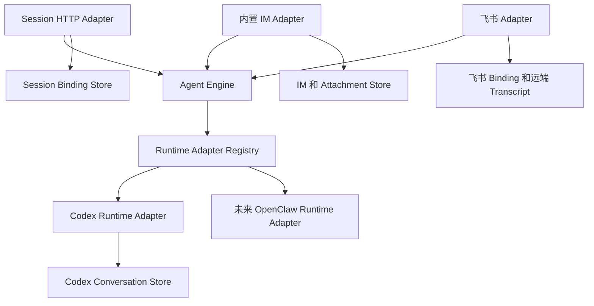
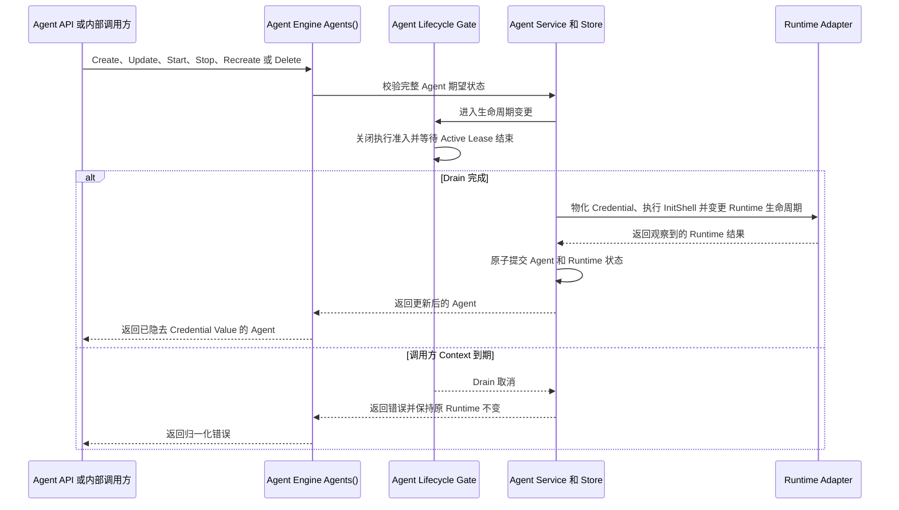
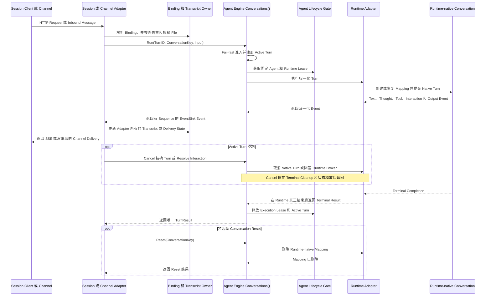

# Agent Engine 解耦

英文版：[agent-engine-decoupling.md](agent-engine-decoupling.md)

## 状态

状态：**架构提案；阶段 2 的 Engine 与 Mock Client 基线已完成；阶段 3 内置 IM Adapter 融合开发中**。

Contract 和阶段 1 的进程内 Conversation 实现位于 [`internal/agentengine`](../../internal/agentengine)。
阶段 1 已把匿名 Session API 接入现有 Codex Runtime，并移除匿名 Session 对 IM Entity 的依赖。
阶段 2 完成 Engine、Memory Client、Session 迁移、Codex Runtime Adapter 行为和基于 Mock 的飞书 Adapter 证明。
阶段 2 不引入或切换生产 Channel Adapter。
阶段 3 负责两侧融合与原子切换，阶段 4 再重构 Engine 内部组件。
该 Package 是精确 Go Type 和 Method Signature 的 Source of Truth。
本文档说明期望的 Owner、行为和增量实现计划。

`internal/channel/csgclaw` 已包含阶段 3 的 Runtime-neutral Core，包括 Binding-scoped Worker、
Conversation Key/Input 转换、Attachment Resolver Boundary 和 Transcript Renderer。
这些组件尚未接入 Composition Root；生产内置 IM Path 仍使用 `internal/channelbridge/codexbridge`。
因此当前实现不代表阶段 3 已完成，也不改变现有 Channel 行为。

## 1. 范围

### 1.1 目标

CSGClaw 需要一条 Runtime 中立的执行路径，供匿名 Session、内置 IM、飞书和未来 Direct Channel 使用：

```text
Channel Adapter 或 Session API -> Agent Engine -> Runtime Adapter
```

设计提供两个公共 Resource Interface：

- `Agents()` 管理持久化 Agent Resource 和 Runtime 生命周期。
- `Conversations(agentID)` 为一个已选择的 Agent 执行 Conversation。

接口采用 Kubernetes Client 风格，先选择 Resource Scope，再暴露聚焦的操作。
它不引入 Kubernetes Controller、API Server、Object Metadata Model 或 Reconciliation Framework。

设计必须：

- 让匿名 Session 独立于 IM Room 和 Message。
- 保留内置 IM 的协作行为。
- 把 Runtime 特有协议隐藏在 `ConversationRuntime` 后面。
- 让每个 Runtime Adapter 物化自己的 Credential，并初始化自己的执行环境。
- 支持 Text、File、实时进度、Interaction 和 CSGClaw Structured Output。
- 复用当前 State Owner，不创建 Engine Database。
- 支持按小步、可评审的阶段实现。

### 1.2 非目标

本方案不：

- 替换现有 Agent、IM、Participant、Team、Task 或 Runtime Store。
- 把 `/api/v1/agents/{id}/llm` 改成 Agent Execution API。
- 实现远程 Agent Engine 或 Engine HTTP 协议。
- 实现完整 OpenAI Responses API 或 `previous_response_id` Chain。
- 增加 Files API 或新的飞书文件下载支持。
- 让 Conversation Execution 拥有 Transcript、Attachment、Runtime Credential File 或 Runtime 原生 Conversation Mapping。
- 统一不同 Runtime Adapter 的 Credential File Format 或 Path。
- 增加兼容、Fallback 或双执行路径。
- 在 OpenClaw 暴露合适的直接协议前声称支持 Direct OpenClaw。

## 2. 当前产品约束

### 2.1 现有状态 Owner

架构保留以下当前 Owner 边界：

| 状态 | Owner |
|---|---|
| Agent、Profile、Runtime Record | `internal/agent` |
| Runtime 原生 Conversation Mapping | 具体 Runtime Package，Codex 当前为 `internal/runtime/codex` |
| User、Room、Message、Thread、Attachment | `internal/im` |
| Participant 和 Channel Binding | `internal/participant` |
| Team、Task、Scheduled Task、Notification、Work | 各自现有 Service |
| 模型传输和 Proxy 认证 | `internal/llm` 和 `internal/cliproxy` |

Agent Engine 不能复制这些持久化状态。
它只能持有进程内 Admission、Active Turn 和 Pending Interaction 状态。

### 2.2 现有执行路径

阶段 1 之前，匿名 Session API 会创建 IM Room 和 Message：

```text
POST /api/v1/agents/{agent}/sessions/{session_id}/responses
  -> 解析 Participant 和 IM User
  -> EnsureAgentSessionRoom
  -> 持久化输入 Message
  -> 通过 Codex Channel Bridge 执行
  -> 持久化最终 Message
```

阶段 1 使用 `Conversations(agentID).Run` 替换该路径，同时保留 Request、SSE 和 Error Shape。
它不再创建匿名 Session IM Entity。

内置 IM 和 Host 侧飞书 Codex 执行当前使用 `internal/channelbridge/codexbridge`。
该 Bridge 已负责 Source Subscription、Deduplication、Conversation Key 构造、隐藏 Channel 和 Thread Context、Attachment Manifest、Activity 渲染、Interaction、Stop 和 `/new`。
执行迁移到 Agent Engine 后，这些 Channel 行为继续由 Channel Adapter 负责。

飞书当前接收 Text、Post 和部分 Interactive Content。
Image、File、Audio 和 Media Input 继续不受支持。

Codex 暴露直接 Session、Prompt、Event、Permission 和 User Input API。
OpenClaw 当前通过自己的 Channel 或 Sandbox Gateway 执行，仓库中没有经过验证且等价的直接 `Run`、Streaming Event、Cancel、Reset 和 Resolve 协议。
因此第一个 Runtime Adapter 是 Codex。

## 3. 目标架构

### 3.1 依赖方向



Agent Engine 不 Import IM、Participant、Channel、Team 或具体 Runtime Package。
Composition Root 注册 Runtime Adapter，并把接口连接到现有 Owner。
缺少 Runtime Adapter 时，在创建 Engine Execution State 或 Session Binding 前返回 `runtime_adapter_unavailable`。
它不会启动 Fallback Execution Path。

上面的总览图展示 Dependency Direction 和 State Ownership。
下面两张图把同一组组件展开为控制面和数据面交互，但不会引入第二条 Engine Execution Path。

#### 控制面

控制面修改 Agent 期望状态，并协调 Runtime 生命周期。
阶段 2 中，Engine Agent Facade 把持久化和生命周期操作委托给现有 Agent Service，因此 Engine 不会创建重复的 Agent Store。



所有现有的 Agent Service 直接生命周期调用方都使用同一个 Gate。
这样可以防止 Session 执行、未来 Channel 执行和当前 Agent API 在 Turn 仍持有固定 Execution Lease 时替换或删除 Runtime。

#### 数据面

数据面执行一个归一化 Turn，并返回有序 Event 和唯一 Terminal Result。
Binding、Transcript、Attachment 和 Delivery State 继续由调用它的 Adapter 及其 Store 管理。



Engine 在这条流程中管理 Admission、Cancellation、Interaction Routing、Event Ordering 和 Result Normalization。
Runtime Adapter 只管理 Runtime 特有的 Mapping、Protocol Translation、Credential Materialization、`InitShell` 执行和 Runtime-local File Exposure。

### 3.2 公共 Resource Interface

精确声明保留在 `internal/agentengine`。
评审入口为：

| Resource | 操作 | 用途 |
|---|---|---|
| `Agents()` | Create、Get、List、Update、Delete、Start、Stop、Recreate | Agent 期望配置和 Runtime 生命周期 |
| `Conversations(agentID)` | Run、Cancel、Reset、Resolve | 限定到一个 Agent 的 Conversation 执行 |
| `ConversationRuntime` | Run、Cancel、Reset、Resolve | Engine 后面的 Runtime 特有直接执行 |

`AgentInterface` 是 Agent Resource 的 Collection-scoped API，调用方不能依赖当前 `internal/agent.Service`。
阶段 2 的 Engine Facade 可以通过私有 Backend 包装当前 Agent Service，以优先复用已经验证的 Agent 持久化和 Runtime 生命周期代码。
该包装只是 Engine 内部实现，不进入公共 Contract，也不阻止阶段 4 把宽泛的 Service 拆成明确的 Storage、Lifecycle 和 Runtime 组件。
Conversation Execution 不保存重复的 Agent Record，并协调 Active Turn 和生命周期变更。
阶段 1 的 Conversation 实现只能通过 Composition Root 注入的私有 Adapter 访问当前 Agent Service。
阶段 2 扩展这个边界，让完整 Engine 通过同一个私有 Facade 实现 `Agents()` 和 `Conversations()`，而不是先重写现有 Agent 组件。
阶段 4 再在保持外部行为的前提下替换临时 Facade，并收敛 Agent State 与 Runtime 生命周期的内部 Owner。
如果内部重构确实需要调整公共 Interface，该调整继续通过共同 Review 完成，并同步所有实现、Mock Client 和 Contract Test。

`AgentSpec` 包含完整期望状态：Name、Description、Instructions、Role、Runtime、Model、Skills 和 MCP Server。
`RuntimeSpec.Credentials` 是 Workspace 相对文件路径到完整 Secret File Content 的 Map。
`RuntimeSpec.InitShell` 是以 Runtime Workspace 为工作目录执行的幂等 Shell Program。
Create 和 Update 把这两个 Field 作为完整 Runtime 期望状态的一部分进行替换。
Go Name 遵循 Kubernetes Go API Field Convention；序列化形式使用 `credentials` 和 `initShell`。
`Credentials` 在 Create 和 Update 中是 Write-only；Create、Update、Get 和 List 返回的所有 `Agent` 都省略其 Value。

阶段 2 的 Codex Runtime Adapter 验证每个相对路径，以严格权限原子写入 Credential File，并删除完整 Update 中省略的旧 File。
它仅在 Credential File 可用后运行 `InitShell`；File 或 Shell 失败会让 Agent Operation 失败，并恢复此前受管理的 Credential File。
`InitShell` 使用选定的 Workspace 作为 `cwd`，并接收与 Codex Process 相同的 `HOME`、Agent 专属 `CODEX_HOME`、Model Environment 和 Reserved Variable Filter；Shell Export 在脚本退出后不会继续生效。
Credential Value 不能进入 Log、Status Message、Event、Transcript、Shell Argument 或 `InitShell` 本身。
Host Feishu Adapter 负责 Delivery 时，Codex Adapter 不接收 Feishu Credential；这两个 Field 不改变 Channel Ownership。

`AgentStatus` 包含观察到的生命周期状态和当前 Runtime ID。
更新 Agent 时，把完整期望 Specification 作为一个 Resource Update 替换。

`ConversationInterface` 不暴露 CRUD Method，因为 Engine 不持久化 Conversation Resource。
阶段 1 已启用 `Run`，并使用 `context.Context` 处理当前 Request Cancellation。
阶段 2 在同一个 Contract 中启用 `Cancel`、`Reset`、`Resolve` 及其相关 Request Field，使 Engine 和 Adapter 可以独立实现并通过 Mock Client 对齐行为。

### 3.3 Conversation 语义

本节描述完整的目标 Contract。
阶段 1 只使用 `TurnID`、`ConversationKey`、Text `InputPart`、Text 和 Tool Event，以及终态 Result。
阶段 2 一次补齐 Continuation Policy、按 Conversation 快速失败的串行化、File、Interaction、Structured Output 和显式生命周期 Method，不再按调用方拆分 Engine 能力。

`ConversationKey` 是调用方拥有的不透明 Identity。
Engine 只校验其非空且长度有界。
它不会解析 Key 中的 Room、Thread、Channel、Binding 或 Session 字段。

`TurnID` 是调用方为一次 `Run` Request 生成的不透明 Identity。
Channel Adapter 在完成 Ingress Validation 后生成该值，并让同一个 Source Event 的重试保持稳定；Session HTTP Adapter 则为其 Request 生成一个 Response ID。
Engine 只校验其非空且长度有界，并原样传递给 Runtime Adapter。
它与 `ConversationKey` 保持不同；Channel Adapter 可以把限定 Scope 的 Source Event ID 规范化为 `TurnID`，因为该 Event 在 Delivery Retry 间标识同一个逻辑 Turn。
在一个 Engine 进程内，`(agentID, ConversationKey, TurnID)` 是幂等 Identity。
进行中的重试加入原 Turn，已完成且已分派的重试回放有界的进程内 Progress Event 并返回缓存 Result，不会再次提交 Runtime Turn。
使用相同 Identity 但不同的规范化 Input 或 Policy 会返回 `invalid_request`。

每个 Adapter 负责构造无碰撞 Key：

| 调用方 | Key 来源 |
|---|---|
| 内置 IM | Agent Participant、Room 和可选 Thread Root |
| 飞书 | App Binding、Chat 和可选 Thread Root |
| Session API | Session Binding Store 保存的随机内部 Key |

Engine 同时只允许 `(agentID, ConversationKey)` 存在一个 Turn 或原子 Control Operation。
不同 Conversation Key 可以并发执行。
`AdmissionPolicy` 为不同的重叠 Turn 选择 `reject_if_busy`、`wait` 或 `supersede`。
`reject_if_busy` 立即返回 `conversation_busy`，并继续作为匿名 Session API 的默认策略。
`wait` 等待当前 Turn 或 Control Operation 完成后再竞争 Admission。
`supersede` 关闭 Admission、取消当前 Turn、等待 Runtime 真实清理完成，并且不留新 Run 插入的窗口直接准入替代 Turn。
因此 Cancel 使用按 Agent 限定的 `ConversationKey` 和 `TurnID` 精确标识一个运行中的 Turn。
Resolve 额外携带 `InteractionID` 来标识一个 Pending Interaction。

Turn 生命周期结束后，`TurnID` 只在有界的进程内幂等窗口中保留。
它不是 Conversation Key、Runtime 原生 Conversation Mapping、Transcript Identity 或持久化 Engine Resource，因此进程重启后仍依赖 Source 侧去重。
`Reset` 仍按 `ConversationKey` 限定，`Resolve` 仍按 `ConversationKey` 和 `InteractionID` 限定。

`ContinuationPolicy` 明确 Runtime Mapping 行为：

- `create_or_resume` 创建缺失的原生 Mapping，或恢复已有 Mapping。
- `require_existing` 在 Mapping 缺失时返回 `conversation_not_resumable`。

`InteractionPolicy` 选择调用方如何处理 Blocking Runtime Interaction：

- `resolve` 允许调用方通过 `Resolve` 回答。
- `reject` 使用 `interaction_unsupported` 结束 Turn。
- `skip_user_input` 提交 Runtime 的空答案形式，并安全拒绝 Permission。

内置 IM 使用 `resolve`。
匿名 Session API 使用 `reject`。
飞书保留当前 `skip_user_input` 行为。

### 3.4 Input、Event 和 Result

`TurnRequest.Input` 是一个有序 `InputPart` List。
Text Part 包含 `Text`。
File Part 包含一个调用方已授权的 `InputFile`。
不存在并行 File List，也不存在 Engine File Preparation 步骤。
增量实现不会把这个 Contract 缩窄为 String。
阶段 1 的 Session HTTP Adapter 创建一个 Text Part，私有 Codex Runtime Adapter 则在调用当前 Runtime API 前按顺序合并 Text Part。
File Part 保留公共 Type，但在后续阶段实现 File Execution 前，会在 Runtime Dispatch 前返回 `file_unavailable`。

Event Sink 接收一个逻辑 Turn 的有序进度：

- Text Delta。
- Thought Delta。
- Activity Update。
- Interaction Request。
- 已验证的 Output Item。

Sink 不是 Event Bus、Transcript Store 或 Channel Renderer。
每个 Event 都携带 `TurnID` 和单调递增的 `Sequence`。
Adapter 可以使用 `(TurnID, Sequence)` 对重试后回放的 Envelope 去重。

`Run` 只返回一个 `TurnResult`，没有第二套裸 Runtime Error。
`Dispatched=false` 表示原生 Turn 尚未提交。
这包括 Engine 拒绝 Admission，以及创建、解析或持久化必要的 Runtime 原生 Conversation Mapping 失败。
`Dispatched=true` 表示 Continuation Policy 已成功满足，必要的 Mapping 已经持久化或解析，并且原生 Turn 已提交。
提交后，成功、失败、取消和超时都保持 `Dispatched=true`。

稳定失败类别包括无效请求、Agent 不可用、Runtime Adapter 不可用、Conversation Busy、Runtime Mapping 缺失、File 不可用、不支持 Interaction、取消和 Runtime 失败。

## 4. Owner

每个事实只有一个 Owner：

| 组件 | 负责 | 不负责 |
|---|---|---|
| Agent Resource 实现 | Agent 持久化、包含 Runtime Credential 和 `InitShell` 的期望配置、Runtime 生命周期、Workspace 和 Runtime Provision | Turn Input、Transcript、Runtime 原生 Conversation Mapping、Channel Event Worker 生命周期 |
| Agent Engine | Admission、每 Conversation 串行化、Dispatch、Active Turn、Pending Interaction、Event 顺序、规范化 Result | 持久化 Agent 或 Conversation State、File、Channel 行为 |
| Runtime Adapter | Runtime Credential 序列化、`InitShell` 执行、原生 Conversation Mapping、直接 Runtime 协议、Runtime Event 转换、向 Runtime 暴露 File | Channel Subscription、Transcript、Agent 持久化 |
| Channel Adapter | Ingress、Identity、Binding 和 Channel Event Worker 生命周期、Host 侧 Channel Credential、Deduplication、Hidden Context、File Authorization、Transcript、Rendering、Ack | Runtime 原生 Mapping、Engine Admission |
| Session HTTP Adapter | HTTP Validation、Session Binding、SSE 和 Error Mapping | IM Room、Message、Participant、Transcript |

阶段 1 的最小 Session 实现没有生命周期协调。
阶段 2 的完整 Engine 让 Agent Resource 实现和 Conversation Execution 共享一个 Agent Lifecycle Gate，确保生命周期变更不会替换活动 Turn 正在使用的资源。
Gate 保持为实现细节，不进入公共 Interface。

## 5. 主要流程

### 5.1 匿名 Session

入口保持不变：

```http
POST /api/v1/agents/{agent}/sessions/{session_id}/responses
```

目标流程为：

```text
Session HTTP Adapter
  -> 加载或创建 Session Binding
  -> 生成 TurnID
  -> Conversations(agentID).Run
  -> Runtime Adapter
  -> 把 Engine Event 映射为现有 SSE
```

阶段 1 Session Binding Store 以 `(agentID, externalSessionID)` 作为唯一 Key，只包含这些 ID 和一个随机不透明 Conversation Key。
它不保存 Prompt、Output、File、Runtime Handle、Interaction 或 Recovery State。
进程重启后，Binding 复用相同 Conversation Key，Codex Adapter 调用现有的幂等 `EnsureSession` 行为。
后续严格续接设计可以在其他调用方真正需要时增加显式 Mapping State。

Route 保留当前 Request Input、`stream`、Body Limit、Timeout、SSE、Error Envelope、`409 session_busy` 和空 `room_id` Response Metadata。
它不创建 Room、User、Participant、IM Message、Participant Work 或 Hidden Channel Context。

### 5.2 内置 IM

```text
IM 持久化用户 Message
  -> Channel Adapter 执行 Routing 和 Deduplication
  -> 构造 ConversationKey、生成 TurnID，并排列 Input
  -> Conversations(agentID).Run
  -> Runtime Adapter
  -> Channel Adapter 渲染 Activity 和最终 Message
```

Channel Adapter 保留 Mention、Thread Context、Skill、Participant Work、Stop、`/new`、Superseding、Replay、Reaction 和 Transcript 行为。
它可以按当前方式，在调用 Engine 前把 Hidden Channel Context 或新 Thread Context 合并进规范化 Text Input。
Engine 不单独建模该 Context。

`/new` 使用同一个 `ConversationKey` 调用 `Reset`。
Engine 在同一个 Conversation Gate 内关闭 Admission、取消并 Drain 活动 Turn、调用 Runtime Adapter 删除原生 Mapping，然后才重新开放 Admission。

### 5.3 Runtime Adapter

Create、影响 Runtime 的 Update 或 Recreate 期间，Agent Resource 实现根据 `RuntimeSpec.Adapter` 选择已注册的 Adapter。
Adapter 物化 `Credentials`、运行 `InitShell`，并且仅在两个步骤都成功后启动 Runtime。
Credential Layout 和初始化机制是该 Adapter 的内部实现。

获得 Admission 后，Engine 为 Agent 已就绪的 Runtime 选择注册的 Adapter。
所选 Adapter：

1. 根据 `ContinuationPolicy` 解析或创建并持久化原生 Conversation Mapping。
2. 执行有序 Input。
3. 把原生 Progress 转成 Engine Event。
4. 在公开 Text 发出前解码合格的 CSGClaw Structured Output。
5. 返回一个终态 Result。

Codex Adapter 复用现有 `conversation_sessions` Mapping 和 `EnsureSession` 行为。
Reset 为同一个 `ConversationKey` 替换该 Mapping。

只有 OpenClaw 提供稳定的直接提交、终态、Event Delivery、Cancel、Reset 和 Interaction 行为后，才增加 OpenClaw Adapter。
它不能通过 IM 或飞书 Event 模拟直接执行。

## 6. 关键边界

### 6.1 持久化

Agent Engine 没有持久化 Conversation Store。
它只保留有界的进程内已分派 Turn Progress Event 和 Result Cache，用于重试幂等。
Agent Resource 实现拥有期望的 Runtime Credential，每个 Runtime Adapter 拥有自己物化出的 Credential File。
Runtime Adapter 拥有原生 Conversation Mapping。
Channel Adapter 拥有 Transcript 和 Source Delivery State。
Session Binding Store 只拥有外部 Session ID 和 Conversation Key 之间的关联。

Engine 进程重启会中断等待中和运行中的 Turn，并清空进程内幂等 Cache。
它不会删除 Runtime 原生 Mapping。
设计不承诺跨重启 Replay、Exactly-once Execution 或 In-flight Side Effect 恢复。

### 6.2 文件

内置 IM 继续拥有 Attachment Metadata、Blob、Download Token 和 GC。
调用 Engine 前，受信任调用方授权文件，并解析包含 ID、Source Path、Name、Media Type、Size 和 Hash 的 `InputFile`。

Engine 校验 Input Shape，但把 `SourcePath` 视为不透明值。
它不调用 IM API、不读取 File Byte、不写 Workspace File、不管理 Blob，也不 Mount Sandbox。
Runtime Adapter 决定如何 Mount、Copy 或暴露 File，并保留 Path、Symlink、Size 和 Hash 校验。
调用方保证已解析 Source 在 `Run` 返回前持续有效。

只有新上传或明确再次引用时才把 File 加入 Input。
不能仅为继续 Runtime 原生 Conversation 而重发之前的 File Byte。

### 6.3 Structured Output 和 Interaction

唯一共享 Decoder 拥有 `::csgclaw-output::` Grammar。
它在 Payload 跨过 Engine 边界前验证 `resource_link` 和 Detached `request_user_input`。
原始控制行不能进入公开 Text 或 Channel Renderer。

Blocking Runtime Permission 或 User Input 保持同一个 Turn 打开，并使用 `Resolve`。
Detached `request_user_input` 完成当前 Turn，并在用户回答后创建后续 Turn。
Detached Input 不调用 `Resolve`。
Engine 在调用 Runtime Adapter 前原子 Claim Pending Interaction，因此重复 Action 只有第一个能够进入 Runtime Resolution。
Runtime Resolution 失败时，只要同一个 Turn 仍处于 Active，就把 Claim 恢复为 Pending；成功时则消费该 Interaction。
Channel Adapter 授权操作用户，Engine 只把 `ResponderID` 当作不透明的审计 Identity，绝不使用它做授权。

Secret Interaction Answer 不能进入 Log 或 Transcript。
Detached Secret Answer 也不能插入模型续接。

### 6.4 并发和生命周期

Engine 在获取 Agent Execution Lease 前应用 Request 的 `AdmissionPolicy`。
等待和 Supersede 保持为进程内状态，Runtime 原生 Conversation Mapping 仍按 Conversation Identity 建立索引。
Channel Adapter 可以为 Subscription、Deduplication 和 Ack 保留 Source Ingress Buffer。

Sink 失败时，Engine 在可能时请求 Runtime Cancel，并等待 Runtime 真实终态后才释放 Admission。
Runtime 不支持 Cancel 时，Engine 继续监督到终态。

Agent Lifecycle Gate 是每 Agent 的进程内并发控制原语，不是 Service 或公共 Interface。
它记录 Admission 是否开放以及哪些 Execution Lease 正在运行。
阶段 2 扩展现有的 `internal/agent.agentLifecycleGate`，不引入第二个 Coordinator。
如果扩展后的职责以后需要更合适的内部名称，可以重命名，但不改变该公共 Contract。

Run Admission 和生命周期变更通过同一个 Gate 串行化。
Run 只有在原子地确认 Agent Ready，并使用选定的内部 Runtime Handle 登记 Active Turn 后才能分派。

Stop、影响 Runtime 的 Update、Recreate 和 Delete 首先把 Agent 标记为不可用，并关闭新 Admission。
新的 Run 返回 `TurnFailed`、`Dispatched=false` 和 `agent_unavailable`。
运行中的 Turn 在 Runtime State 变更前可以执行到终态。

配置的 Drain Timeout 限制等待时间。
超时后，生命周期操作失败，不替换或删除当前 Runtime，并且只在该 Runtime 仍然 Ready 时重新开放 Admission。
Agent 持久化和 Runtime Adapter 调用在 Gate 临界区之外执行，期间 Admission 保持关闭。
生命周期调用失败时，只有确认原 Runtime 仍然 Ready 才重新开放 Admission；否则 Agent 保持不可用，并在 Status 中记录观察到的失败。

Stop 保留 Runtime Conversation Store，Start 只在 Runtime Ready 后重新开放 Admission。
Recreate 和 Delete 在替代 Runtime Ready 或删除完成前，删除 Runtime 所有的 Conversation Mapping。
Mapping 丢失时，严格调用方收到 `conversation_not_resumable`。

### 6.5 Channel Event Worker 生命周期

Channel 层是 Channel Event Worker 生命周期的唯一 Owner。
Composition Root 只启动每个 Channel Adapter 一次，Adapter 按稳定的 Binding Identity 协调已启用的 Binding。
Binding 的创建、更新和删除通过幂等操作启动、重新配置和停止唯一的 Worker。
Worker 监听传入的 Channel Event，面向 Agent ID 并调用 `Conversations(agentID)`，不绑定 Runtime ID 或原生 Session ID。

Agent Resource 实现、Agent Engine 和 Runtime Adapter 既不控制 Channel Event Worker，也不访问 IM Message 持久化。
每个 Channel 迁移时，从 Agent Resource Path 删除当前 `LifecycleObserver` 和 `BindingActivator -> codexBridgeMgr` 控制链。
Binding 变更直接调用所属 Channel 层。

Agent Stop、影响 Runtime 的 Update、Recreate 和 Runtime Restart 不改变 Binding、Worker 或已保存的 Transcript。
Agent 不可用期间，Worker 继续正常 Ingress 和 Ack，并按 Channel 行为处理 `agent_unavailable`。
Agent 删除由 Application 和 Binding 边界协调：删除或停用关联 Binding，Channel Adapter 停止对应 Worker，已保存的 Transcript 继续由 Channel 拥有。
`AgentInterface.Delete` 本身保持 Channel-neutral。

## 7. 增量实现

阶段只描述交付顺序，不把 Agent Engine Contract 或实现能力人为切碎。
从阶段 2 开始，Agent Engine Interface 是 Engine 与 Adapter 之间唯一的中介线。

### 阶段 1：匿名 Session Path（已完成）

- 建立独立的 `internal/agentengine` Contract 和进程内 Conversation 实现。
- 通过私有 Adapter 复用 Codex 的 `EnsureSession`、`Prompt` 和 Scoped Runtime Event。
- 让 Streaming 和 Non-streaming 匿名 Session Request 通过 `Conversations(agentID).Run` 执行。
- 增加 Agent-scoped Session Binding Store。
- 删除匿名 Session 对 IM Room、Message 和 Participant 的持久化依赖，同时保留现有 HTTP、SSE、Timeout 和 Error Shape。
- 对不受支持的 Runtime Adapter 明确失败，不启动 Fallback Path。
- 保持 Agent CRUD、内置 IM、飞书、Team、Task、Scheduled Task、Notification 和 Work 行为不变。

### 阶段 2：Agent Engine 与 Mock 基线 - 已完成

- 实现完整 `agentengine.Interface`，并提供实现同一 Contract 的并发安全、有状态 `enginetest.MemoryClient`。
- Interface 不是不可修改的冻结协议；实现中发现遗漏或错误时，可以通过共同 Review 调整，并在同一次变更中同步真实 Engine、Mock Client、Contract Test 和受影响的 Adapter 调用代码。
- 实现 `Agents()`、`Run`、`Cancel`、原子 `Reset`、Claimed `Resolve`、显式 Admission Policy、Turn 重试幂等、TurnID Event Envelope、File Input、Interaction、Structured Output、`Dispatched` 和稳定 Error。
- Agent Engine Facade 优先包装现有 Agent Service、Codex Session、Broker、Structured Output 和 Runtime Provision 代码，不把内部重构作为完成 Engine 的前置条件。
- Agent Engine 通过共享 Lifecycle Gate 协调 Agent Mutation、Admission、Active Turn、Drain 和固定 Runtime Handle。
- 把匿名 Session API 迁移到 `agentengine.Interface`，同时保留其 HTTP Contract 和零 IM Entity 创建。
- 通过 `MemoryClient` 证明 Test-only 飞书 Ingress Harness，并让飞书 Credential 只存在于当前 Channel Binding Owner。
- 生产 Channel Adapter 的实现、融合和原子切换保留在阶段 3。
- 将 Codex `RuntimeSpec.Credentials` 物化为 Workspace 相对文件，并在 File 可用后运行 `RuntimeSpec.InitShell`。

### 阶段 3：Agent Engine 与 Adapter 融合

- Composition Root 把真实 Agent Engine 注入已通过 Mock Client 验证的 Adapter。
- 运行 Engine 与 Adapter 的联合 Contract、并发、生命周期和端到端行为验证。
- 验证通过后，把目标 Channel 的执行路径原子切换为 `Channel Adapter -> Agent Engine -> Runtime Adapter`。
- 保留现有 Room、Thread、Mention、File、Interaction、Work、Stop、`/new`、Transcript、Rendering、Reaction 和 Ack 行为。
- 切换时删除对应的旧执行入口、重复队列、重复取消状态和 Agent 生命周期到 `codexBridgeMgr` 的控制链。
- 不运行双执行、Shadow Prompt 或 Fallback；任一必需能力缺失都阻止切换。

### 阶段 4：重构 Agent Engine 内部组件

- 在外部行为保持不变的前提下重构 Engine 内部组件；公共 Interface 默认保持稳定，确有必要时仍可通过共同 Review 演进。
- 把阶段 2 的 Agent Service Facade 收敛为职责明确的 Agent Resource Backend、Conversation Coordinator、Lifecycle Gate、Runtime Adapter Registry 和 Runtime Adapter。
- 抽取可复用的 Storage、Runtime Provision、Credential、InitShell、File Exposure、Interaction 和 Structured Output 能力，删除重复状态与反向控制依赖。
- 让 `Agents()` 成为 Agent 持久化和 Runtime 生命周期的统一 Engine 入口，并逐步迁移仍然绕过该入口的内部调用方。
- 使用阶段 2 的 Contract Test 和阶段 3 的端到端测试证明重构不改变 CSGClaw 现有行为；如果 Interface 发生经 Review 的调整，则同步更新 Adapter 和 Mock Client。

每次合入都必须保持 CSGClaw 现有行为可用。
阶段 2 的两侧可以独立开发和验证，阶段 3 只负责融合与原子切换，阶段 4 只改变 Engine 内部结构。

## 8. 验收标准

### 8.1 阶段 1（已完成）

- Streaming 和 Non-streaming Session Request 都使用 `Conversations(agentID).Run`。
- 匿名 Session Execution 不创建 IM Entity，并保留现有 HTTP、JSON、SSE、Timeout 和 Error Shape。
- Session Binding 以 `(agentID, externalSessionID)` 作为唯一 Key，持久化一个不透明 Conversation Key，并在重启后复用它。
- 同一 Agent 和 Session 的重叠请求返回 `409 session_busy`；不同 Session，以及不同 Agent 下相同外部 Session ID 可以并发执行。
- Codex Text Delta 和 Tool Activity 保留现有 SSE Shape 和 Secret Redaction。
- Session Adapter 发送一个 Text `InputPart`，私有 Codex Runtime Adapter 保留有序的 Multi-part Text Input。
- 不受支持的 Runtime Adapter 在创建 Binding 前明确失败，不启动 Fallback。
- Request Cancellation 通过 `context.Context` 到达 Codex Runtime。
- 取消后的新请求会等待 Runtime Cleanup 完成再开始；仍在运行的重叠请求继续立即返回 `409 session_busy`。
- Agent CRUD、内置 IM、飞书、Team、Task、Scheduled Task、Notification 和 Work 行为保持不变。

### 8.2 目标架构

- `internal/agentengine` 不 Import IM、Participant、Channel、Team 或具体 Runtime Package。
- `Interface` 暴露 `Agents()` 和按 Agent 限定的 `Conversations(agentID)`。
- Conversation Request 不重复携带 Agent ID。
- Conversation Key 保持不透明并由调用方拥有。
- 每次 Run 都携带调用方生成的不透明 Turn ID，Cancel 使用 Conversation Key 和 Turn ID 定位一个 Turn。
- Engine 不持久化 Agent、Conversation、Transcript、File 或 Delivery State。
- Agent Resource 实现、Agent Engine 和 Runtime Adapter 不依赖 Channel Event Worker，也不访问 IM Message 持久化。
- Channel Event Worker 按稳定的 Binding Identity 建立索引，不使用 Runtime ID 或原生 Session ID。
- Runtime 原生 Conversation Mapping 只有一个 Owner。
- 阶段 2 完成后，外部调用方只依赖 `AgentInterface`，`Conversations()` 只通过 Engine 内部 Facade 访问 Agent 可用性和 Runtime 选择。
- 阶段 4 完成后，`AgentInterface` 实现是唯一的 Agent 持久化和 Runtime 生命周期 Owner，并且 Engine 内部不再依赖宽泛的 `internal/agent.Service`。
- Runtime Credential File Layout 和初始化由各 Runtime Adapter 负责。
- 缺少 Runtime Adapter 时明确失败，不启动 Fallback Path。
- Go Contract 和两种语言文档保持同步。

### 8.3 目标行为

- 匿名 Session 不创建 IM Entity，并保留公共 API Contract。
- 不同 Conversation 可以并发，一个 Conversation 内保持串行。
- 内置 IM 保留 Room、Thread、Mention、File、Activity、Stop、Work、Interaction 和 `/new` 行为。
- 飞书保留当前支持的 Text 行为，不声称支持 File。
- Binding 创建、更新和删除通过幂等操作协调唯一的 Channel Event Worker。
- Agent Stop、Recreate 和 Runtime Restart 既不重启 Channel Event Worker，也不删除 Binding 或 Transcript。
- Agent API 删除会删除或停用关联 Binding、停止对应 Event Worker，并保留已保存的 Transcript。
- Codex Conversation 在 Stop 后再次 Start 时可以继续。
- 生命周期变更关闭 Admission、Drain 运行中的 Turn，并且不会替换活动 Turn 正在使用的 Runtime。
- Lifecycle Drain Timeout 保持当前 Runtime 不变，并返回失败的生命周期操作。
- Session Binding 按 `(agentID, externalSessionID)` 唯一，Mapping 失败后保持 `initializing`，进程重启后使用相同的 Conversation Key 重试。
- Codex Credential File 以严格权限原子替换；`InitShell` 执行失败会让 Agent Operation 失败，并恢复此前受管理的 Credential。
- Create、Update、Get 和 List Result 省略 Runtime Credential Value。
- Recreate 和 Delete 如实报告严格续接 Mapping 缺失。
- CSGClaw Structured Output 不泄漏原始控制行。
- Secret Answer 不进入 Log 或 Transcript。

### 8.4 目标验证

- Contract Test 覆盖 Run、Cancel、原子 Reset、Claimed Resolve、Event Envelope、终态 Result 和稳定 Error。
- 测试覆盖 Turn 重试幂等、不同 Conversation 并发、Reject、Wait、Supersede、Sink Failure 和 Cancel 行为。
- 测试覆盖无 MCP、本地 MCP、远程 MCP、Text Input 和 File Input。
- 匿名测试验证 IM Entity 数量不变，并且 Session Binding Scope 按 Agent 隔离。
- Channel 测试验证 Deduplication、Replay、Superseding、Rendering、Binding 驱动的 Event Worker 生命周期和幂等协调。
- Lifecycle 测试验证 Agent Stop、Recreate 和 Runtime Restart 不启动或停止 Channel Event Worker。
- Agent 删除测试验证 Binding 清理、Event Worker 停止和 Transcript 保留。
- Lifecycle 测试验证 Admission 关闭、Active Turn Drain、Drain Timeout、Lifecycle Failure 和 Runtime Pinning。
- 阶段 2 使用同一套 Contract Test 验证 Mock Client 和真实 Engine，并验证 Adapter 可以只通过 Mock Client 独立完成行为测试。
- 阶段 3 联合测试验证真实 Engine 与 Adapter 的契约一致、原子切换没有双执行或 Fallback，并保留所有现有 Channel 行为。
- 阶段 4 测试验证 Agent API 使用 `Agents()`、临时 Service Facade 已删除；如公共 Contract 经 Review 调整，Mock Client、Adapter 和 Contract Test 必须同步通过。
- Runtime 测试验证分派前完成 Mapping 创建和持久化、严格续接、Reset、Stop 和 Start、Recreate 和 Delete 语义。
- Runtime Adapter 测试验证 Credential Path Containment、原子替换、删除、权限、`InitShell` 失败回滚和 Secret Redaction。
- Agent Contract 测试验证所有返回的 Agent Value 都省略 Runtime Credential。
- 现有 Agent、Session API、内置 IM、飞书、Team、Task、Scheduled Task、Notification 和 Work 回归测试通过。
