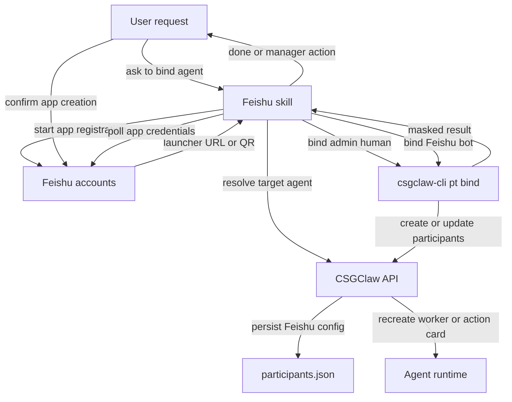
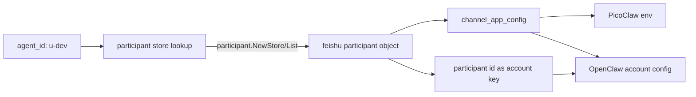

# Feishu participant 配置与 `pt bind` 设计草案

本文档记录新版 Feishu 对接方案。新流程不再把 Feishu app 配置写入旧的
`~/.csgclaw/channels/feishu.toml`，而是由
`~/.csgclaw/im/participants.json` 统一承载 Feishu participant、app 凭证、admin human
和 agent 绑定关系。旧 toml 自动迁移本期暂不实现。

变更边界：保持现有 participant store、participant API、room/message/member 引用和非
Feishu channel 行为不变；只在 `channel=feishu` 的 participant 内增加 Feishu 专属
`channel_app_config` 结构。

> 说明：当前代码里的旧路径是 `channels/feishu.toml`；历史安装中如果存在旧配置，本期不做
> 自动扫描和迁移。

## 当前代码结论

改造前已经有 participant 架构，但 Feishu 配置仍停留在旧形状：

- `participant.Store` 持久化到 `~/.csgclaw/im/participants.json`，文件结构是顶层
  `participants: []`。
- `Participant` 当前有 `channel_app_ref`，但没有 `channel_app_config`，无法保存
  Feishu app credential；真人 admin open_id 可以用现有 `channel_user_ref` 表达。
- `pt create` 可以创建 Feishu participant 并绑定 agent；旧 `pt config` 会写
  `channels/feishu.toml`。
- Feishu provider 仍从 `feishu.FileStore` 读取 `[bots.<key>]`，`BotConfig(key)` 的 key
  仍是旧本地配置 key。
- PicoClaw runtime env 注入当前仍用 `agentID` 查 Feishu provider；OpenClaw 配置渲染也
  用 `agentID` 查 provider。
- Feishu skill 旧脚本使用 agent 的旧 bot 命名、先写 Feishu config API、再 ensure
  participant、最后 recreate worker。

新版方案要把这条链路改成：

```text
Feishu skill
  -> csgclaw-cli pt bind
  -> participant API/service/store
  -> ~/.csgclaw/im/participants.json
  -> Feishu participant config reader
  -> runtime recreate 时注入 Feishu env/config
```

## 1. 新增命令

### 命令形状

新增 `csgclaw-cli pt bind`，专门完成“把外部 channel 身份绑定到 participant，并写入该
channel 所需 app config”的流程。

第一阶段只实现 Feishu，并且必须显式区分 Feishu human 和 Feishu bot。这里的
`human|bot` 是 CLI 交互语义，落到 participant 里分别对应 `type=human|agent`。

```bash
csgclaw-cli pt bind \
  --channel feishu \
  --feishu-kind bot \
  --agent <agent-name-or-id> \
  --app-id <cli_xxx> \
  --app-secret-stdin \
  [--restart]

csgclaw-cli pt bind \
  --channel feishu \
  --feishu-kind human \
  --admin \
  --open-id <ou_xxx> \
  [--name <display-name>]
```

secret 来源沿用现有安全输入方式，三选一：

```bash
--app-secret-file <path>
--app-secret-env <ENV_NAME>
--app-secret-stdin
```

建议默认行为：

`pt bind` 不暴露通用 `--participant-id`。Feishu bot 的 participant ID 由解析后的
agent ID 按当前代码里的 `agent.ParticipantIDForAgent(agent.Name, agent.ID)` 逻辑推导：
`u-dev -> dev`，`u-manager -> manager`。Feishu human 第一阶段只支持 `--admin`，
participant ID 固定为 `admin`，用现有 `channel_user_ref` 保存 Feishu 真人 `open_id`。

| 参数 | 必填 | 默认值 | 说明 |
| --- | --- | --- | --- |
| `--channel` | 是 | 无 | 当前只接受 `feishu`。 |
| `--feishu-kind` | 是 | 无 | `bot` 或 `human`，决定后续参数校验和 participant type。 |
| `--agent` | bot 必填 | 无 | agent 名称或 ID。先按 ID 查，再按 `u-<name>` 查，再按唯一 `name` 查。 |
| `--name` | human 可选；bot 不使用 | human 默认 `admin` | Feishu human participant 显示名。bot 显示名固定使用 agent.Name。 |
| `--admin` | human 第一阶段必填 | false | 标记该 human 是默认群主 admin；本期只实现 `feishu:admin` human。 |
| `--open-id` | human 必填 | 无 | Feishu 真人 open_id，写入 `channel_user_ref`，并设置 `channel_user_kind=open_id`。 |
| `--app-id` | bot 必填 | 无 | Feishu app `client_id`/`app_id`，写入 `channel_app_config.app_id`。 |
| `--app-secret-*` | bot 必填 | 无 | Feishu app secret，只读入内存，不打印；human 不接受 app secret。 |
| `--restart` | bot 可选 | false | true 时配置写入后让目标 Agent 重新物化 runtime env/config；manager 成功重建时返回 `manager_recreated`。 |

### 命令执行逻辑

`pt bind` 不应该真正 fork 一次 `pt create` 子进程；实现上应复用 `pt create` 的请求构造、
校验和渲染 helper，避免 CLI 自己调用自己。对外行为可以理解成“查询 agent 后执行一次
participant create/update”。

本期 `pt bind` 采用 CLI 侧编排多个现有 API 的方式，不要求服务端提供单个事务型 bind API：
先查 agent，再写 participant，最后按需 recreate agent。Feishu 配置读取方直接读取
`participants.json`，因此写入 participant 后不需要额外 reload provider。任何后续步骤失败
都不回滚已经保存的 participant/config；CLI 和 server 日志必须打印清楚失败阶段、`agent_id`、
`participant_id` 和错误原因。

执行步骤分 human 和 bot 两支。

```text
Human bind:
1. 要求 --feishu-kind human、--admin、--open-id。
2. 创建或更新 Feishu admin human participant：
   - id = "admin"
   - channel = "feishu"
   - type = "human"
   - name = --name 或 "admin"
   - channel_user_ref = open_id
   - channel_user_kind = "open_id"
3. 保存 participants.json。
4. 不触发 agent recreate。

Bot bind:
1. 要求 --feishu-kind bot、--agent、--app-id 和一个 app_secret 来源。
2. 解析参数，读取 app_secret，禁止在 stdout/stderr 打印 secret。
3. 调用 GET /api/v1/agents 或 GET /api/v1/agents/{id} 解析目标 agent：
   - "manager" / "u-manager" -> agent ID "u-manager"。
   - 先尝试原始输入作为 ID。
   - 再尝试 "u-" + 输入。
   - 再按 Agent.Name 做唯一匹配；多个同名则失败。
4. 推导 participant_id：
   - manager -> "manager"。
   - 其他 agent ID 去掉开头 "u-"，例如 "u-dev" -> "dev"。
   - 本期只保证新写入使用该 canonical participant ID；历史 `u-` participant ID 不在本期自动改名。
5. 组装 Feishu app config：
   - channel_app_config.app_id = app_id。
   - channel_app_config.app_secret = app_secret。
6. 确保 Feishu agent participant：
   - channel = "feishu"
   - type = "agent"
   - id = participant_id
   - name = agent.Name
   - agent_id = 解析出的 agent.ID
   - channel_user_kind = "app_id"
   - app_id 的真实值只保存在 channel_app_config.app_id
   - channel_app_config 写入 app_id/app_secret
7. 如果 canonical participant 已存在：
   - 更新 name/channel_user_kind/channel_app_config/agent_id。
   - 如历史记录已有 channel_app_ref，可以保留；新流程不依赖它。
   - 不重新生成 created_at。
8. 如果只发现同 `agent_id` 的历史非 canonical participant（例如 `feishu:u-dev`）：
   - 本期不做 rename/delete/引用迁移。
   - 继续写入 canonical participant（例如 `feishu:dev`），并在 CLI/server 日志中记录 warning。
   - 后续由历史数据专项迁移统一处理旧 participant。
9. 保存 participants.json。Feishu 发送、建群和 runtime 注入后续都直接读取该文件，不需要 reload。
10. 根据 --restart 处理 agent：
   - worker：调用 POST /api/v1/agents/{agent_id}/recreate。
   - manager：保持现有安全边界，返回 action card 或要求浏览器侧 bootstrap replace；不在
     manager-hosted skill 进程里直接自杀式 recreate。
   - recreate 失败不回滚 participant 写入，CLI 返回/打印 `config_saved=true` 与 recreate 错误。
11. 输出 JSON/table 结果，secret 只显示 "present"。
```

### 写入文件结构

仍沿用当前 `participant.Store` 的顶层结构，不把文件改成单对象：

```json
{
  "participants": [
    {
      "id": "admin",
      "channel": "feishu",
      "type": "human",
      "name": "admin",
      "channel_user_ref": "ou_d5fe8e00e4e0acef115d5a8277442ef2",
      "channel_user_kind": "open_id",
      "lifecycle_status": "active",
      "mentionable": true,
      "created_at": "2026-06-10T09:23:54.872146313Z",
      "updated_at": "2026-06-10T09:23:54.872146313Z"
    },
    {
      "id": "dev",
      "channel": "feishu",
      "type": "agent",
      "name": "dev",
      "channel_user_kind": "app_id",
      "channel_app_config": {
        "app_id": "cli_xxxxxxxxxxxxxxxx",
        "app_secret": "[REDACTED]"
      },
      "agent_id": "u-dev",
      "lifecycle_status": "active",
      "mentionable": true,
      "created_at": "2026-06-10T09:23:54.872146313Z",
      "updated_at": "2026-06-10T09:23:54.872146313Z"
    }
  ]
}
```

真实文件里保存真实 `app_secret`，文件权限必须保持 `0600`。写入请求、store、Feishu
配置 reader 和 runtime wiring 都使用未脱敏配置；只在对外响应边界脱敏
`channel_app_config.app_secret`。文档、日志、CLI 输出和 API 响应只允许显示 `present`
或 `[REDACTED]`。

### Feishu `channel_app_config` 结构

`channel_app_config` 是新增的 channel 专属扩展字段；只有 `channel=feishu` 时按下面的
结构解析，其他 channel 保持当前 participant 数据形状，不需要写这个字段。

```go
type FeishuChannelAppConfig struct {
    AppID     string `json:"app_id,omitempty"`
    AppSecret string `json:"app_secret,omitempty"`
}
```

它承接旧 `channels/feishu.toml` 的 bot app 凭证语义：

- 旧 `[bots.<key>] app_id/app_secret`：Feishu bot app 的应用凭证，写到
  `type=agent` 的 Feishu participant 上。
- 旧 `[global] admin_open_id`：不再写入 `channel_app_config`。默认群主由
  `id=admin,type=human,channel_user_kind=open_id` 的 Feishu participant 表达，真实
  `open_id` 放在 `channel_user_ref`。

当前代码里仍有 bot info 能力：`internal/channel/feishu/service.go` 里的 `fetchBotInfo(...)`
会调用 Feishu bot info API，`ResolveBotOpenID(...)` 会基于 app config 解析 bot 自身
`open_id`。这个 bot open_id 和 `feishu:admin` human 的 `channel_user_ref` 不是同一个概念：
前者是 bot app 的身份，后者是真人管理员身份。`pt bind --feishu-kind bot` 不再强制解析 bot open_id；bot participant
统一写 `channel_user_kind=app_id`，app_id 的真实值保存在 `channel_app_config.app_id`。

`channel_app_ref` 不是 Feishu app 凭证来源。它是 participant 架构里已有的非敏感 app scope
引用字段，主要服务于 app-scoped open_id 这类身份解释。新版 Feishu bind 不写
`channel_app_ref`；如历史数据里已经存在，可以保留但不作为 Feishu 配置 source of truth。

### 字段来源

| 字段 | 来源 | 说明 |
| --- | --- | --- |
| `id` | bot 由 agent ID 推导；human 固定 `admin` | Feishu channel 内 participant key。bot 使用解析后的 agent ID 去掉开头 `u-`；manager 固定 `manager`；不从命令行读取 participant ID。 |
| `channel` | `--channel` | 当前固定 `feishu`。 |
| `type` | `--feishu-kind` | `bot -> agent`；`human -> human`。 |
| `name` | bot 使用 agent.Name；human 使用 `--name` 或 `admin` | 显示名，不参与 ID 推导。Feishu skill 默认不传 human name，因此管理员显示名为 `admin`。 |
| `channel_user_ref` | human 使用 `--open-id`；bot 不写 | Feishu human 的真实 open_id。默认群主读取 `feishu:admin.channel_user_ref`。 |
| `channel_user_kind` | human 固定 `open_id`；bot 固定 `app_id` | 描述 Feishu participant 的 channel 身份类型。 |
| `channel_app_config` | Feishu skill/手动参数 | Feishu 专属结构；bot 保存 `app_id/app_secret`，human 不写。 |
| `agent_id` | `--agent` 解析结果 | 只给 `type=agent` participant 写入，指向 runtime agent。 |
| `lifecycle_status` | participant service | 新建为 `active`。 |
| `mentionable` | participant service | 默认 true。 |
| `created_at` | participant service | 首次创建时间。 |
| `updated_at` | participant service | 每次 bind/update 刷新。 |

## 2. 新的 Feishu 对接流程

用户入口保持不变：用户在对话框里说“帮我将 dev agent 对接飞书”。

Skill 内部流程改成：



### Skill 具体变更

Feishu skill 不再自己调用旧 Feishu config API，也不再以旧 bot 命名为主语义。

脚本参数建议从：

```bash
python .../feishu_register.py start --agent u-dev --role worker --bot-name dev --qr
python .../feishu_register.py finalize --registration-id <id>
```

改成：

```bash
python .../feishu_register.py start --agent dev --role worker --qr
python .../feishu_register.py finalize --registration-id <id>
```

`finalize` 成功拿到 Feishu 返回值后，分两类调用。

如果当前流程是 manager 对接，并且注册返回了真人管理员 `open_id`，skill 先显式保存
默认群主 human：

```bash
csgclaw-cli --output json pt bind \
  --channel feishu \
  --feishu-kind human \
  --admin \
  --open-id "$ADMIN_OPEN_ID"
```

保存 bot app 凭证并绑定目标 agent：

```bash
printf '%s' "$APP_SECRET" | csgclaw-cli --output json pt bind \
  --channel feishu \
  --feishu-kind bot \
  --agent dev \
  --app-id "$APP_ID" \
  --app-secret-stdin
```

非 manager agent 对接时不默认创建 human；默认群主始终是 `feishu:admin` human。worker 默认由
`pt bind` recreate。manager 仍返回 action card，让 Web 窗口触发安全的 manager bootstrap
replace。

### Runtime 注入流程

运行时不能再把 `agentID` 直接当 Feishu 配置 key。新的查询规则是：

```text
agentID
  -> 复用 participant.NewStore(participantsPath) 读取 participants.json
  -> Store.List(channel=feishu,type=agent,agent_id=agentID)
  -> 得到 Feishu participant 对象
  -> 直接从该 participant.channel_app_config 解析 app_id/app_secret
  -> 注入 PicoClaw env 或渲染 OpenClaw Feishu account
```



PicoClaw 仍只读取环境变量：

```text
PICOCLAW_CHANNELS_FEISHU_ENABLED=true
PICOCLAW_CHANNELS_FEISHU_APP_ID=cli_xxx
PICOCLAW_CHANNELS_FEISHU_APP_SECRET=...
```

OpenClaw 仍写入 gateway config 的 `channels.feishu.accounts`。变化是配置值直接来自匹配到的
Feishu participant，account key 使用该 participant 的 `id`，不再把 `agentID` 当作 Feishu
配置 key。

Feishu 建群时默认群主不从 bot app config 复制，而是直接读取 `feishu:admin` human：

```text
participants.json
  -> Store.Get(channel=feishu,id=admin)
  -> channel_user_kind=open_id
  -> channel_user_ref 作为 Feishu CreateChat OwnerId
```

room 相关命令行和 room API 入参保持当前形状，不新增群主参数。

### 旧配置迁移（暂不实现）

旧 `channels/feishu.toml` 自动迁移本期暂不实现。原因是存量用户较少，且旧配置 key、
历史 participant ID、agent ID 之间可能存在多种形态；为避免引入额外兼容风险，本期先只保证
新流程写入和读取 `im/participants.json`。

本期行为：

- `pt bind` 和 Feishu skill 只写新的 `participants.json` 结构。
- Feishu 配置读取只把 `participants.json` 作为运行时配置来源。
- `serve` 启动时不扫描、不改写、不备份旧 `channels/feishu.toml`。
- 不再把旧 `feishu.toml` snapshot 作为持久来源；旧 `feishu.FileStore` 只保留到未清理调用点
  完成替换前，不进入新链路。
- 本期不自动迁移历史 `u-` Feishu participant ID；新流程只保证新写入 ID 符合当前
  `agent.ParticipantIDForAgent(...)` 逻辑。
- 如确有旧用户需要保留配置，先通过重新执行 Feishu 对接流程生成新的 participant 配置。

## 3. 模块边界与代码路径

### CLI 层

文件：

- `cli/participant/participant.go`
- `cli/participant/config.go`
- `internal/apiclient/client.go`
- `cli/csgclawcli/app.go`
- `cli/app_test.go`
- `cli/csgclawcli/app_test.go`

职责：

- 新增 `pt bind` 子命令。
- `pt bind` 复用现有 participant create/PATCH 路由和请求构造；不新增直接写文件逻辑。
- `pt bind` 是 CLI 侧串行编排：查询 agent、写 participant、按需 recreate agent。任一步失败
  都不回滚前面已经成功的写入，但必须在日志和命令结果里明确
  标出失败阶段。
- 删除旧 `pt config` 入口。Feishu 凭证只通过 `pt bind` 写入
  `participants.json` 的 Feishu `channel_app_config`。
- CLI 只通过 API 修改 server 侧 state，不直接写宿主机 `participants.json`。

### API 与 participant 层

文件：

- `internal/apitypes/participant.go`
- `internal/participant/model.go`
- `internal/participant/service.go`
- `internal/participant/store.go`
- `internal/api/participant.go`
- 删除旧 `internal/api/feishu_config.go` 和对应路由。
- `internal/participant/store_test.go`
- `internal/participant/service_test.go`
- `internal/api/participant_test.go`

职责：

- `Participant` 新增 `ChannelAppConfig` 字段，例如
  `map[string]any` 或等价 `json.RawMessage`，JSON tag 为 `channel_app_config,omitempty`；
  只有 `channel=feishu` 时按 `FeishuChannelAppConfig` 校验。
- `internal/participant/model.go` 新增 `ChannelUserKindAppID = "app_id"`；Feishu bot
  participant 由 `pt bind` 或兼容 API 写入该 kind。
- `CreateRequest` 支持写入 `channel_app_config`，但非 Feishu channel 不需要写入，也不改变
  现有行为。
- 为了复用现有 PATCH 路由，`UpdateRequest` 需要新增 Feishu 专用可更新字段：
  `channel_user_kind`、`channel_app_config`、`agent_id`。这些字段只允许
  `channel=feishu` 使用；非 Feishu channel 仍保持当前 PATCH 行为。
- `pt bind` 的 upsert 逻辑使用现有路由完成：
  - bot 先按当前 `agent.ParticipantIDForAgent(agent.Name, agent.ID)` 推导 canonical participant ID。
  - human 使用固定 ID `admin`。
  - canonical participant 不存在则 POST `/api/v1/channels/feishu/participants`。
  - canonical participant 已存在则 PATCH `/api/v1/channels/feishu/participants/{id}` 写入 Feishu 专用字段。
  - 如果只按 `agent_id=<agentID>` 找到历史非 canonical participant，本期不迁移它；继续写入
    canonical participant，并记录 warning。
  - 如果现有 participant 的 `type` 不匹配，或已有非空 `agent_id` 指向另一个 agent，则失败并提示人工处理。
- 当前 `participant.Service` 创建 participant 时依赖旧 channel user 字段做必填校验；实现时需要让
  Feishu bot 不依赖 `channel_user_ref`。Feishu admin human 继续使用现有
  `channel_user_ref + channel_user_kind=open_id` 作为身份来源；Feishu bot 以
  `channel_user_kind=app_id + channel_app_config.app_id/app_secret` 作为身份和凭证来源。
  其他 channel 仍保持原校验。
- `participant.Store` 继续负责 `participants.json` 落盘和 `0600` 权限。
- Feishu `channel_app_config` 写入前做 JSON 校验；API 展示和 CLI 渲染统一使用脱敏后的
  participant。
- 旧 Feishu config API 不保留。Feishu 凭证通过 participant API 和 `pt bind`
  写入 `channel_app_config`，不再写旧 toml，也不承担旧文件自动迁移职责。

### Feishu channel/config reader 层

文件：

- `internal/channel/feishu/config.go`
- 新增建议：`internal/channel/feishu/participant_config.go`
- `internal/channel/feishu/service.go`
- `internal/channel/feishu/*_test.go`

职责：

- 不再从 `feishu.FileStore` 或旧 `feishu.toml` snapshot 构造运行时配置。
- 新增轻量 Feishu participant config reader，直接复用现有 participant store API：
  - `participant.NewStore(participantsPath)` 读取 `participants.json`。
  - `Store.List(participant.ListOptions{Channel: participant.ChannelFeishu})` 扫描 Feishu participant。
  - `Store.Get(participant.ChannelFeishu, "admin")` 读取默认群主 human。
- reader 暴露按需查询 helper，而不是持久化 snapshot：
  - `FeishuConfigForAgent(agentID string) (participantID string, config FeishuChannelAppConfig, ok bool)`。
  - `FeishuConfigForParticipant(participantID string) (config FeishuChannelAppConfig, ok bool)`。
  - `DefaultAdminOpenID() (openID string, ok bool)`。
  - `MentionOpenID(participantID string) (openID string, ok bool)` 用于 human participant 的 @ 目标。
  - 每次调用直接读取当前 `participants.json`；本期优先保持实现简单，不引入缓存失效问题。
  - 如果同一个 `agent_id` 同时存在 canonical 和历史非 canonical Feishu participant，优先使用
    canonical participant，并记录 warning；本期不在 reader 内改写历史 participant ID。
  - `feishu:admin` human participant 的 `channel_user_ref` 提供默认群主 `open_id`。
- 运行时注入不要再先查 participant ID 再二次调用旧 `BotConfig`；应直接按 agent ID 返回匹配到的
  participant 和 app config。
- Feishu channel API 入参统一使用 Feishu participant ID：
  - `/api/v1/channels/feishu/messages` 的 `sender_id` 是 Feishu participant ID。
  - `/api/v1/channels/feishu/rooms` 的 `creator_id` 和 `member_ids` 是 Feishu participant ID。
  - `/api/v1/channels/feishu/participants/{id}/events` 的 `{id}` 是 Feishu participant ID。
  - 不在这些 API 中使用 agent ID、Feishu open_id 或 app_id 作为 participant 入参。
- Feishu service 内部 `apps map[string]AppConfig` 的 key 统一是 Feishu participant ID。
  `appConfigForSenderLocked`、`appIDForMemberLocked` 等函数继续按 key 查 app config，但传入值必须是
  Feishu participant ID。@ agent 继续通过 `appConfigForMentionLocked` 解析 app-backed bot open_id；
  @ human 则通过 participant 的 `channel_user_ref` 解析 Feishu open_id，不要求 human participant 有 app config。
- `feishu.FileStore` 和旧 `Provider/Snapshot` 不再作为运行时配置持久来源；旧 toml 自动迁移暂不实现。
- Feishu service 内部 `feishuManagerBotID = "u-manager"` 需要调整为 manager participant ID
  `manager`，否则 create room/list members 仍会按旧 key 找 app。
- Feishu room 创建时默认读取 `DefaultAdminOpenID()` 作为 CreateChat OwnerId；room 相关命令行不改。

### Serve/bootstrap 层

文件：

- `cli/serve/serve.go`
- `internal/onboard/onboard.go`
- `internal/onboard/detect.go`
- `internal/onboard/*_test.go`

职责：

- 启动时只需要确定 `participants.json` 路径，并把路径交给 Feishu config reader 与 runtime wiring：

```text
participants.json path
  -> Feishu participant config reader
  -> agent.Service runtime wiring
  -> participant.Service API
```

- 本期不在启动时迁移旧 `channels/feishu.toml`。
- 因为 Feishu 配置读取方直接读 `participants.json`，`configureFeishuService` 不再需要维护
  reload hook，也不需要把旧 provider 的内存状态推给 runtime。

### Runtime wiring 层

文件：

- `internal/app/runtimewiring/picoclaw.go`
- `internal/app/runtimewiring/openclaw.go`
- `internal/runtime/openclawsandbox/config.go`
- `internal/runtime/picoclawsandbox/*`
- `internal/app/runtimewiring/*_test.go`
- `internal/runtime/openclawsandbox/config_test.go`

职责：

- `picoClawRuntimeEnvVars(...)` 不再把 `agentID` 当 Feishu 配置 key 传给 `BotConfig`；改为
  调用 `FeishuConfigForAgent(agentID)` 找到 Feishu participant 和 app config。
- OpenClaw `updateOpenClawFeishuChannel(...)` 改为按 agent ID 找到 Feishu participant 对象，
  用该对象的 `channel_app_config` 渲染 account，并用该对象的 `id` 作为 account key。
- 如果 runtime builder 当前只拿到 agent ID，需要新增 resolver：

```go
type FeishuAgentConfigResolver interface {
    FeishuConfigForAgent(agentID string) (participantID string, config FeishuChannelAppConfig, ok bool)
}
```

最小实现可以让 Feishu participant config reader 实现这个 resolver。runtime wiring 的调用顺序必须是：

```text
agentID -> FeishuConfigForAgent(agentID) -> 使用返回的 config 注入 env/config
```

如果没有找到 Feishu participant，则不注入 Feishu 配置；不要把 `agentID` 直接传给
`BotConfig(...)` 当作兼容回退。

### Feishu skill 层

文件需要同步两份内置模板：

- `internal/templates/embed/openclaw-manager/workspace/skills/feishu/SKILL.md`
- `internal/templates/embed/openclaw-manager/workspace/skills/feishu/scripts/feishu_setup/*.py`
- `internal/templates/embed/openclaw-manager/workspace/skills/feishu/scripts/tests/*`
- `internal/templates/embed/picoclaw-manager/workspace/skills/feishu/SKILL.md`
- `internal/templates/embed/picoclaw-manager/workspace/skills/feishu/scripts/feishu_setup/*.py`
- `internal/templates/embed/picoclaw-manager/workspace/skills/feishu/scripts/tests/*`

职责：

- 用户自然语言入口不变。
- 脚本 state 使用 `agent_id`/`participant_id`。
- `finalize` 不再 `PUT /api/v1/channels/feishu/config`。
- `finalize` 改为调用 `csgclaw-cli pt bind`。
- 输出仍只显示 `app_secret: present`。

## 4. 建议实施顺序

1. 扩展 participant schema：新增 `channel_app_config`，补 create/update/store/API 测试。
2. 增加 Feishu participant config reader，复用 `participant.NewStore/List/Get` 直接读取
   participants.json；不再从旧 feishu.toml snapshot 生成运行时配置。
3. 调整 serve/onboard 启动顺序，把 participants.json 路径交给 Feishu service 和 runtime
   wiring；旧 feishu.toml 自动迁移不进入本期。
4. 修改 runtime wiring：PicoClaw/OpenClaw 都按 agent ID 找到 Feishu participant，并直接读取
   该 participant 的 `channel_app_config` 注入配置。
5. 新增 `csgclaw-cli pt bind`，并让它通过现有 API 串行完成 agent 查询、participant upsert、
   agent recreate；失败不回滚，日志和命令结果标明失败阶段。
6. 修改 Feishu skill：`finalize` 调用 `pt bind`，清理旧 bot 命名文案。
7. 更新 `docs/tech/channel/feishu.zh.md`、`docs/tech/channel/feishu.md` 和 CLI 文档，说明新配置位置。
8. 跑针对性测试：

```bash
go test ./internal/participant ./internal/api ./internal/channel/feishu ./internal/app/runtimewiring ./internal/runtime/openclawsandbox ./cli
```

涉及启动顺序后，再跑：

```bash
go test ./cli/serve ./internal/onboard
```

## 5. 不做的事情

- 不让 skill 直接编辑宿主机 `~/.csgclaw/im/participants.json`。
- 不继续以旧 bot 命名作为新流程的外部参数或文档主语义。
- 不在本期实现旧 `channels/feishu.toml` 到 `participants.json` 的自动迁移。
- 不在 runtime 中保留 `agentID -> old feishu.toml key` 的 fallback。
- 不把 Feishu public webhook 当作 CSGClaw/OpenClaw 主入站路径。
- 不改变 PicoClaw/OpenClaw 内部读取 app_id/app_secret 的方式，只改变 CSGClaw 注入来源。

## 6. 已确认决议

1. `participants.json` 保持当前顶层 `{ "participants": [...] }` 结构，继续由现有
   `participant.Store` 读写；不能为了 Feishu 改坏其他 channel 或现有 participant API。
2. `channel_app_config` 是 Feishu 专属扩展。只有 `channel=feishu` 时按
   `FeishuChannelAppConfig` 解析，非 Feishu participant 不写这个字段，也不改变现有行为。
   真实 secret 只在落盘和 server 内部读取时保留；所有对外响应统一脱敏
   `channel_app_config.app_secret`。
3. Feishu bot 和 Feishu human 必须在 `pt bind` 命令层区分：
   - `--feishu-kind bot` 写 `type=agent`，`channel_user_kind=app_id`，保存 app
     `app_id/app_secret`，并绑定 `agent_id`。
   - `--feishu-kind human` 写 `type=human`，保存真人 `open_id`，不绑定 agent，不接收 app secret。
4. Feishu 新结构只用 `channel_user_kind` 标记身份类型：human 的真人 open_id 写入
   `channel_user_ref`，bot 的 app_id/app_secret 写入 `channel_app_config`。
5. 旧 `feishu.toml` 的 `[global] admin_open_id` 语义由 `feishu:admin` human participant
   表达，真实 open_id 放在 `channel_user_ref`，不复制到每个 bot participant，也不写入
   `channel_app_config`。
6. 现有 bot info 函数保留可用，但 `pt bind` 不依赖它写 participant 身份；不要把 bot
   open_id 和 admin human 的 `channel_user_ref` 混用。
7. `pt bind` 不提供 `--participant-id`。bot participant ID 按当前
   `agent.ParticipantIDForAgent(agent.Name, agent.ID)` 逻辑从 agent 推导；human participant ID
   当前固定为 `admin`，`name` 默认也是 `admin`。本期不自动 rename 历史 `u-` Feishu
   participant ID。
8. Feishu channel API 入参统一使用 Feishu participant ID；runtime 内部可以按 agent ID 找
   Feishu participant，但 channel API 不直接使用 agent ID/open_id/app_id 作为 participant 入参。
9. 旧 Feishu config API 不保留；Feishu 凭证只通过 participant API 和 `pt bind`
   写入 `channel_app_config`，不再写旧 toml。
10. manager 配置完成后的安全 action card 路径保留；manager 不在 manager-hosted skill 进程里
   直接 recreate 自己。
11. `pt bind` 采用 CLI 侧串行调用多个现有 API 的实现方式；recreate 或后续步骤失败不回滚已经保存的
   participant/config，但必须在日志和命令结果中明确失败步骤、`agent_id`、`participant_id` 和错误。
