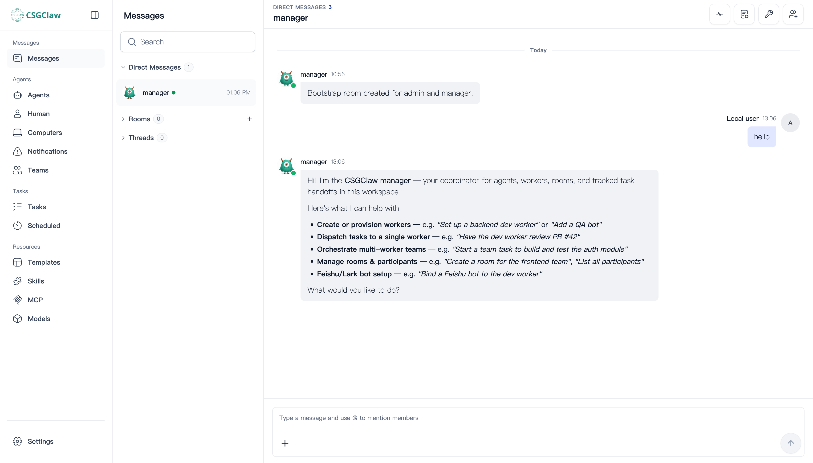

# Introducing CSGClaw

This page explains what CSGClaw is, what you can use it for, and how to get started from an everyday user's perspective.

## What is CSGClaw?

CSGClaw is a multi-agent collaboration tool that runs on your own computer. You can think of it as a personal team of AI agents: tell the Manager what you want to achieve, and it can help break the goal into tasks, assign different Workers, track progress, and bring the results together.

Instead of trying to make one AI assistant handle everything, CSGClaw helps multiple AI agents with different responsibilities work together like a team.



CSGClaw gives you:

- **One place to coordinate work** — Work mainly with the Manager instead of constantly switching between separate AI chat windows.
- **Workers with clear roles** — Set up different Workers for frontend, backend, testing, documentation, research, and other responsibilities.
- **A WebUI out of the box** — Start the service, then chat, manage agents, and follow their collaboration in your browser.
- **Multiple communication channels** — Use the WebUI by default, or connect Feishu, WeChat, Matrix, and other channels when needed.
- **Isolated execution** — Workers run in sandboxes by default, reducing their impact on your local environment.
- **Flexible setup** — Start with practical defaults, then adjust agent models, roles, and runtime environments as your needs grow.

## How can you use CSGClaw?

CSGClaw works best for clear goals that involve multiple steps or different kinds of expertise. For example, you can use it to:

- Build a product prototype with pages, APIs, and tests;
- Ask different Workers to research information, organize findings, and write documentation;
- Split a larger development request into frontend, backend, testing, and acceptance tasks;
- Coordinate code changes, reviews, and documentation updates in an existing project;
- Keep separate agent roles and context for different kinds of work.

A typical collaboration might look like this:

```text
You: Build a simple product prototype with a home page, login page,
     and basic admin view.

Manager: I will split this into three parts:
  · Alice → home page and login UI
  · Bob   → backend APIs and data model
  · Carol → integration checks and acceptance

You: The login page also needs GitHub sign-in.

Manager: I have updated the plan and notified the frontend and backend Workers.
```

You still set the goal and make important decisions. The Manager organizes the collaboration, while Workers carry out the specific tasks.

## Key concepts

### Manager

The Manager is your main point of contact with the AI team. It understands your goal, breaks it into tasks, selects suitable Workers, coordinates the order of work, and summarizes progress and results for you.

### Worker

A Worker is an AI team member responsible for specific tasks. Each Worker can have its own role, model, and working environment. Clear responsibilities keep context focused and make longer workflows easier to manage.

### WebUI

The WebUI is CSGClaw's built-in browser workspace. After starting the service, you can use it to talk with the Manager and Workers, manage agents, and follow their collaboration.

### Sandbox

A sandbox is the isolated environment in which a Worker carries out tasks. CSGClaw uses Docker by default and also supports other sandbox options through configuration. For most users, the default setup is a good place to start.

## How is CSGClaw different from a regular AI assistant?

A regular AI assistant usually works inside one conversation and one shared context. When a task involves several responsibilities, you often have to split the work yourself, switch between conversations, and organize the results manually.

CSGClaw organizes that collaboration for you:

- You describe the goal through one main point of contact;
- The Manager breaks down and coordinates the work;
- Workers carry out tasks according to their roles;
- Different roles can continue collaborating toward the same goal;
- Results and decisions that need your attention return to the same workspace.

The important difference is not simply running multiple agents at once. It is giving their collaboration a clear, manageable structure.

## Who is CSGClaw for?

- Individuals who want to move from a single AI assistant to an AI team;
- Independent developers who regularly handle multi-step development, testing, documentation, or research work;
- Small teams looking for a simpler way to use and manage multiple agents;
- Users who value quick startup, browser-based interaction, and secure defaults.

If you only need a quick answer to a simple question, a regular chat assistant may already be enough. If your work requires planning, specialization, and ongoing coordination, CSGClaw is likely a better fit.

## Recommended setup order

### 1. Install CSGClaw

macOS or Linux:

```bash
curl -fsSL https://csgclaw.opencsg.com/install.sh | bash
```

Windows PowerShell:

```powershell
curl.exe -fsSL https://csgclaw.opencsg.com/install.ps1 | powershell -ExecutionPolicy Bypass -Command -
```

Windows currently uses Docker by default, so make sure Docker is running on your computer first.

### 2. Start the service

```bash
csgclaw serve
```

CSGClaw will try to open your browser automatically. If it does not, open the address printed in the terminal, such as `http://127.0.0.1:18080/`.

### 3. Check your agent settings

In the WebUI, follow the on-screen guidance to check your model settings and adjust the Manager and Workers for your needs. You do not need a large team on day one. Starting with one Manager and a few Workers with clear responsibilities makes the collaboration model easier to understand.

### 4. Start with a specific goal

You can say this directly to the Manager:

> Help me create a product introduction page. First, break the goal into tasks and tell me which Workers you plan to involve. Wait for my confirmation before starting.

Observe how the Manager plans and assigns the work, then gradually add more Workers, communication channels, or advanced workflows.

For installation details and other basic information, see the project [README](../../README.md).
