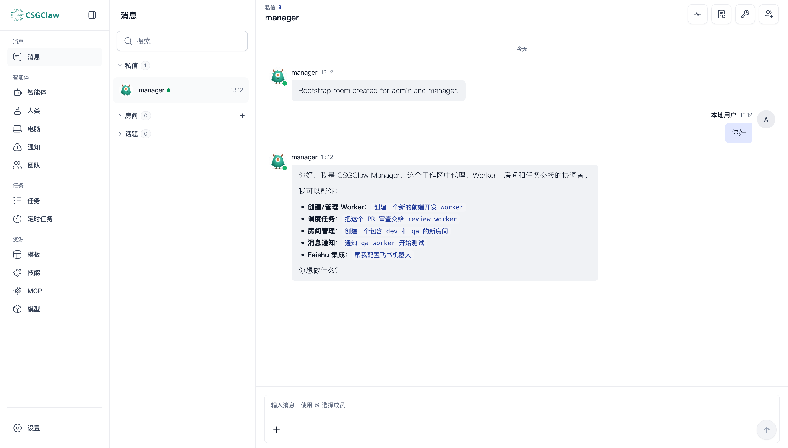

# CSGClaw 项目介绍

本页将从普通用户的视角介绍 CSGClaw 是什么、适合用来做什么，以及如何快速开始。

## CSGClaw 是什么？

CSGClaw 是一款可以部署在自己电脑上的多智能体协作工具。你可以把它理解为一支由 AI 组成的个人团队：你只需要向 Manager 说明目标，Manager 会帮助你拆解任务、安排不同的 Worker、跟踪进展并汇总结果。

它关注的不是让一个 AI 助手包办所有事情，而是让多个职责不同的 AI Agent 像团队成员一样协作。



CSGClaw 提供：

- **统一的协作入口**：主要和 Manager 沟通，不必在多个 AI 对话窗口之间反复切换。
- **分工明确的 Worker**：可以为前端、后端、测试、文档、调研等工作设置不同角色。
- **开箱即用的 WebUI**：启动服务后，直接在浏览器中对话、管理 Agent 和查看协作过程。
- **多通道接入**：除了 WebUI，还可以按需连接飞书、微信、Matrix 等通信工具。
- **隔离的执行环境**：Worker 默认在沙箱中运行，减少任务执行对本机环境的影响。
- **灵活的运行方式**：提供适合日常使用的默认配置，也可以根据需要调整 Agent 的模型、角色和运行环境。

## 你可以怎样使用 CSGClaw？

CSGClaw 更适合目标明确、需要多个步骤或不同角色配合的任务。例如：

- 制作一个包含页面、接口和测试的产品原型；
- 让不同 Worker 分别完成资料收集、内容整理和文档撰写；
- 将一个较大的开发需求拆成前端、后端、测试和验收任务；
- 在已有项目中安排代码修改、检查和文档更新；
- 为不同类型的工作保留各自独立的 Agent 角色和上下文。

一次典型的协作可能是：

```text
你：做一个简单的产品原型，包含首页、登录页和后台页面。

Manager：我会把任务拆成三个部分：
  · Alice → 首页和登录界面
  · Bob   → 后台接口和数据结构
  · Carol → 联调和验收

你：登录页还需要支持 GitHub 登录。

Manager：已更新任务，并同步给负责前端和后端的 Worker。
```

你仍然负责确定目标和做关键决策，Manager 负责组织协作，Worker 负责完成具体工作。

## 认识几个核心概念

### Manager

Manager 是你与 AI 团队之间的主要沟通入口。它负责理解目标、拆解任务、选择合适的 Worker、协调执行顺序，并向你汇总进展和结果。

### Worker

Worker 是负责具体任务的 AI 成员。每个 Worker 都可以拥有自己的角色、模型和工作环境。明确的分工可以减少上下文混杂，让不同类型的任务更容易持续推进。

### WebUI

WebUI 是 CSGClaw 自带的浏览器工作区。服务启动后，你可以在这里与 Manager 和 Worker 对话、管理 Agent，并查看他们的协作过程。

### Sandbox

Sandbox 是 Worker 执行任务时使用的隔离环境。CSGClaw 默认使用 Docker，也支持通过配置选择其他沙箱方案。对于普通用户，保持默认设置通常就可以开始使用。

## CSGClaw 和普通 AI 助手有什么不同？

普通 AI 助手通常围绕一次对话和一个上下文工作。当任务涉及多种职责时，你需要自己反复拆分问题、切换对话并整理结果。

CSGClaw 把这些协作关系组织起来：

- 你向一个统一入口说明目标；
- Manager 负责拆解和协调；
- Worker 按各自职责执行任务；
- 不同角色可以围绕同一个目标持续协作；
- 最终结果和需要你决策的问题会回到同一个工作区。

关键不只是“同时运行多个 Agent”，而是让它们形成清晰、可管理的协作过程。

## CSGClaw 适合谁？

- 希望从单个 AI 助手升级到 AI 团队的个人用户；
- 经常处理开发、测试、文档或调研等多步骤任务的独立开发者；
- 希望降低多智能体使用和管理门槛的小团队；
- 看重快速启动、浏览器操作和默认安全隔离的用户。

如果你只需要一次简单问答，普通聊天助手可能已经足够；如果任务需要拆解、分工和持续协调，CSGClaw 会更适合。

## 推荐的上手顺序

### 1. 安装 CSGClaw

macOS 或 Linux：

```bash
curl -fsSL https://csgclaw.opencsg.com/install.sh | bash
```

Windows PowerShell：

```powershell
curl.exe -fsSL https://csgclaw.opencsg.com/install.ps1 | powershell -ExecutionPolicy Bypass -Command -
```

Windows 当前默认使用 Docker，请先确保本机 Docker 可以正常运行。

### 2. 启动服务

```bash
csgclaw serve
```

CSGClaw 会尽量自动打开浏览器。如果没有自动打开，请访问终端中显示的地址，例如 `http://127.0.0.1:18080/`。

### 3. 检查 Agent 配置

进入 WebUI 后，根据页面提示检查模型配置，并按自己的任务需要调整 Manager 和 Worker。刚开始不必创建很多角色，保留一个 Manager 和少量职责清晰的 Worker 更容易理解协作方式。

### 4. 从一个具体目标开始

你可以直接对 Manager 说：

> 帮我做一个产品介绍页面。请先拆解任务，告诉我准备让哪些 Worker 参与，等我确认后再开始。

先观察 Manager 如何拆解和分配任务，再逐步增加 Worker、通道或更复杂的工作流。

更多安装和基础信息可以查看项目的[中文 README](../../README.zh.md)。
